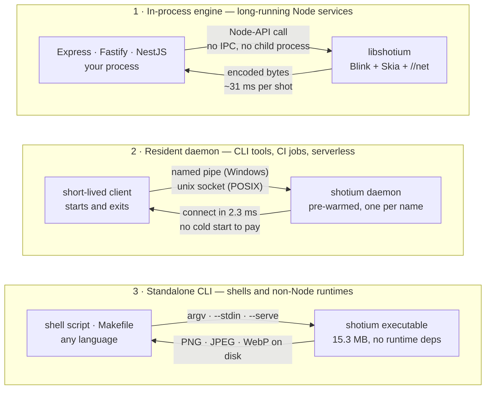
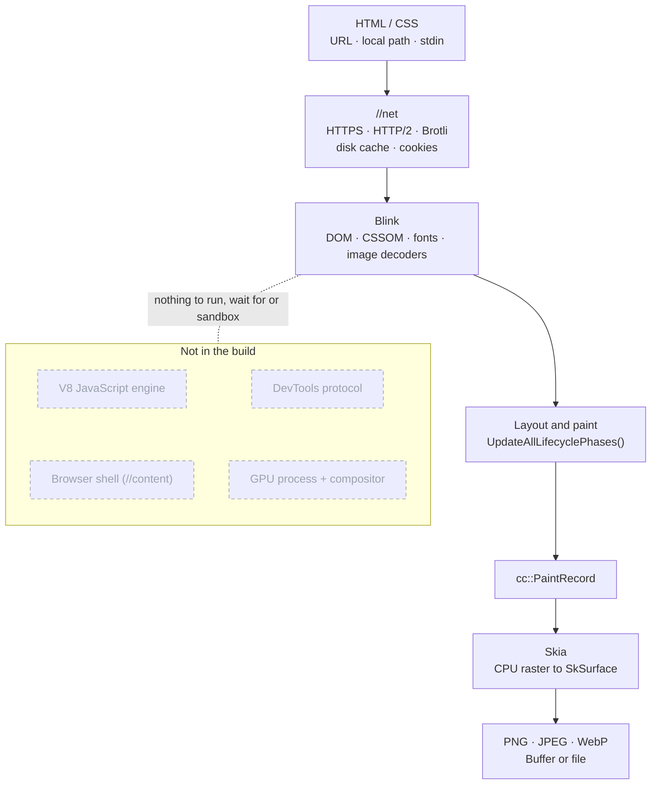

# shotium

> Static HTML/CSS screenshots from a stripped-down Chromium core. Blink lays out
> and paints, Skia rasterises on the CPU, Chromium's `//net` fetches — with no V8,
> no browser shell, no GPU process and no DevTools protocol left in the build.

[](LICENSE)
[](https://www.npmjs.com/package/@shotkit/shotium)
[-green.svg)](https://www.npmjs.com/package/@shotkit/shotium)

**English** · [简体中文](README.zh.md)

---

## See It Run

<p align="center">
  
</p>

Install, a couple of dozen lines, one capture — no browser is launched, because Blink is
running inside that `node` process. The timings in the recording are paid while
a screen recorder is running; [the benchmarks](#performance-benchmarks) below are
the numbers to quote.

---

## Quick Start

### 1. Installation

```bash
# npm
npm install @shotkit/shotium

# pnpm
pnpm add @shotkit/shotium

# yarn
yarn add @shotkit/shotium

# bun
bun add @shotkit/shotium
```

Prebuilt platform binaries are distributed as optional npm dependencies (covering Windows, macOS, and Linux on x64 and arm64). Package managers automatically download the matching binary without requiring local build tools.

### 2. Basic Example

The program below is [`docs/demo/card.mjs`](docs/demo/card.mjs) — the same file
the recording runs, so it cannot drift away from what actually works:

<p align="center">
  
</p>

<details>
<summary>Copy the source</summary>

```ts
import { statSync } from 'node:fs';
import shotium, { screenshot } from '@shotkit/shotium';

// One engine per process: Blink's process-wide statics
// cannot be re-initialised, so start() is idempotent.
shotium.start();

function shoot() {
  return screenshot({
    file: 'card.html',        // URL, local path or file://
    viewport: { width: 720, height: 380 },
    scale: 2,                 // device pixel ratio
    type: 'png',
    path: 'card.png',         // to disk; `image` is then null
  });
}

// The first capture also pays for Blink, Skia and font warm-up.
for (const pass of ['cold', 'warm']) {
  const { render, total } = (await shoot()).stats.timing;
  console.log(`${pass}  render ${render.toFixed(1)} ms  total ${total.toFixed(1)} ms`);
}

const kb = (statSync('card.png').size / 1024).toFixed(1);
console.log(`card.png  1440x760  ${kb} KB`);

await shotium.stop();
```

</details>

Point `file` at an `https://` URL, a local path or a `file://` URL. The input
document for the run above is [`docs/demo/card.html`](docs/demo/card.html), and
this is what comes back out — grid, gradients, dashed borders and box shadows,
laid out by Blink and rasterised by Skia:

<p align="center">
  
</p>

### 3. Or From the Shell

The standalone executable takes the same engine to environments without a
Node.js runtime, and reads a document from `stdin` when there is no file to
point at:

<p align="center">
  
</p>

---

## Table of Contents

- [See It Run](#see-it-run)
- [Quick Start](#quick-start)
- [Overview & Key Highlights](#overview--key-highlights)
- [Execution Mode Selection Guide](#execution-mode-selection-guide)
- [Technical Scope](#technical-scope)
- [Usage Modes](#usage-modes)
  - [1. In-Process Engine](#1-in-process-engine)
  - [2. Resident Daemon](#2-resident-daemon-daemon)
  - [3. Standalone CLI](#3-standalone-cli)
- [API Reference](#api-reference)
  - [`ScreenshotOptions` & `ScreenshotResult`](#screenshotoptions)
  - [`StartOptions` & `StartResult`](#startoptions)
  - [`CaptureStats` Metrics Breakdown](#capturestats)
  - [`daemon` Module & Status](#daemon-module)
  - [`cache` Management Module](#cache-module)
- [Performance Benchmarks](#performance-benchmarks)
- [Architecture](#architecture)
- [Environment Variables](#environment-variables)
- [C ABI / FFI Integration](#c-abi--ffi-integration)
- [Building from Source](#building-from-source)
- [Regenerating the README Assets](#regenerating-the-readme-assets)
- [License](#license)

---

## Overview & Key Highlights

**shotium** is a lightweight, high-performance rendering engine designed specifically for capturing static screenshots from HTML and CSS.

By stripping Chromium down to its essential rendering pipeline, it retains only:
- **Blink** layout engine
- **Skia** CPU rasterization
- Typography and image decoders
- Chromium **`//net`** network stack

### Core Advantages

- **Complete Removal of V8 & Browser Shell**: No `//content` framework, no GPU process, no compositor, and no DevTools protocol.
- **Ultra-Lightweight & Fast**: ~41 MB core binary, cold starts under 350 ms, single viewport capture in ~47 ms, and minimal memory overhead compared to Headless Chrome.
- **Zero IPC In-Process Rendering**: Direct rendering and encoding within the host Node.js process via Node-API, with per-shot latency down to **31 ms**.
- **Dual Distribution**:
  - **Node.js Native Addon**: Loaded directly into the host process via Node-API with zero child process overhead (19.4 MB on win32-x64).
  - **Standalone Executable**: Single-file CLI binary (15.3 MB compressed), available on [GitHub Releases](https://github.com/sj817/shotium/releases).

---

## Execution Mode Selection Guide



| Use Case | Recommended Mode | Key Benefit |
|---|---|---|
| **Long-Running Web / API Services** (Express, Fastify, NestJS) | **In-Process Engine** | Zero IPC overhead, zero process startup cost, lowest per-shot latency (~31 ms). |
| **CLI Tools / CI Pipelines / Serverless Tasks** | **Resident Daemon** | Cross-process pre-warmed engine reuse; connects in **2.3 ms**, eliminating cold starts. |
| **Non-Node.js Environments / Shell Scripting** | **Standalone CLI** | Standalone binary with `--stdin` pipeline support and zero external runtime dependencies. |

---

## Technical Scope

shotium is optimized for server-side static HTML/CSS rendering tasks (such as social preview cards, invoices, receipts, marketing banners, PDF/PNG reports, and SSR page snapshots).

### Supported Features

- **Modern CSS Standards**: Powered by Blink, supporting Flexbox, CSS Grid, custom web fonts, SVG, CSS variables, and complex selectors.
- **Versatile Input Sources**: Supports remote URLs (`http://`, `https://`) and local filesystem paths (relative, absolute, or `file://`). Markup assembled at runtime is written to a file first, or piped into the CLI on `--stdin`; `data:` URLs are rejected.
- **Native Image Encoding**: Encodes directly to PNG, JPEG, and WebP formats with quality and alpha transparency control.
- **Embedded Chromium Network Stack**: Direct integration with Chromium `//net` (supporting HTTPS, HTTP/2, Brotli compression, redirects, disk cache, and cookies).
- **In-Process Performance**: In-process rendering via Node-API and C ABI with no inter-process memory copies.

### Deliberate Non-Goals & Boundaries

- **No JavaScript Execution**: V8 is completely removed. `<script>` tags and client-side hydration logic are ignored. Input documents must be server-rendered or static HTML.
- **No Browser Sandbox**: Chromium's multi-process sandbox is omitted. SSRF prevention and URL validation must be handled by the caller; local `file://` subresource access is disabled by default (`allowFileAccess: false`).
- **Deterministic Grayscale Antialiasing**: Rasterization uses grayscale antialiasing with a fixed gamma curve and ignores host ClearType subpixel settings, ensuring byte-identical output across platforms.

---

## Usage Modes

### 1. In-Process Engine

The engine runs directly inside your Node.js process via Node-API, bound to the C ABI defined in [`shot/shot_api.h`](shot/shot_api.h). `screenshot()` returns the image buffer encoded directly by Blink (~**31 ms** per shot).

```ts
import { writeFile } from 'node:fs/promises';
import { tmpdir } from 'node:os';
import { join } from 'node:path';
import shotium, { screenshot } from '@shotkit/shotium';

// Start engine and retrieve cache status
const { cacheDir, cacheActive } = shotium.start();

// 1. Capture remote URL
const res1 = await screenshot({
  file: 'https://example.com',
  viewport: { width: 1280, height: 720 },
  type: 'webp',
  quality: 85,
});

// 2. Capture dynamically assembled HTML. The renderer loads documents from
// http, https and file only, so the markup goes through a file on the way in.
const html = `<div style="padding: 24px; background: #f6f8fa;"><h2>Invoice #1024</h2></div>`;
const page = join(tmpdir(), 'invoice-1024.html');
await writeFile(page, html);
const res2 = await screenshot({
  file: page,
  viewport: { width: 600, height: 300 },
});

// 3. Memory reclamation strategies:
// - releaseMemory(): clears Blink heap, Skia caches, and PartitionAlloc free lists (instant)
// - releaseWorkingSet: true: additionally asks OS to reclaim physical working set memory
shotium.releaseMemory({ releaseWorkingSet: true });

// 4. Shut down engine
await shotium.stop();
```

#### Lifecycle & Execution Model

- **Process Singleton**:
  - Blink relies on process-wide statics that cannot be cleanly uninitialized.
  - Each Node.js process hosts a single engine instance; subsequent `new Runtime()` calls reuse the existing instance.
- **Start / Stop Semantics**:
  - Calling `stop()` drains the task queue, marks `running: false`, and releases working set memory.
  - Calling `start()` subsequent times re-activates the engine and preserves its warm disk cache.
- **Configuration Consistency**:
  - Engine options are established at initial creation.
  - Passing conflicting options in subsequent `start()` calls throws an explicit error rather than silently ignoring parameters.
- **Concurrency & Parallelism**:
  - Within a single engine instance, concurrent screenshot calls are queued and rendered sequentially.
  - To achieve parallel throughput, scale horizontally across multiple worker processes.
- **Status Reporting**:
  - `start()` and `status()` return `{ running, cacheDir, cacheActive }`.
  - If `cacheDir` cannot be opened, `cacheActive` is set to `false`, and the engine operates safely in cacheless mode.

---

### 2. Resident Daemon (`daemon`)

Recommended for CLI tools, CI pipelines, or ephemeral serverless tasks where cold-start overhead must be minimized.

The daemon runs the engine in a standalone background process exposed via a local IPC socket (Named Pipe on Windows, Unix domain socket on POSIX). It pre-renders a blank page upon startup to warm up all subsystems, allowing clients to connect with ~**2.3 ms** latency.

```ts
import { daemon } from '@shotkit/shotium';

// Connect to existing daemon, or automatically launch one in background
const client = await daemon.connect();

// Dispatch screenshot request
const { image, stats } = await client.screenshot({
  file: 'https://example.com',
  viewport: { width: 1280, height: 720 },
});

// Manage daemon status or release memory from client connection
const clientStatus = await client.status();
await client.releaseMemory({ releaseWorkingSet: false });

client.close();

// Global daemon operations (optional)
const daemonInfo = await daemon.status();
console.log(`Daemon PID: ${daemonInfo.pid}, Uptime: ${daemonInfo.uptimeMs}ms, Served: ${daemonInfo.served}`);

// Stop daemon
await daemon.stop();
```

- **Request Multiplexing**: Multiple requests can be dispatched concurrently over a single connection; each message carries a unique `id`. The daemon processes and returns responses in completion order.
- **Multi-Instance Isolation**: Each daemon instance renders requests serially. To scale concurrent rendering, launch multiple distinct daemon instances using unique `name` identifiers.

---

### 3. Standalone CLI

For environments without a Node.js runtime, download the standalone binary from [GitHub Releases](https://github.com/sj817/shotium/releases):

```bash
# 1. Capture a remote URL to file
shotium https://example.com --width 1280 --height 720 -o output.png

# 2. Capture a full-page local HTML file as WebP
shotium --file page.html --full-page --type webp --quality 85 -o output.webp

# 3. Pipeline / Stdin capture
cat template.html | shotium --stdin --width 800 --height 600 -o banner.png

# 4. Run as a resident service reading length-prefixed JSON requests from stdin
shotium --serve --cache-dir /var/tmp/shotium-cache
```

---

## API Reference

### `ScreenshotOptions`

```ts
interface ScreenshotOptions {
  /** Target URL (http/https/file) or local file path */
  file: string;

  /** Output image format (default: 'png') */
  type?: 'png' | 'jpeg' | 'webp';

  /** Viewport dimensions (default: 1280x720) */
  viewport?: { width?: number; height?: number };

  /** Capture full scrollable document */
  fullPage?: boolean;

  /** Capture bounding box of matching CSS selector (resolved via Document::querySelector) */
  selector?: string;

  /** Capture specific rectangular coordinate region */
  clip?: { x: number; y: number; width: number; height: number };

  /** Compression quality: 1-100 (jpeg and webp only, default: 90) */
  quality?: number;

  /** Device scale factor: 0.01 - 8.0 (default: 1.0) */
  scale?: number;

  /** Preserve transparent background (png and webp only; jpeg has no alpha channel) */
  omitBackground?: boolean;

  /** Output file path. If specified, writes directly to disk and image returns null */
  path?: string;

  /** Page navigation options */
  pageGotoParams?: {
    /** Timeout in milliseconds (default: 30000) */
    timeout?: number;
    /**
     * load: wait until DOM is parsed and basic resources loaded (default)
     * networkidle: additionally wait for 500ms window with 0 in-flight requests (for late WebFonts/CSS)
     */
    waitUntil?: 'load' | 'networkidle';
  };

  /** Allow document to read local file:// subresources (default: false) */
  allowFileAccess?: boolean;

  /** HTTP cache strategy (default: 'default') */
  cache?: 'default' | 'reload' | 'no-store' | 'only-if-cached';

  /** Extra request headers, sent to same-origin URLs only */
  headers?: Record<string, string>;
}
```

> **Note**: `fullPage`, `selector`, and `clip` are mutually exclusive. Specifying more than one will throw a validation error.

#### `ScreenshotResult` Return Structure

```ts
interface ScreenshotResult {
  /** Encoded image buffer; null when path parameter was specified (written directly to disk) */
  image: Buffer | null;
  /** Detailed capture timing and network statistics */
  stats: CaptureStats;
}
```

#### Parameter Details

- **`file` Input Schemes**:
  - Remote URLs: `https://example.com`
  - Local Paths: `./template.html`, `/absolute/path/index.html`, `file:///...`
  - Runtime-assembled markup: write it to a file and pass that path. `data:` URLs are rejected by the renderer; the standalone CLI reads a document from `--stdin` instead.
- **`cache` Strategies** (follows Web Fetch API, applies to document and subresources):
  - `default`: Standard HTTP caching behavior.
  - `reload`: Bypasses existing cache, fetches fresh resources from server, and updates cache.
  - `no-store`: Completely disables reading and writing to cache.
  - `only-if-cached`: Retrieves cached entries only; throws an immediate error if cache misses (no network request).
- **`headers` Scope**:
  - Strictly adheres to Same-Origin policy.
  - Passed headers (such as `Authorization` or `Cookie`) are sent only to the target site, and never forwarded to cross-origin external stylesheets or fonts.

---

### `StartOptions`

```ts
interface StartOptions {
  /**
   * HTTP disk cache directory. Defaults to a project-specific directory
   * under ~/.shotium/cache; set to null to disable disk caching.
   */
  cacheDir?: string | null;

  /** Maximum size ceiling for cache directory in bytes (default: 256 MB) */
  cacheMaxBytes?: number;

  /** Custom User-Agent string */
  userAgent?: string;

  /** Directory containing shotium_data.pak and shotium_strings.pak */
  resourceDir?: string;
}
```

#### `StartResult` Return Structure

```ts
interface StartResult {
  /** Whether the runtime instance is currently started */
  running: boolean;
  /** Active cache directory path (null when caching is disabled) */
  cacheDir: string | null;
  /** Whether cache directory was opened successfully and is active */
  cacheActive: boolean;
}
```

---

### `CaptureStats`

Every capture operation returns detailed timing breakdown and network statistics:

```ts
interface CaptureStats {
  requests: number;     // Total resources requested by document (including itself)
  fromCache: number;    // Number of resource bodies served from HTTP disk cache
  failed: number;       // Number of failed subresource requests
  bytes: number;        // Total decoded body bytes (not transfer size)
  httpStatus: number;   // Main document HTTP status code (0 for file: URLs)
  finalUrl: string;     // Final URL after resolving redirects
  timing: {
    fetch: number;      // Document retrieval: DNS, TCP, TLS, and round-trip latency
    render: number;     // Rendering: parsing, subresources, styles, layout, paint
    setup: number;      // Page/frame creation and document installation
    wait: number;       // Parsing, load completion and subresource wait
    lifecycle: number;  // Capture selection, style, layout and lifecycle
    paint: number;      // PaintRecord extraction
    raster: number;     // Surface preparation and PaintRecord replay
    encode: number;     // Image encoding duration
    total: number;      // Total wall-clock duration
  };
}
```

#### Metrics & Timing Breakdown

- **Network Latency Breakdown**: For cold `https:` requests, `timing.fetch` represents the majority of total latency. Cache hits reduce fetch latency to sub-millisecond levels:

| Scenario | `fetch` Latency | `render` Latency | `total` Latency |
|---|---|---|---|
| **Local file** (`file:` or a path) | 0.2 ms | 20 ms | 25 ms |
| **HTTPS (Cold request)** | 321.1 ms | 16 ms | 350 ms |
| **HTTPS (Cache hit)** | 0.7 ms | 18 ms | 31 ms |

- **`fromCache` Semantics**: Indicates that the response body was served from disk. If an entry is revalidated via conditional request (304 Not Modified), network round-trip latency is still incurred while saving body payload transfer.
- **Failure Diagnostics (`error.stats`)**: When a capture fails or times out, the error object includes `error.stats` containing network metrics prior to the error.

---

### `daemon` Module

Manages resident daemon instances and IPC connections:

```ts
import { daemon } from '@shotkit/shotium';

// 1. Establish IPC connection
const client = await daemon.connect({
  name: 'custom-pool',      // Optional: daemon naming isolation
  idleTimeoutMs: 300000,    // Idle exit timeout when no connections active (default 5 min; 0 = never)
  prewarm: true,            // Pre-renders a blank page upon startup to warm up engine (default true)
});

// 2. Client instance methods
const res = await client.screenshot({ file: 'https://example.com' });
const status = await client.status();
await client.releaseMemory({ releaseWorkingSet: false });
client.close();

// 3. Global daemon management
const info: DaemonStatus = await daemon.status();
await daemon.stop();
```

#### `DaemonStatus` Structure

```ts
interface DaemonStatus {
  pid: number;              // Daemon OS process ID
  endpoint: string;         // IPC socket path / named pipe
  cacheDir: string | null;  // Active disk cache directory
  warm: boolean;            // Whether engine pre-warm has completed
  uptimeMs: number;         // Uptime in milliseconds
  connections: number;      // Current active client connections
  inFlight: number;         // Requests currently being rendered
  served: number;           // Total completed requests
  idleTimeoutMs: number;    // Configured idle timeout
  version: string;          // Engine version
}
```

---

### `cache` Module

Manages persistent HTTP disk caching across processes and engine lifecycles:

```ts
import { cache } from '@shotkit/shotium';

// 1. Directory query
cache.getDir();                     // Current project's cache directory (absolute path)
cache.getDirs({ target: 'all' });   // List all shotium cache directories on the system

// 2. List cached file metadata
const files = await cache.getFiles(); // [{ url, lastUsedMs, bytes, dir }, ...]

// 3. Evict cache and inspect result
const result: CacheClearResult = await cache.clear({
  glob: ['https://example.com/**'], // Evict by URL glob pattern
  maxAge: 86400,                    // Evict entries unused for > 24h (seconds)
  maxSize: 64 * 1024 * 1024,        // Evict via LRU to under 64 MB
});

console.log(`Removed: ${result.removed}, Bytes before: ${result.bytesBefore}, Bytes after: ${result.bytesAfter}`);
```

#### Cache Design & Guidelines

- **Directory Structure**: Stored under `~/.shotium/cache/<project-hash>`, avoiding ephemeral `/tmp` directories that are automatically purged on reboot.
- **Index Integrity**: Cache files are stored using URL-key hashes with an internal index file. Cache eviction must be performed via the `cache` API rather than manual file deletion to preserve index consistency.
- **Cross-Process Sharing**: Multiple processes may concurrently access the same cache directory safely.

---

## Performance Benchmarks

The canonical benchmark now runs on six native GitHub runner platforms. Browse its ranked, bilingual results in the [VitePress benchmark explorer](https://sj817.github.io/shotium/) or inspect the raw archive under [`benchmark-results/`](benchmark-results/LATEST.md). The table below is the earlier single-machine Windows result and is retained only as [legacy evidence](benchmark-results/legacy/2026-08-25-windows-local/RESULTS.md); it must not be compared directly with the CI series.

### 1. Throughput & Cold Start

| Engine | Cold Start (1 shot) | Marginal / Shot | 10 Pages, 4 in Flight | Working Set Memory (Private) |
|---|--:|--:|--:|--:|
| **shotium** | **352 ms** | **47 ms** | **237 ms (42 shots/s)** | **256 MiB (73 MiB private)** |
| Puppeteer (`chrome-headless-shell`) | 946 ms | 133 ms | 905 ms (11 shots/s) | 647 MiB (180 MiB private) |
| Puppeteer (`headless Chrome`) | 1,559 ms | 132 ms | 1,890 ms (5 shots/s) | 1,287 MiB (379 MiB private) |
| Playwright (`chrome-headless-shell`) | 962 ms | 150 ms | 1,171 ms (9 shots/s) | 652 MiB (215 MiB private) |
| Playwright (`headless Chrome`) | 1,385 ms | 146 ms | 1,276 ms (8 shots/s) | 789 MiB (282 MiB private) |

> Note: The 4-in-flight metric for shotium was measured using 4 independent processes vs. 4 concurrent pages within a single browser instance for Puppeteer/Playwright. Single-process shotium instances render serially; multi-process scaling provides horizontal throughput.

### 2. Client Connection to Pre-warmed Engine

| Engine | Client End-to-End | Connect Latency | Screenshot Time | Idle Memory (Total) | Idle Memory (Engine Only) |
|---|--:|--:|--:|--:|--:|
| **shotium daemon** | **250 ms** | **2.3 ms** | **57 ms** | **58 MiB** | **2.8 MiB** |
| Puppeteer (`chrome-headless-shell`) | 512 ms | 17.0 ms | 170 ms | 355 MiB | 287 MiB |
| Puppeteer (`headless Chrome`) | 588 ms | 19.0 ms | 204 ms | 587 MiB | 519 MiB |
| Playwright (`chrome-headless-shell`) | 764 ms | 38.0 ms | 189 ms | 272 MiB | 154 MiB |
| Playwright (`headless Chrome`) | 680 ms | 34.0 ms | 228 ms | 400 MiB | 299 MiB |

---

## Architecture



The whole pipeline is one thread in one process: no renderer to spawn, no
compositor frame to wait on, and no `<script>` to execute.

1. **Direct Blink Lifecycle**: Bypasses `//content` and compositor layers by instantiating `PageNonOrdinary` and invoking `LocalFrameView::UpdateAllLifecyclePhases()` synchronously.
2. **Skia CPU Rasterization**: Draws the generated `cc::PaintRecord` directly to an in-memory `SkSurface`, passing raw pixel buffers to Skia image codecs.
3. **Embedded Network Stack**: Directly links against Chromium's `//net` subsystem (`URLRequestContext`, BoringSSL, SpdySession).
4. **Unified Backend**: Both the npm addon and the standalone CLI invoke the identical underlying `shot::Capture` interface, with automated test suites verifying byte-identical output.

---

## Environment Variables

| Variable | Description |
|---|---|
| `SHOTIUM_ENDPOINT` | Overrides the daemon's IPC socket path or named pipe. |
| `SHOTIUM_DAEMON_LOG` | Path where a background daemon started by `daemon.connect()` writes diagnostic logs. |

For custom source checkouts, specify `resourceDir` to locate data packs:

```ts
shotium.start({ resourceDir: '/path/to/out/Shot' });
```

---

## C ABI / FFI Integration

For integration with languages other than JavaScript (C++, Rust, Go, Python), shotium exports a pure C interface in [`shot/shot_api.h`](shot/shot_api.h):

```c
#include "shot_api.h"

shot_engine* engine = NULL;
shot_buffer* error = NULL;
shot_engine_create("{}", &engine, &error);

shot_buffer* png = NULL;
shot_buffer* stats = NULL;  /* Optional; pass NULL if metrics are not needed */
shot_engine_capture(engine, "{\"file\":\"https://example.com\"}",
                    &png, &stats, &error);

const uint8_t* data = shot_buffer_data(png);
size_t size = shot_buffer_size(png);

shot_buffer_free(png);
shot_buffer_free(stats);
shot_engine_destroy(engine);
```

> **ABI Version**: The current C ABI version is **2** (introducing `out_stats` in `shot_engine_capture` and adding `shot_engine_status`, `shot_cache_list`, and `shot_cache_clear`). Verify `shot_abi_version()` matches `SHOT_ABI_VERSION` before making calls across prebuilt binary versions.

---

## Building from Source

### Prerequisites

- [depot_tools](https://commondatastorage.googleapis.com/chrome-infra-docs/flat/depot_tools/docs/html/depot_tools_tutorial.html#_setting_up) configured on `PATH`
- ~40 GB free disk space
- Platform toolchains:
  - **Windows**: Visual Studio 2022 + Windows SDK (10.0.26100.0 or 10.0.28000)
  - **macOS**: Xcode
  - **Linux**: Build dependencies (`./build/install-build-deps.sh --no-prompt --no-nacl`)

### Build Steps

```bash
mkdir shotium-build && cd shotium-build

cat > .gclient <<'EOF'
solutions = [{
  "name": "src",
  "url": "https://github.com/sj817/shotium.git",
  "managed": False,
  "custom_deps": {},
  "custom_vars": {"checkout_configuration": "small"},
}]
target_os = ["win"] # or ["mac"], ["linux"]
EOF

gclient sync --nohooks --no-history
gclient runhooks

cd src

# Generate repackaged ICU data tables
python3 tools/shot/icu_repack.py \
  third_party/icu/cast/icudtl.dat \
  third_party/icu/shot/icudtl.dat --preset shot

mkdir -p out/Shot
echo 'import("//build/args/shot.gn")' > out/Shot/args.gn
# macOS: echo 'import("//build/args/shot-mac.gn")' > out/Shot/args.gn
# Linux: echo 'import("//build/args/shot-linux.gn")' > out/Shot/args.gn

gn gen out/Shot
ninja -C out/Shot shot
```

For a profile-guided performance build, the helper performs the instrumented
build, trains CLI/serve/C ABI on the render corpus, merges the profile, and
rebuilds the same output directory:

```bash
python3 tools/shot/pgo.py --out out/ShotPgo --jobs 12
```

### Test Suites

```bash
python tools/shot/serve_check.py   out/Shot/shotium.exe  # Protocol and codecs
python tools/shot/net_check.py     out/Shot/shotium.exe  # HTTP, SSL, redirects, and caching
node   tools/shot/node_check.cjs   out/Shot/shotium.exe  # Addon bindings, queue, lifecycle
node   tools/shot/daemon_check.cjs out/Shot/shotium.exe  # Daemon socket IPC and concurrency
python tools/shot/demo_check.py    out/Shot/shotium.exe  # Visual rendering reftests (84 tests)
```

To compile the Node.js native addon locally against the built shared library:

```bash
export SHOT_INCLUDE_DIR=$PWD/shot SHOT_LIB_DIR=$PWD/out/Shot
npx node-gyp@13 rebuild -C shotium/native
cp out/Shot/libshotium.so out/Shot/*.pak shotium/native/build/Release/
npm --prefix shotium install && npm --prefix shotium run build
```

---

## Regenerating the README Assets

Every image above is generated from the sources in [`docs/demo/`](docs/demo) —
nothing was drawn by hand, and nothing was retyped into a screenshot:

```bash
npm run docs:assets   # card.webp, example-node.webp, example-cli.webp
npm run docs:demo     # demo.gif, recorded from docs/demo.tape
npm run docs          # both
```

- `docs:assets` renders `card.html` **with shotium itself**, and freezes
  `card.mjs` and a recorded CLI session into code stills. Needs
  [freeze](https://github.com/charmbracelet/freeze) and ffmpeg on `PATH`; freeze
  writes SVG for a `.webp` output path, so the conversion is done with ffmpeg.
- `docs:demo` records [`docs/demo.tape`](docs/demo.tape) with
  [vhs](https://github.com/charmbracelet/vhs), which also needs ttyd, ffmpeg and
  bash. It installs the published package into `docs/.demo-run` on camera, so
  the recording is a real session rather than a reenactment.
- The CLI still needs a `shotium` executable — `SHOTIUM_CLI=...`, or one under
  `out/Shot*`. Without one it re-freezes the transcript already recorded in
  [`docs/demo/cli-session.txt`](docs/demo/cli-session.txt).

---

## License

BSD-3-Clause (Chromium upstream license). See [LICENSE](LICENSE).
