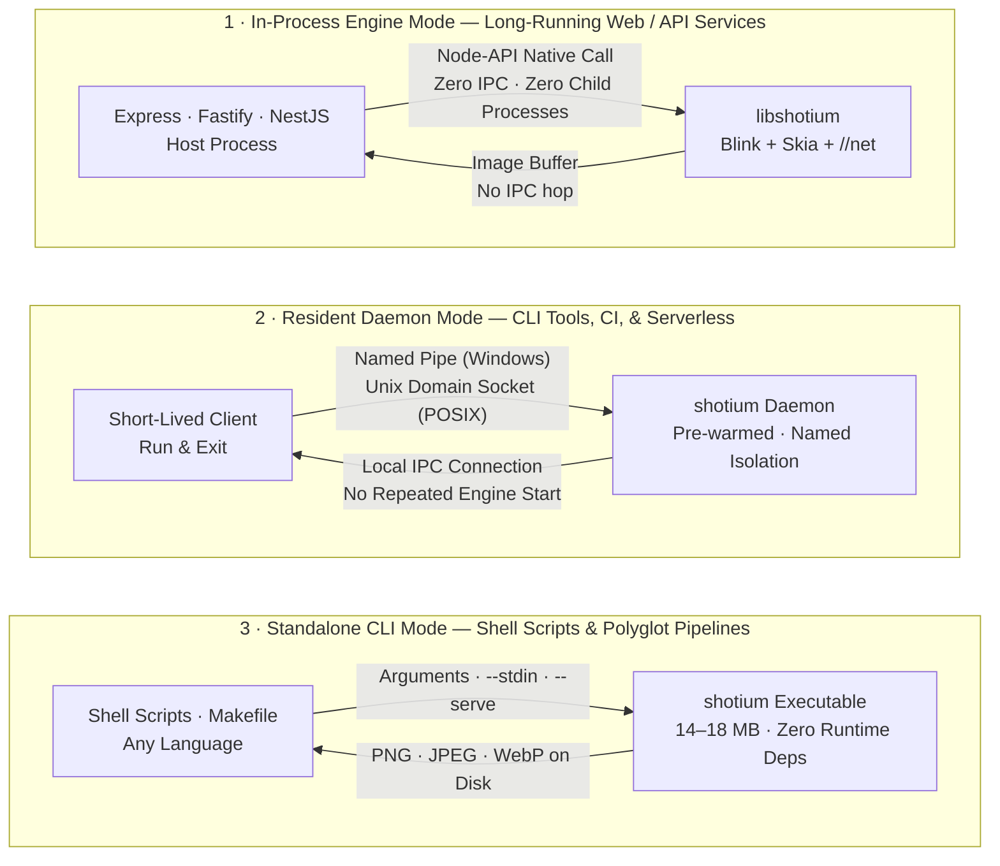
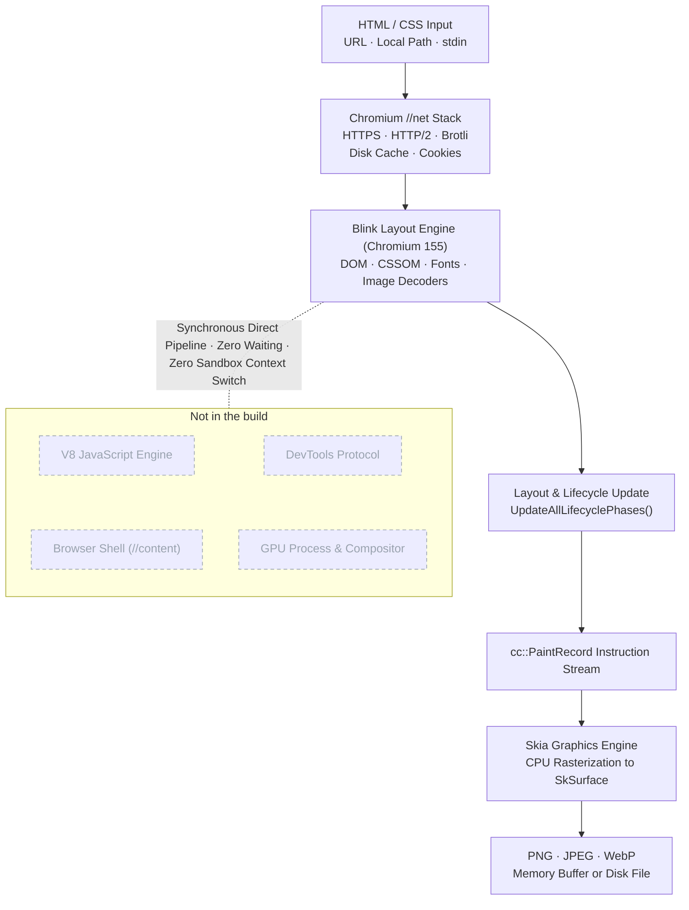

<h1 align="center">shotium</h1>

<p align="center">
  <b>High-performance, lightweight static HTML/CSS screenshot engine powered by Chromium. In-process, sub-50ms capture with no browser shell, V8, or DevTools.</b>
</p>

<p align="center">
  <a href="https://www.npmjs.com/package/@shotkit/shotium"></a>
  <a href="https://chromium.googlesource.com/chromium/src/+/refs/tags/155.0.8048.0"></a>
  <a href="https://github.com/sj817/shotium/releases"></a>
  <a href="https://sj817.github.io/shotium/en/"></a>
  <a href="LICENSE"></a>
</p>

<p align="center">
  <b>English</b> · <a href="README.zh.md">简体中文</a>
</p>

<p align="center">
  
</p>

**shotium** strips Chromium down to its essential rendering pipeline — the Blink layout engine, Skia 2D graphics library, and `//net` network stack — packaged as a compact ~22 MB native engine. It lays out static HTML and CSS with 100% Chrome fidelity, rasterizes on the CPU, and delivers PNG, JPEG, or WebP buffers directly inside your host process.

By stripping out the V8 JavaScript engine, the browser shell (`//content`), the GPU process, and the DevTools remote protocol, shotium eliminates browser startup latency, IPC serialization overhead, and orphaned background processes.

---

## Key Highlights

- **Chromium 155 Baseline Fidelity**: Retained Blink DOM/CSS layout, Skia rasterization, and `//net` stack are synchronized against upstream Chromium `155.0.8048.0`. Full support for modern CSS Grid, Flexbox, Container Queries, `@font-face`, SVG, CSS variables, and gradients with 100% Chrome rendering accuracy.
- **Auditable Cross-Engine Benchmarks**: Native CI compares Shotium with Puppeteer and Playwright engine variants on six platforms; complete runs with complete evidence and no blocking harness or Shotium failure are publishable, while noisy or failed cells are labeled and excluded from rankings. (See [Benchmarks](#benchmarks))
- **Zero External Dependencies**: `npm install @shotkit/shotium` automatically downloads the native prebuilt binary for Windows, macOS, and Linux (x64 and arm64). The engine loads via Node-API directly into your host process — no child processes, no WebSockets, and no lingering zombie browsers.
- **Deterministic Typography & Layout**: Typography uses deterministic grayscale antialiasing with a fixed gamma curve for byte-identical rendering across all operating systems.
- **Auditable Memory Footprint**: The benchmark records the complete owned process tree, peak RSS, and resident memory drift for every engine variant; comparative memory figures are published only when the run passes the quality and evidence gates.
- **Multi-Language & Multi-Mode Ecosystem**: In-process embedding via Node.js (`@shotkit/shotium`), a pre-warmed resident daemon for CLI tools and CI pipelines, a standalone single-file binary for shell scripting, a standard C ABI for Rust, Go, Python, and C++, with runnable examples and no separate language packages planned for now.

---

## Quick Start

### 1. Installation

```bash
# Node.js / TypeScript (npm, pnpm, yarn, bun)
pnpm add @shotkit/shotium
```

### 2. Quick Node.js Example

```ts
import { writeFileSync } from 'node:fs';
import { screenshot } from '@shotkit/shotium';

// Renders URL or local HTML file directly; engine starts automatically on first use
const { image, stats } = await screenshot({
  file: 'https://example.com',
  viewport: { width: 1280, height: 720 },
  type: 'png',
});

console.log(`Rendered in ${stats.timing.render.toFixed(1)}ms (total: ${stats.timing.total.toFixed(1)}ms)`);
writeFileSync('example.png', image!);
```

> 📖 **Looking for comprehensive Node.js & TypeScript documentation?**
> Check out the [Dedicated Node.js Documentation (`apps/demo/shotium/README.md`)](apps/demo/shotium/README.md) for full cookbook recipes, Express/Fastify integration, local file permissions (`allowFileAccess`), and complete TypeScript API reference.

### 3. Standalone CLI

For production environments without Node.js or for shell scripts, prebuilt standalone executables read from file paths, URLs, or standard input (`stdin`):

<p align="center">
  
</p>

---

## Benchmarks

Benchmark figures come from the official [six-platform CI benchmark suite](https://sj817.github.io/shotium/en/). Shotium and the Puppeteer/Playwright Chrome and headless-shell engine variants run identical test scenarios on the same GitHub-hosted runner for each comparison. Publication requires all platform shards and evidence plus no blocking harness or Shotium failure. Noisy and failed cells remain visible but are excluded from formal rankings, so a measured competitor failure cannot erase unrelated passing comparisons. The latest publishable result and its raw archive are linked from [`benchmark-results/LATEST.md`](benchmark-results/LATEST.md). This README deliberately does not pin numbers from an untrusted run.

### Benchmark Methodology

- **Direct Parity**: Speedup ratios are calculated exclusively when both engine variants complete identical scenarios on the same hardware runner and concurrency level. Data marked as `noisy` is displayed explicitly and excluded from formal rankings.
- **Concurrency Architecture**: The harness submits the same request concurrency to one engine instance. It does not force equal internal worker or tab topology, so the result measures each engine variant's real scheduling behavior under that workload.
- **Platform Availability**: Puppeteer provides no native arm64 builds on Linux/Windows, and Playwright runs x64 emulation on Windows arm64; these combinations are reported as `n/a`.
- **Memory Footprint**: RSS and process-tree telemetry are recorded per engine and scenario; memory claims require the same publishability gate as latency claims.

> [!TIP]
> **PGO Optimization Notice & Feedback**:
> Current prebuilt binaries have not yet been trained against an exhaustive production corpus for PGO (Profile-Guided Optimization). While standard web layouts and CSS components perform exceptionally well, certain edge cases, deeply nested documents, or complex CSS combinations may experience sub-optimal throughput. If you encounter rendering bottlenecks or unexpected slowdowns in real-world scenarios, please open an [Issue](https://github.com/sj817/shotium/issues) with a reproducible HTML/CSS sample so we can incorporate it into our PGO training corpus.

---

## Comparison

| Feature / Metric | shotium | Puppeteer / Playwright | Satori (`@vercel/og`) | wkhtmltoimage |
|---|---|---|---|---|
| **Layout Engine** | Chromium Blink 155 + Skia | Full Chromium | Custom Layout Engine | QtWebKit (archived 2023) |
| **CSS Capabilities** | Full modern Chrome CSS (155) | Full modern Chrome CSS | Limited subset (Flexbox only, no Grid) | 2012-era WebKit standard |
| **Input Formats** | HTML file, URL, `stdin` | HTML file, URL | JSX element tree | HTML file, URL |
| **JavaScript Execution** | Disabled (V8 removed) | Supported | N/A | Legacy JavaScriptCore |
| **Execution Architecture** | In-process (Node-API / C ABI) | Separate browser process + IPC | In-process (WASM / JS) | Child process |
| **Distribution Size** | ~22 MB native engine | Browser download (> 100 MB) | Minimal (pure JS / WASM) | Native OS package |
| **First Image Latency (linux-x64)** | [See validated benchmark](https://sj817.github.io/shotium/en/) | [See validated benchmark](https://sj817.github.io/shotium/en/) | N/A | N/A |

### Technology Selection Guide

- **Use Headless Chrome**: When pages require client-side JavaScript execution, dynamic single-page app hydration, or complex user interaction workflows.
- **Use Satori**: When simple layout within a Flexbox subset is sufficient and native binary extensions cannot be deployed in the target environment.
- **Use shotium**: When rendering server-side or static HTML templates requiring 100% pixel-perfect Chromium fidelity, high concurrency throughput, and ultra-low latency and memory consumption.

---

## Use Cases

- **Social Media Previews & Open Graph Images**: High-throughput server-side generation of dynamic preview cards with custom text and user avatars.
- **Invoices, Receipts, & Certificates**: Pixel-perfect rendering of structured financial documents, shipping labels, and credential certificates from HTML/CSS templates.
- **Chatbot Message Cards**: Lightweight replacement for Puppeteer in bot frameworks (e.g., [yunzai-renderer-shotium](https://github.com/sj817/yunzai-renderer-shotium) for Miao-Yunzai, and [zhin-plugin-shotium](https://github.com/sj817/zhin-plugin-shotium) for zhin.js).
- **Report & Dashboard Exports**: Batch server-side export of data reports containing complex SVG charts.
- **Email & Template Previews**: Consistent cross-platform visual validation of HTML email templates.
- **Web Snapshot Generation**: Large-scale thumbnail and page capture pipelines at a fraction of the cost of browser clusters.

---

## Design Non-Goals & Boundaries

- **No JavaScript Execution**: V8 is not compiled into the engine. `<script>` tags are ignored. Documents must be pre-rendered HTML, template outputs, or static pages.
- **No Multi-Process Sandbox**: Chromium's multi-process sandbox has been removed alongside the browser shell. Applications accepting untrusted input must validate URLs and enforce SSRF defenses upstream. `file://` subresource loading is disabled by default (`allowFileAccess: false`).
- **No `data:` URLs as Main Document**: Dynamic HTML markup must be written to a temporary file or supplied via `--stdin` in CLI mode.
- **Single-Threaded Serial Rendering**: Each engine instance processes requests serially via an internal queue. Scale concurrency horizontally using worker processes or multiple named resident daemons.

---

## Execution Modes & Topology



### Mode Selection Matrix

| Use Case | Recommended Mode | Rationale |
|---|---|---|
| **Web & API Services** (Express, Fastify, NestJS) | **In-Process Engine** | Zero IPC overhead, zero startup latency, lowest per-request rendering time. |
| **CLI Tools, CI Pipelines, Serverless Functions** | **Resident Daemon** | Keeps the engine pre-warmed in the background so clients avoid repeated engine starts. |
| **Non-Node Environments & Shell Scripts** | **Standalone CLI** or **C ABI & FFI** | Single portable binary with pipeline support (`--stdin`) and resident service mode (`--serve`). |

---

## Language SDKs & Client Ecosystem

Shotium's native C core supports multiple programming languages and environments:

### 1. Node.js & TypeScript (`@shotkit/shotium`)

The official JavaScript/TypeScript package. It runs in-process via Node-API or connects transparently to a background daemon.

```ts
import shotium, { screenshot } from '@shotkit/shotium';

// In-process server lifecycle
shotium.start({ cacheMaxBytes: 256 * 1024 * 1024 });

const { image } = await screenshot({
  file: './report.html',
  allowFileAccess: true, // required for local subresources (CSS/images/fonts)
  viewport: { width: 1280, height: 720 },
});

// Periodic memory reclamation
shotium.releaseMemory({ releaseWorkingSet: true });

// Graceful shutdown
await shotium.stop();
```

👉 **[Read the complete Node.js Documentation (`apps/demo/shotium/README.md`)](apps/demo/shotium/README.md)** for:
- Three usage paradigms (Direct one-shot, In-process web services, Resident daemon).
- In-memory HTML string rendering via temp files.
- Local subresource security (`allowFileAccess`).
- Atomic zero-copy disk writes via `path`.
- Ultra-tall document slicing (`screenshotTiles`) with `{n}` streaming.
- Cache management (`cache.getFiles()`, `cache.clear({ glob })`).
- Comprehensive TypeScript type definitions and error diagnostics.

---

### 2. Standalone CLI (`shotium`)

Prebuilt standalone binaries are distributed on [GitHub Releases](https://github.com/sj817/shotium/releases) (CLI, shared library, C header and resource packs):

```bash
# 1. Capture a URL with a custom viewport
shotium https://example.com --width 1280 --height 720 -o output.png

# 2. Capture a full-page local HTML file as WebP
shotium --file page.html --full-page --type webp --quality 85 -o output.webp

# 3. Read HTML from standard input pipeline
cat template.html | shotium --stdin --width 800 --height 600 -o banner.png

# 4. Cut a very tall page into tiles; {n} becomes 1, 2, 3 ...
shotium --file article.html --full-page --tile-height 8000 -o article-{n}.png

# 5. Resident service mode: read length-prefixed JSON requests from stdin
shotium --serve --cache-dir /var/tmp/shotium-cache
```

Run `shotium --help` for the complete list of command-line flags.

---


### Language examples and precompiled C ABI

At this early stage, Shotium provides **a common C ABI and precompiled GitHub Release libraries**, rather than separate Go, Python, Rust, C# or Java packages. Dedicated bindings can be published when there is demand. Archives include the shared library, `shot_api.h`, resource packs and integration guide. The existing npm package continues to be published.

[Download and ABI guide](apps/c-abi/README.md) · [Go](apps/go/README.md) · [Python](apps/python/README.md) · [Rust](apps/rust/README.md) · [C#](apps/csharp/README.md) · [Java](apps/java/README.md)

The complete npm package source now lives in [`apps/demo/shotium/`](apps/demo/shotium/README.md), with packaging, loading and CI updated together. See [apps](apps/README.md) for the full example index.

### 3. C ABI & FFI Integration (`shot/shot_api.h`)

For Rust, Go, Python, C++, or any language with C FFI support, shotium exports a clean C interface in [`shot/shot_api.h`](shot/shot_api.h):

```c
#include "shot_api.h"

shot_engine* engine = NULL;
shot_buffer* error = NULL;
shot_engine_create("{}", &engine, &error);

shot_buffer* png = NULL;
shot_buffer* stats = NULL;  /* Optional; pass NULL if metrics are not needed */
shot_engine_capture(engine, "{\"file\":\"https://example.com\"}",
                    &png, &stats, &error);

const uint8_t* data = shot_buffer_data(png);
size_t size = shot_buffer_size(png);

/* Free memory buffers and destroy engine */
shot_buffer_free(png);
shot_buffer_free(stats);
shot_engine_destroy(engine);
```

> **ABI Versioning**: Current ABI version is **3**. ABI 3 adds `shot_engine_capture_tiles()` and the `shot_tile_list_*` ownership API. Call `shot_abi_version()` to verify compatibility against `SHOT_ABI_VERSION`.

---

### 4. Python example / Python 示例

Use the [ctypes example](apps/python/README.md) with a precompiled library; no Shotium pip package is needed. A separately published Python SDK is deferred until there is demand.

---

## Core Engine Parameters & Options

Shotium's CLI flags, Node.js options, and C ABI JSON payloads share the same underlying engine parameters:

| Parameter | CLI Flag | Node.js Option | Description |
|---|---|---|---|
| Target Input | `[url]` or `--file <path>` | `file: string` | URL (`https://`, `http://`, `file://`) or local filesystem path. |
| Stdin Pipe | `--stdin` | N/A | Reads HTML input directly from `stdin`. |
| Viewport | `--width <px> --height <px>` | `viewport: { width, height }` | Layout viewport in CSS pixels. Default: `1280x720`. |
| Full Page | `--full-page` | `fullPage: boolean` | Capture the entire scrollable document height. |
| CSS Selector | `--selector <sel>` | `selector: string` | Capture the bounding box of the matching element (via `Document::querySelector`). |
| Clip Region | `--clip <x,y,w,h>` | `clip: { x, y, width, height }` | Specific rectangular crop region in CSS pixels. |
| Image Format | `--type <png\|jpeg\|webp>` | `type: 'png' \| 'jpeg' \| 'webp'` | Image encoding format. Default: `png`. |
| Quality | `--quality <1-100>` | `quality: number` | Compression quality for `jpeg` and `webp`. Default: `90`. |
| Device Scale | `--scale <dpr>` | `scale: number` | Device pixel ratio (DPR, 0.01–8.0). Default: `1.0`. |
| Transparent BG | `--omit-background` | `omitBackground: boolean` | Preserve transparent alpha background (PNG/WebP only). |
| Output File | `-o <path>` / `--output <path>` | `path: string` | Direct atomic disk write destination. |
| Tile Slicing | `--tile-height <px>` | `tile: { height: number }` | Slices tall pages into horizontal strips (up to 32,000 px each). |
| Local Files | `--allow-file-access` | `allowFileAccess: boolean` | Allow reading local `file://` subresources (fonts/images/CSS). Default: `false`. |
| HTTP Cache | `--cache <mode>` | `cache: CacheMode` | `'default'`, `'reload'`, `'no-store'`, or `'only-if-cached'`. |
| Wait Policy | `--wait-until <mode>` | `pageGotoParams.waitUntil` | `'load'` (default) or `'networkidle'` (waits for 500ms quiet window). |
| Timeout | `--timeout-ms <ms>` | `pageGotoParams.timeout` | Navigation and rendering timeout in ms. Default: `30000`. |

> **Mutual Exclusion**: `fullPage`, `selector`, and `clip` are mutually exclusive.

---

## Architecture



The entire rendering pipeline executes synchronously on a single thread in a single process: no separate renderer process, no compositor frame synchronization, and no JavaScript runtime pauses.

1. **Direct Blink Execution**: shotium instantiates `PageNonOrdinary` and calls `LocalFrameView::UpdateAllLifecyclePhases()` synchronously, completely bypassing `//content` and the compositor.
2. **CPU Rasterization via Skia**: The resulting `cc::PaintRecord` is replayed directly into an in-memory `SkSurface`, with pixel data passed directly to Skia's image encoders.
3. **Embedded Chromium Networking**: Integrates directly with Chromium's `//net` library (`URLRequestContext`, BoringSSL, HTTP/2 SPDY sessions, and disk caching).
4. **Unified Native Core**: Both the Node.js native addon and the standalone CLI invoke the identical underlying `shot::Capture` C++ implementation, ensuring byte-identical rendering output across environments.

---

## Environment Variables

| Variable | Description |
|---|---|
| `SHOTIUM_ENDPOINT` | Overrides the daemon IPC address (Unix domain socket path or Windows named pipe). |
| `SHOTIUM_DAEMON_LOG` | Output path for diagnostics logs from daemons spawned by `daemon.connect()`. |

When developing from source, configure `resourceDir` to point to compiled data packs:

```ts
shotium.start({ resourceDir: '/path/to/out/Shot' });
```

---

## Building from Source

### Prerequisites

- [depot_tools](https://commondatastorage.googleapis.com/chrome-infra-docs/flat/depot_tools/docs/html/depot_tools_tutorial.html#_setting_up) installed and added to `PATH`
- At least 40 GB of free disk space
- Platform compiler toolchains:
  - **Windows**: Visual Studio 2022 and Windows SDK (10.0.26100.0 or 10.0.28000)
  - **macOS**: Xcode
  - **Linux**: Run `./build/install-build-deps.sh --no-prompt --no-nacl`

### Build Steps

```bash
mkdir shotium-build && cd apps/demo/shotium-build

cat > .gclient <<'EOF'
solutions = [{
  "name": "src",
  "url": "https://github.com/sj817/shotium.git",
  "managed": False,
  "custom_deps": {},
  "custom_vars": {"checkout_configuration": "small"},
}]
target_os = ["win"] # or ["mac"], ["linux"]
EOF

gclient sync --nohooks --no-history
gclient runhooks

cd src

# Repack stripped ICU data tables (once per checkout: pnpm -C scripts install)
pnpm icu:repack third_party/icu/cast/icudtl.dat third_party/icu/shot/icudtl.dat --preset shot

mkdir -p out/Shot
echo 'import("//build/args/shot.gn")' > out/Shot/args.gn
# macOS: echo 'import("//build/args/shot-mac.gn")' > out/Shot/args.gn
# Linux: echo 'import("//build/args/shot-linux.gn")' > out/Shot/args.gn

gn gen out/Shot
ninja -C out/Shot shot
```

### Test Suites

```bash
pnpm verify:serve  out/Shot/shotium.exe  # Protocol and image codec validation
pnpm verify:net    out/Shot/shotium.exe  # HTTP, TLS, redirects, and caching validation
pnpm verify:node   out/Shot/shotium.exe  # Addon bindings, queue, and lifecycle tests
pnpm verify:daemon out/Shot/shotium.exe  # Daemon IPC and concurrency tests
pnpm verify:demos  out/Shot/shotium.exe  # Visual regression reftests (84 cases)
```

---

## Documentation Assets

All images and demo recordings in this documentation are generated directly from sources in [`docs/demo/`](docs/demo):

```bash
pnpm run docs:assets   # Regenerate card.webp, example-node.webp, example-cli.webp
pnpm run docs:demo     # Regenerate demo.gif (recorded via docs/demo.tape)
pnpm run docs          # Run full asset generation suite
```

---

## License

BSD-3-Clause, matching upstream Chromium. See [LICENSE](LICENSE).

### Node native entry

The Node-API addon is built by GN with the engine core: `pnpm build:engine
--target shot_node` produces `out/Shot/shotium.node`. Screenshot requests and
statistics cross the Node boundary as objects. Rendering stays on the engine
thread and completes Promises through Node-API; captures do not occupy libuv
workers while waiting for rendering. Public `stop()`/`start()` behavior is unchanged.

The npm platform packages contain the self-contained `.node`, CLI and resource
packs. The independent C ABI library remains available in GitHub Release
archives; Node does not load it. Building the addon requires the full source
checkout and the pinned SDK prepared by `scripts/node-sdk.ts`, not node-gyp.
