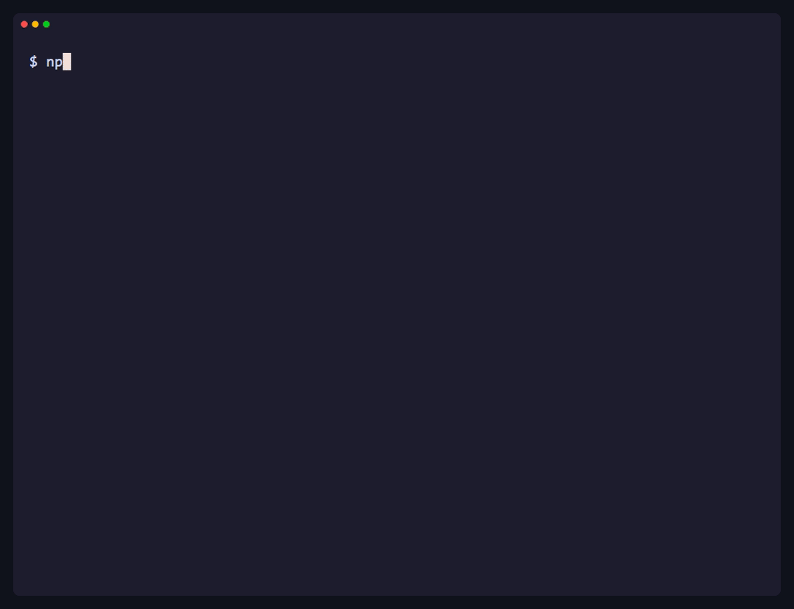
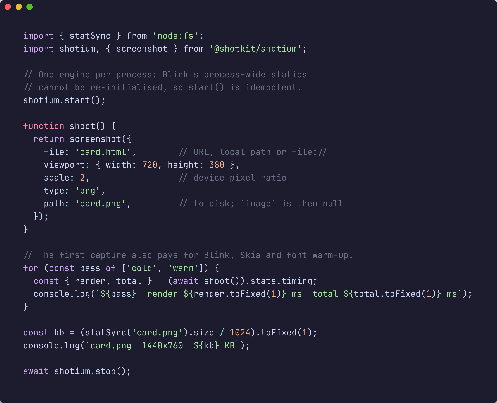
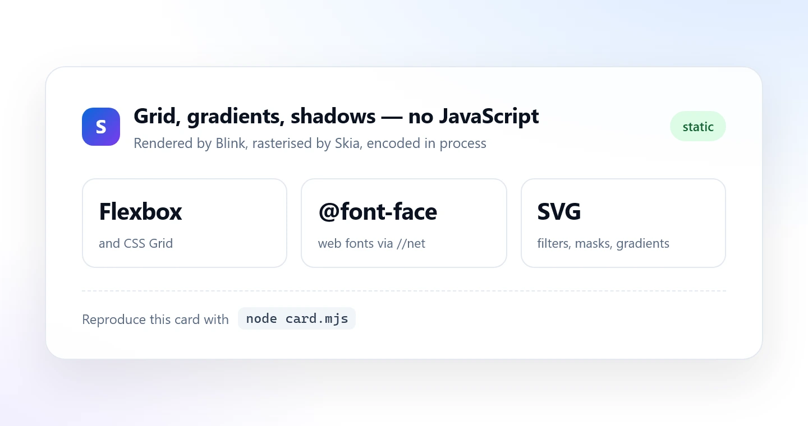
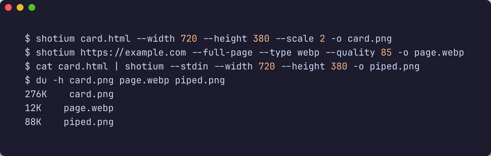
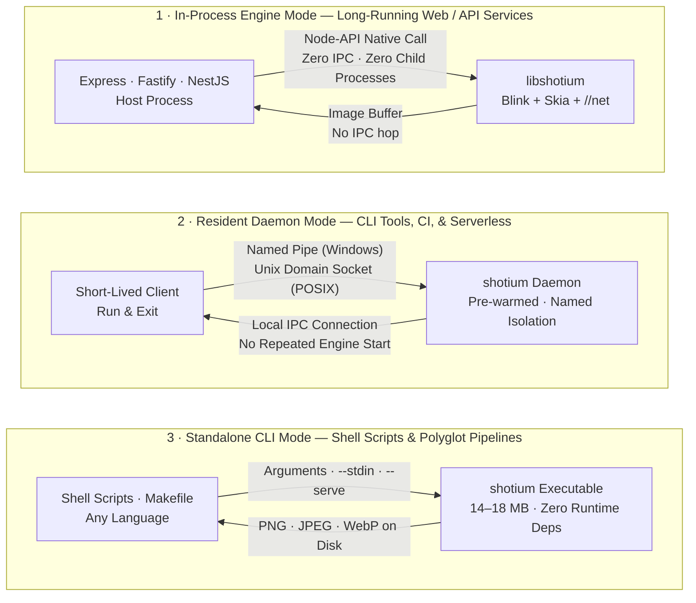
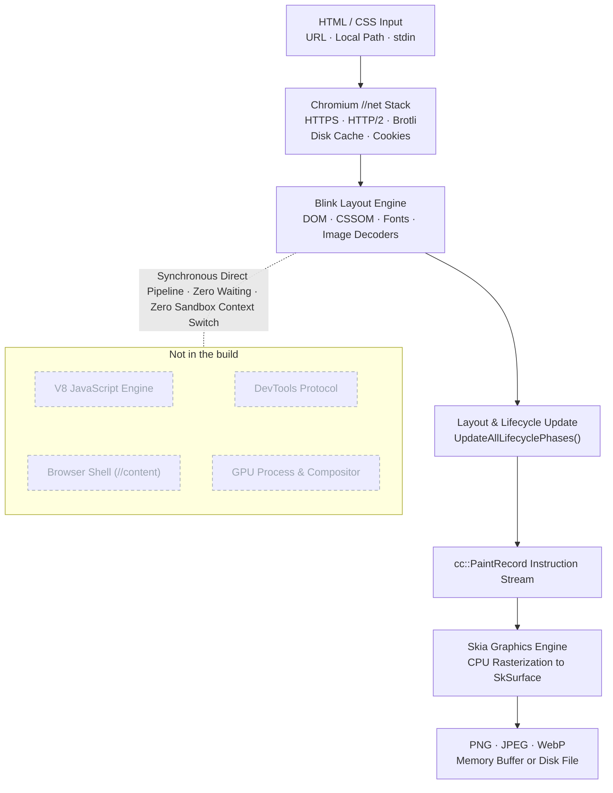

<h1 align="center">shotium</h1>

<p align="center">
  <b>High-performance, lightweight static HTML/CSS screenshot engine powered by Chromium. In-process, sub-50ms capture with no browser shell, V8, or DevTools.</b>
</p>

<p align="center">
  <a href="https://www.npmjs.com/package/@shotkit/shotium"></a>
  <a href="https://github.com/sj817/shotium/releases"></a>
  <a href="https://sj817.github.io/shotium/en/"></a>
  <a href="LICENSE"></a>
</p>

<p align="center">
  <b>English</b> · <a href="README.zh.md">简体中文</a>
</p>

<p align="center">
  
</p>

**shotium** strips Chromium down to its essential rendering pipeline — the Blink layout engine, Skia 2D graphics library, and `//net` network stack — packaged as a compact ~22 MB npm dependency. It lays out static HTML and CSS with 100% Chrome fidelity, rasterizes on the CPU, and delivers PNG, JPEG, or WebP buffers directly inside your host process.

By stripping out the V8 JavaScript engine, the browser shell (`//content`), the GPU process, and the DevTools remote protocol, shotium eliminates browser startup latency, IPC serialization overhead, and orphaned background processes.

---

## Key Highlights

- **Auditable Cross-Engine Benchmarks**: Native CI compares Shotium with Puppeteer and Playwright engine variants on six platforms; only complete, quality-passing runs with complete evidence are publishable. (See [Benchmarks](#benchmarks))
- **Zero External Dependencies**: `pnpm add` automatically downloads the native prebuilt binary for Windows, macOS, and Linux (x64 and arm64). The engine loads via Node-API directly into your host process — no child processes, no WebSockets, and no lingering zombie browsers.
- **Full Chromium CSS Compatibility**: Complete support for CSS Grid, Flexbox, `@font-face`, SVG, gradients, box shadows, filters, and CSS variables. Typography uses deterministic grayscale antialiasing with a fixed gamma curve for byte-identical rendering across all platforms.
- **Auditable Memory Footprint**: The benchmark records the complete owned process tree, peak RSS, and resident memory drift for every engine variant; comparative memory figures are published only when the run passes the quality and evidence gates.
- **Flexible Deployment Models**: In-process embedding for long-lived backend services, a pre-warmed resident daemon for CLI tools and CI pipelines, a standalone single-file binary for shell scripting, and a standard C ABI for Rust, Go, Python, and C++.

---

## Quick Start

### 1. Installation

```bash
# pnpm 9.15.9
pnpm add @shotkit/shotium
```

### 2. Node.js / TypeScript Example

The snippet below is [`docs/demo/card.mjs`](docs/demo/card.mjs), the exact script executed in the demo recording:

<p align="center">
  
</p>

<details>
<summary>Click to view full source code</summary>

```ts
import { statSync } from 'node:fs';
import shotium, { screenshot } from '@shotkit/shotium';

// Initialize the engine (singleton per process; idempotent)
shotium.start();

function shoot() {
  return screenshot({
    file: 'card.html',        // Remote URL, local relative/absolute path, or file://
    viewport: { width: 720, height: 380 },
    scale: 2,                 // Device pixel ratio (DPR)
    type: 'png',
    path: 'card.png',         // Output file path; returns null buffer when path is set
  });
}

// First call warms up subsystems and font caches; subsequent calls run warm
for (const pass of ['cold', 'warm']) {
  const { render, total } = (await shoot()).stats.timing;
  console.log(`${pass}  render ${render.toFixed(1)} ms  total ${total.toFixed(1)} ms`);
}

const kb = (statSync('card.png').size / 1024).toFixed(1);
console.log(`card.png  1440x760  ${kb} KB`);

// Gracefully shut down the engine
await shotium.stop();
```

</details>

Input document [`docs/demo/card.html`](docs/demo/card.html) rendered by Blink and Skia:

<p align="center">
  
</p>

### 3. Standalone CLI

For production environments without Node.js or for shell scripts, prebuilt standalone executables read from file paths, URLs, or standard input (`stdin`):

<p align="center">
  
</p>

---

## Benchmarks

Benchmark figures come from the official [six-platform CI benchmark suite](https://sj817.github.io/shotium/en/). Shotium and the Puppeteer/Playwright Chrome and headless-shell engine variants run identical test scenarios on the same GitHub-hosted runner for each comparison. Only complete, quality-passing runs with complete evidence are publishable; failed and noisy attempts remain available as diagnostics but are not performance claims. The latest publishable result and its raw archive are linked from [`benchmark-results/LATEST.md`](benchmark-results/LATEST.md). This README deliberately does not pin numbers from an untrusted run.

### Benchmark Methodology

- **Direct Parity**: Speedup ratios are calculated exclusively when both engine variants complete identical scenarios on the same hardware runner and concurrency level. Data marked as `noisy` is displayed explicitly and excluded from formal rankings.
- **Concurrency Architecture**: The harness submits the same request concurrency to one engine instance. It does not force equal internal worker or tab topology, so the result measures each engine variant's real scheduling behavior under that workload.
- **Platform Availability**: Puppeteer provides no native arm64 builds on Linux/Windows, and Playwright runs x64 emulation on Windows arm64; these combinations are reported as `n/a`.
- **Memory Footprint**: RSS and process-tree telemetry are recorded per engine and scenario; memory claims require the same publishability gate as latency claims.

> [!TIP]
> **PGO Optimization Notice & Feedback**:
> Current prebuilt binaries have not yet been trained against an exhaustive production corpus for PGO (Profile-Guided Optimization). While standard web layouts and CSS components perform exceptionally well, certain edge cases, deeply nested documents, or complex CSS combinations may experience sub-optimal throughput. If you encounter rendering bottlenecks or unexpected slowdowns in real-world scenarios, please open an [Issue](https://github.com/sj817/shotium/issues) with a reproducible HTML/CSS sample so we can incorporate it into our PGO training corpus.

---

## Comparison

| Feature / Metric | shotium | Puppeteer / Playwright | Satori (`@vercel/og`) | wkhtmltoimage |
|---|---|---|---|---|
| **Layout Engine** | Chromium Blink + Skia | Full Chromium | Custom Layout Engine | QtWebKit (archived 2023) |
| **CSS Capabilities** | Full modern Chrome CSS | Full modern Chrome CSS | Limited subset (Flexbox only, no Grid) | 2012-era WebKit standard |
| **Input Formats** | HTML file, URL, `stdin` | HTML file, URL | JSX element tree | HTML file, URL |
| **JavaScript Execution** | Disabled (V8 removed) | Supported | N/A | Legacy JavaScriptCore |
| **Execution Architecture** | In-process (Node-API / C ABI) | Separate browser process + IPC | In-process (WASM / JS) | Child process |
| **Distribution Size** | ~22 MB standalone | Browser download (> 100 MB) | Minimal (pure JS / WASM) | Native OS package |
| **First Image Latency (linux-x64)** | [See validated benchmark](https://sj817.github.io/shotium/en/) | [See validated benchmark](https://sj817.github.io/shotium/en/) | N/A | N/A |

### Technology Selection Guide

- **Use Headless Chrome**: When pages require client-side JavaScript execution, dynamic single-page app hydration, or complex user interaction workflows.
- **Use Satori**: When simple layout within a Flexbox subset is sufficient and native binary extensions cannot be deployed in the target environment.
- **Use shotium**: When rendering server-side or static HTML templates requiring 100% pixel-perfect Chromium fidelity, high concurrency throughput, and ultra-low latency and memory consumption.

---

## Use Cases

- **Social Media Previews & Open Graph Images**: High-throughput server-side generation of dynamic preview cards with custom text and user avatars.
- **Invoices, Receipts, & Certificates**: Pixel-perfect rendering of structured financial documents, shipping labels, and credential certificates from HTML/CSS templates.
- **Chatbot Message Cards**: Lightweight replacement for Puppeteer in bot frameworks (e.g., [yunzai-renderer-shotium](https://github.com/sj817/yunzai-renderer-shotium) for Miao-Yunzai, and [zhin-plugin-shotium](https://github.com/sj817/zhin-plugin-shotium) for zhin.js).
- **Report & Dashboard Exports**: Batch server-side export of data reports containing complex SVG charts.
- **Email & Template Previews**: Consistent cross-platform visual validation of HTML email templates.
- **Web Snapshot Generation**: Large-scale thumbnail and page capture pipelines at a fraction of the cost of browser clusters.

---

## Design Non-Goals & Boundaries

- **No JavaScript Execution**: V8 is not compiled into the engine. `<script>` tags are ignored. Documents must be pre-rendered HTML, template outputs, or static pages.
- **No Multi-Process Sandbox**: Chromium's multi-process sandbox has been removed alongside the browser shell. Applications accepting untrusted input must validate URLs and enforce SSRF defenses upstream. `file://` subresource loading is disabled by default (`allowFileAccess: false`).
- **No `data:` URLs as Main Document**: Dynamic HTML markup must be written to a temporary file or supplied via `--stdin` in CLI mode.
- **Single-Threaded Serial Rendering**: Each engine instance processes requests serially via an internal queue. Scale concurrency horizontally using worker processes or multiple named resident daemons.

---

## Execution Modes



### Mode Selection Matrix

| Use Case | Recommended Mode | Rationale |
|---|---|---|
| **Web & API Services** (Express, Fastify, NestJS) | [In-Process Engine](#1-in-process-engine) | Zero IPC overhead, zero startup latency, lowest per-request rendering time. |
| **CLI Tools, CI Pipelines, Serverless Functions** | [Resident Daemon](#2-resident-daemon) | Keeps the engine pre-warmed in the background so clients avoid repeated engine starts. |
| **Non-Node Environments & Shell Scripts** | [Standalone CLI](#3-standalone-cli) or [C ABI & FFI Integration](#c-abi-ffi-integration) | Single portable binary with pipeline support (`--stdin`) and resident service mode (`--serve`). |

---

## Detailed Usage

### 1. In-Process Engine

Loads directly into the Node.js process via Node-API, bound to the C ABI defined in [`shot/shot_api.h`](shot/shot_api.h). Calling `screenshot()` resolves directly to an in-memory image buffer.

```ts
import { writeFile } from 'node:fs/promises';
import { tmpdir } from 'node:os';
import { join } from 'node:path';
import shotium, { screenshot } from '@shotkit/shotium';

// 1. Initialize engine and inspect disk cache status
const { cacheDir, cacheActive } = shotium.start();

// 2. Capture a remote URL
const res1 = await screenshot({
  file: 'https://example.com',
  viewport: { width: 1280, height: 720 },
  type: 'webp',
  quality: 85,
});

// 3. Capture dynamically assembled HTML via temporary file
const html = `<div style="padding: 24px; background: #f6f8fa;"><h2>Invoice #1024</h2></div>`;
const page = join(tmpdir(), 'invoice-1024.html');
await writeFile(page, html);

const res2 = await screenshot({
  file: page,
  viewport: { width: 600, height: 300 },
});

// 4. Proactive memory management after burst traffic:
//    releaseMemory() clears Blink heap, Skia caches, and PartitionAlloc free lists;
//    releaseWorkingSet: true requests OS-level physical memory trimming.
shotium.releaseMemory({ releaseWorkingSet: true });

// 5. Cleanly shut down
await shotium.stop();
```

#### Lifecycle & Behavioral Characteristics

- **Process-Wide Singleton**: Because Blink relies on immutable process-level global state, all `Runtime` instances and top-level functions in a process share the same underlying engine.
- **`start()` & `stop()`**: `stop()` drains in-flight requests, sets `running: false`, and trims the working set. A subsequent `start()` reactivates the engine immediately while preserving warm disk cache entries.
- **Immutable Configuration**: Startup options are locked on the first `start()` invocation; calling `start()` with conflicting options throws an explicit error.
- **Serial Queue**: Concurrent `screenshot()` calls are queued and processed sequentially. Scale across worker processes for parallel rendering.
- **Cache Status Awareness**: `start()` and `status()` return `{ running, cacheDir, cacheActive }`. If the cache directory is inaccessible, `cacheActive` is `false` and the engine gracefully continues in no-cache mode.

### 2. Resident Daemon

Designed for short-lived CLI tasks, CI job steps, and serverless handlers where eliminating repeated cold-start latency is essential.

The daemon hosts the engine in a background process accessible via local IPC (named pipes on Windows, Unix domain sockets on POSIX). It pre-warms subsystems by rendering a blank document on boot, allowing clients to avoid repeated engine startup and use the warm capture path immediately.

```ts
import { daemon } from '@shotkit/shotium';

// 1. Connect to an existing daemon or start one automatically
const client = await daemon.connect({
  name: 'default',          // Optional: isolate daemons by instance name
  idleTimeoutMs: 300000,    // Inactivity timeout in ms (default 5 min; 0 = infinite)
  prewarm: true,            // Automatically perform pre-warm render on startup
});

// 2. Perform screenshot capture
const { image, stats } = await client.screenshot({
  file: 'https://example.com',
  viewport: { width: 1280, height: 720 },
});

// 3. Client cleanup and memory management
const clientStatus = await client.status();
await client.releaseMemory({ releaseWorkingSet: false });
client.close();

// 4. Process management (optional)
const daemonInfo = await daemon.status();
console.log(`Daemon PID: ${daemonInfo.pid}, Uptime: ${daemonInfo.uptimeMs}ms, Served: ${daemonInfo.served}`);

await daemon.stop();
```

- **Multiplexed Requests**: A single connection supports multiple concurrent requests; each message includes a unique `id` and responses are returned as completed.
- **Instance Isolation**: Each daemon instance renders serially; launch multiple daemons with distinct `name` values for parallel processing.

### 3. Standalone CLI

Download prebuilt platform binaries from [GitHub Releases](https://github.com/sj817/shotium/releases) (14–18 MB `.7z` archive, zero external runtime dependencies):

```bash
# 1. Capture a URL with a custom viewport
shotium https://example.com --width 1280 --height 720 -o output.png

# 2. Capture a full-page local HTML file as WebP
shotium --file page.html --full-page --type webp --quality 85 -o output.webp

# 3. Read HTML from standard input pipeline
cat template.html | shotium --stdin --width 800 --height 600 -o banner.png

# 4. Resident service mode: read length-prefixed JSON requests from stdin
shotium --serve --cache-dir /var/tmp/shotium-cache
```

CLI flags (`--selector`, `--scale`, `--omit-background`, `--wait-until`, `--timeout-ms`, `--user-agent`, `--cache-max-bytes`, etc.) correspond directly to API options. Run `shotium --help` for the complete option reference.

---

## API Reference

### `ScreenshotOptions`

```ts
interface ScreenshotOptions {
  /** Target URL (http/https/file protocol) or local file path */
  file: string;

  /** Output image format (default: 'png') */
  type?: 'png' | 'jpeg' | 'webp';

  /** Viewport dimensions (default: 1280x720) */
  viewport?: { width?: number; height?: number };

  /** Capture full scrollable document */
  fullPage?: boolean;

  /** Capture bounding box of the first matching CSS selector */
  selector?: string;

  /** Crop rectangle in CSS pixels */
  clip?: { x: number; y: number; width: number; height: number };

  /** Compression quality 1–100 (jpeg and webp only; default: 90) */
  quality?: number;

  /** Device scale factor (DPR) 0.01–8.0 (default: 1.0) */
  scale?: number;

  /** Preserve transparent alpha channel instead of white background (png/webp only; default: false) */
  omitBackground?: boolean;

  /** Output file path. When set, writes directly to disk and `image` buffer is null */
  path?: string;

  /** Navigation and load control */
  pageGotoParams?: {
    /** Navigation timeout in milliseconds (default: 30000) */
    timeout?: number;
    /**
     * Wait condition:
     * - 'load': DOM parsed and all subresources loaded (default)
     * - 'networkidle': wait until no active network requests for at least 500 ms
     */
    waitUntil?: 'load' | 'networkidle';
  };

  /** Allow loading local file:// subresources (default: false) */
  allowFileAccess?: boolean;

  /** HTTP cache policy (default: 'default') */
  cache?: 'default' | 'reload' | 'no-store' | 'only-if-cached';

  /** Additional request headers (sent exclusively to same-origin requests) */
  headers?: Record<string, string>;
}
```

> **Mutual Exclusion**: `fullPage`, `selector`, and `clip` are mutually exclusive. Specifying more than one will throw a validation error.

#### `ScreenshotResult`

```ts
interface ScreenshotResult {
  /** Encoded image buffer; null when `path` is specified and file is written */
  image: Buffer | null;
  /** Detailed timing breakdown and network statistics */
  stats: CaptureStats;
}
```

#### Parameter Details

- **`file` Schemes**: Supports `https://example.com`, `./template.html`, `/absolute/path/index.html`, and `file:///...`. Dynamic markup must be saved to a file or supplied via `--stdin` in CLI mode; `data:` URLs are not accepted.
- **`cache` Policy Semantics**: Follows the standard Fetch API specification:
  - `default`: Standard HTTP caching rules.
  - `reload`: Bypasses cache, fetches from origin, and updates cache.
  - `no-store`: Completely bypasses cache reading and writing.
  - `only-if-cached`: Reads exclusively from disk cache; fails immediately on cache miss without network access.
- **`headers` Same-Origin Security**: Custom headers (e.g., `Authorization`, `Cookie`) are strictly sent to same-origin targets and are never forwarded to third-party assets (CDNs, fonts, cross-origin images).

---

### `StartOptions`

```ts
interface StartOptions {
  /**
   * HTTP disk cache directory.
   * Defaults to ~/.shotium/cache/<project-hash>; pass null to disable caching.
   */
  cacheDir?: string | null;

  /** Maximum disk cache size in bytes (default: 256 MB) */
  cacheMaxBytes?: number;

  /** Custom User-Agent header */
  userAgent?: string;

  /** Directory containing shotium_data.pak and shotium_strings.pak (source checkouts) */
  resourceDir?: string;
}
```

#### `StartResult`

```ts
interface StartResult {
  /** Whether the engine is initialized and running */
  running: boolean;
  /** Active cache directory path; null when caching is disabled */
  cacheDir: string | null;
  /** Whether the cache directory is actively in use */
  cacheActive: boolean;
}
```

---

### `CaptureStats`

Each capture returns a fine-grained timing and network metric breakdown:

```ts
interface CaptureStats {
  requests: number;     // Total resources requested (including root document)
  fromCache: number;    // Resources served from HTTP disk cache
  failed: number;       // Failed subresource requests
  bytes: number;        // Total decoded response body bytes
  httpStatus: number;   // HTTP status code of root document (0 for local files)
  finalUrl: string;     // Final URL after resolving redirects
  timing: {
    fetch: number;      // Document fetch: DNS, TCP, TLS handshake, round trips
    render: number;     // Core rendering: HTML parse, subresources, layout, paint
    setup: number;      // Page/Frame initialization, document attachment
    wait: number;       // DOM parse wait, load event, subresource resolution
    lifecycle: number;  // Bounding box calculation, style recalculation, layout lifecycle
    paint: number;      // cc::PaintRecord extraction
    raster: number;     // SkSurface allocation and Skia rasterization replay
    encode: number;     // Image encoding (PNG/JPEG/WebP)
    total: number;      // Total wall-clock duration for capture
  };
}
```

#### Latency Breakdown

For un-cached remote HTTPS requests, `timing.fetch` constitutes the majority of total latency; on disk cache hits, network latency drops below 1 ms:

| Scenario | `fetch` Phase | `render` Phase | `total` Wall-Clock |
|---|--:|--:|--:|
| Local file (`file:` or path) | 0.2 ms | 20 ms | 25 ms |
| HTTPS remote page (cold request) | 321.1 ms | 16 ms | 350 ms |
| HTTPS remote page (cache hit) | 0.7 ms | 18 ms | 31 ms |

- **`fromCache` Semantics**: Only counts responses whose body is served directly from disk. Conditional requests returning `304 Not Modified` still incur network round-trip latency.
- **Error Diagnostics**: On capture failure or timeout, the thrown error object contains `error.stats` with all metrics collected up to the point of failure.

---

### `daemon` Module

```ts
import { daemon } from '@shotkit/shotium';

// 1. Establish connection (auto-spawns daemon if needed)
const client = await daemon.connect({
  name: 'custom-pool',      // Optional: isolate daemons by instance name
  idleTimeoutMs: 300000,    // Idle timeout before auto-exit (ms)
  prewarm: true,            // Pre-warm rendering on daemon boot
});

// 2. Client operations
const res = await client.screenshot({ file: 'https://example.com' });
const status = await client.status();
await client.releaseMemory({ releaseWorkingSet: false });
client.close();

// 3. Process management
const info: DaemonStatus = await daemon.status();
await daemon.stop();
```

#### `DaemonStatus`

```ts
interface DaemonStatus {
  pid: number;              // Process ID of the daemon
  endpoint: string;         // Socket path or named pipe identifier
  cacheDir: string | null;  // Active disk cache path
  warm: boolean;            // Whether startup pre-warm has finished
  uptimeMs: number;         // Uptime in milliseconds
  connections: number;      // Active client connection count
  inFlight: number;         // Requests currently being rendered
  served: number;           // Total requests completed since startup
  idleTimeoutMs: number;    // Configured idle timeout duration
  version: string;          // Core engine version string
}
```

---

### `cache` Module

The HTTP disk cache is shared across processes and persists across engine restarts:

```ts
import { cache } from '@shotkit/shotium';

// 1. Query cache directories
cache.getDir();                     // Current project's cache path (absolute)
cache.getDirs({ target: 'all' });   // All shotium cache directories on machine

// 2. List cache entries
const files = await cache.getFiles(); // [{ url, lastUsedMs, bytes, dir }, ...]

// 3. Evict cache entries and retrieve results
const result: CacheClearResult = await cache.clear({
  glob: ['https://example.com/**'], // URL glob pattern matching
  maxAge: 86400,                    // Evict entries unused for > 24 hours (seconds)
  maxSize: 64 * 1024 * 1024,        // Trim total size to within 64 MB via LRU
});

console.log(`Removed: ${result.removed}, Bytes before: ${result.bytesBefore}, Bytes after: ${result.bytesAfter}`);
```

- **Storage Location**: Located under `~/.shotium/cache/<project-hash>`, avoiding temporary OS `/tmp` paths that are wiped on reboot.
- **Index Integrity**: Entries are keyed by URL hash and managed via an index file; always evict via the `cache` API rather than manual file deletion.
- **Multi-Process Concurrency**: Built-in file locking ensures safe concurrent access across multiple processes.

---

## Architecture



The entire rendering pipeline executes synchronously on a single thread in a single process: no separate renderer process, no compositor frame synchronization, and no JavaScript runtime pauses.

1. **Direct Blink Execution**: shotium instantiates `PageNonOrdinary` and calls `LocalFrameView::UpdateAllLifecyclePhases()` synchronously, completely bypassing `//content` and the compositor.
2. **CPU Rasterization via Skia**: The resulting `cc::PaintRecord` is replayed directly into an in-memory `SkSurface`, with pixel data passed directly to Skia's image encoders.
3. **Embedded Chromium Networking**: Integrates directly with Chromium's `//net` library (`URLRequestContext`, BoringSSL, HTTP/2 SPDY sessions, and disk caching).
4. **Unified Native Core**: Both the Node.js native addon and the standalone CLI invoke the identical underlying `shot::Capture` C++ implementation, ensuring byte-identical rendering output across environments.

---

## Environment Variables

| Variable | Description |
|---|---|
| `SHOTIUM_ENDPOINT` | Overrides the daemon IPC address (Unix domain socket path or Windows named pipe). |
| `SHOTIUM_DAEMON_LOG` | Output path for diagnostics logs from daemons spawned by `daemon.connect()`. |

When developing from source, configure `resourceDir` to point to compiled data packs:

```ts
shotium.start({ resourceDir: '/path/to/out/Shot' });
```

---

## C ABI & FFI Integration

For C++, Rust, Go, Python, or any language supporting C FFI, shotium exports a clean C interface in [`shot/shot_api.h`](shot/shot_api.h):

```c
#include "shot_api.h"

shot_engine* engine = NULL;
shot_buffer* error = NULL;
shot_engine_create("{}", &engine, &error);

shot_buffer* png = NULL;
shot_buffer* stats = NULL;  /* Optional; pass NULL if metrics are not needed */
shot_engine_capture(engine, "{"file":"https://example.com"}",
                    &png, &stats, &error);

const uint8_t* data = shot_buffer_data(png);
size_t size = shot_buffer_size(png);

/* Free memory buffers and destroy engine */
shot_buffer_free(png);
shot_buffer_free(stats);
shot_engine_destroy(engine);
```

> **ABI Versioning**: Current ABI version is **2** (introduced in 0.3 with `out_stats`, `shot_engine_status`, `shot_cache_list`, and `shot_cache_clear`). Call `shot_abi_version()` to verify compatibility against `SHOT_ABI_VERSION`.

---

## Building from Source

### Prerequisites

- [depot_tools](https://commondatastorage.googleapis.com/chrome-infra-docs/flat/depot_tools/docs/html/depot_tools_tutorial.html#_setting_up) installed and added to `PATH`
- At least 40 GB of free disk space
- Platform compiler toolchains:
  - **Windows**: Visual Studio 2022 and Windows SDK (10.0.26100.0 or 10.0.28000)
  - **macOS**: Xcode
  - **Linux**: Run `./build/install-build-deps.sh --no-prompt --no-nacl`

### Build Steps

```bash
mkdir shotium-build && cd shotium-build

cat > .gclient <<'EOF'
solutions = [{
  "name": "src",
  "url": "https://github.com/sj817/shotium.git",
  "managed": False,
  "custom_deps": {},
  "custom_vars": {"checkout_configuration": "small"},
}]
target_os = ["win"] # or ["mac"], ["linux"]
EOF

gclient sync --nohooks --no-history
gclient runhooks

cd src

# Repack stripped ICU data tables
python3 tools/shot/icu_repack.py   third_party/icu/cast/icudtl.dat   third_party/icu/shot/icudtl.dat --preset shot

mkdir -p out/Shot
echo 'import("//build/args/shot.gn")' > out/Shot/args.gn
# macOS: echo 'import("//build/args/shot-mac.gn")' > out/Shot/args.gn
# Linux: echo 'import("//build/args/shot-linux.gn")' > out/Shot/args.gn

gn gen out/Shot
ninja -C out/Shot shot
```

For Profile-Guided Optimization (PGO) builds, use the helper script to run instrumented builds, benchmark training, profile merging, and final optimized compilation:

```bash
python3 tools/shot/pgo.py --out out/ShotPgo --jobs 12
```

### Test Suites

```bash
python tools/shot/serve_check.py   out/Shot/shotium.exe  # Protocol and image codec validation
python tools/shot/net_check.py     out/Shot/shotium.exe  # HTTP, TLS, redirects, and caching validation
node   tools/shot/node_check.cjs   out/Shot/shotium.exe  # Addon bindings, queue, and lifecycle tests
node   tools/shot/daemon_check.cjs out/Shot/shotium.exe  # Daemon IPC and concurrency tests
python tools/shot/demo_check.py    out/Shot/shotium.exe  # Visual regression reftests (84 cases)
```

To compile the Node.js native addon against a local shared library build:

```bash
export SHOT_INCLUDE_DIR=$PWD/shot SHOT_LIB_DIR=$PWD/out/Shot
pnpm dlx node-gyp@13 rebuild -C shotium/native
cp out/Shot/libshotium.so out/Shot/*.pak shotium/native/build/Release/
pnpm --dir shotium install --no-lockfile && pnpm --dir shotium run build
```

---

## Documentation Assets

All images and demo recordings in this documentation are generated directly from sources in [`docs/demo/`](docs/demo):

```bash
pnpm run docs:assets   # Regenerate card.webp, example-node.webp, example-cli.webp
pnpm run docs:demo     # Regenerate demo.gif (recorded via docs/demo.tape)
pnpm run docs          # Run full asset generation suite
```

- `docs:assets`: Renders `card.html` via shotium, using [freeze](https://github.com/charmbracelet/freeze) and ffmpeg to freeze `card.mjs` and terminal sessions into crisp code graphics.
- `docs:demo`: Records [`docs/demo.tape`](docs/demo.tape) using [vhs](https://github.com/charmbracelet/vhs) (with ttyd, ffmpeg, and bash). Runs clean installation and real captures on a published package.
- The CLI demonstration uses `shotium` (configured via `SHOTIUM_CLI=...` or located in `out/Shot*`); if no binary is found, it automatically falls back to [`docs/demo/cli-session.txt`](docs/demo/cli-session.txt).

---

## License

BSD-3-Clause, matching upstream Chromium. See [LICENSE](LICENSE).\n
