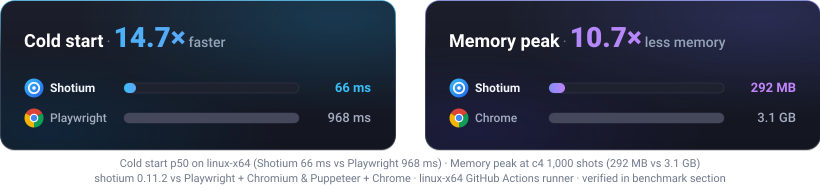
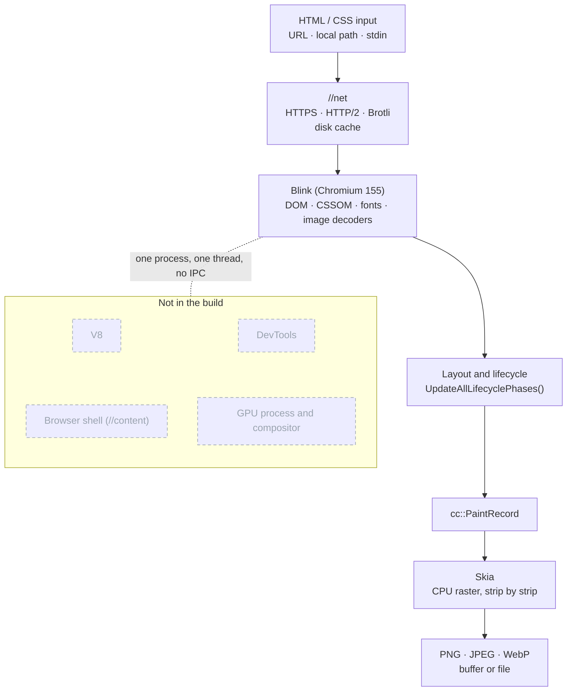

<h1 align="center">shotium</h1>

<p align="center">
  <b>A static HTML/CSS screenshot engine cut out of Chromium: Blink, Skia and the network stack, without a browser around them</b>
</p>

<p align="center">
  <a href="https://www.npmjs.com/package/@pixel.js/shotium"></a> <a href="https://chromium.googlesource.com/chromium/src/+/refs/tags/155.0.8048.0"></a> <a href="https://github.com/sj817/shotium/releases"></a> <a href="https://sj817.github.io/shotium/en/"></a> <a href="LICENSE"></a>
</p>

<p align="center">
  <b>English</b> · <a href="README.zh.md">简体中文</a>
</p>

<p align="center">
  
</p>

shotium extracts the core rendering pipeline from Chromium: Blink for DOM parsing, CSS styling, layout and painting, Skia for CPU rasterisation and image encoding, and `//net` for resource fetching and HTTP caching. It strips out all unnecessary browser shell components: V8, the `//content` layer, multi-process architecture, compositor, GPU process, and DevTools

The engine runs directly within the host process, rendering documents on a dedicated serial worker thread and returning PNG, JPEG, or WebP byte buffers. The layout engine is based on Chromium 155, matching Chrome's layout fidelity; fonts are rasterised with grayscale antialiasing and fixed gamma, ensuring deterministic, pixel-identical output within the same environment

### Key Highlights

- **Ultra-Fast & Low Latency**: Warm captures in ~13 ms, cold start in ~59 ms—no external browser process launch or DevTools Protocol handshake delay
- **Focused Downloads**: CLI, C ABI and language examples ship separately; download only the delivery and platform you need. New archive sizes come from the actual Release assets
- **Zero CDP Overhead**: Operates without V8, multi-process IPC, or JSON-RPC serialization, directly driving Blink via in-process Node-API and C ABI bindings
- **Production-Ready Resilience**: Built-in streaming tile rasterisation (`screenshotTiles`), daemon process pool for short-lived workflows (`daemon`), and explicit GC memory reclaim

---

### Official SDKs and Multi-Language Support

| Language / Ecosystem | Binding Mechanism | Highlights | Runnable Demo & Docs |
|:---|:---|:---|:---:|
|  **Node.js / TypeScript** | Node-API native addon | In-process embedding, streaming tiles, daemon client | [TypeScript SDK Guide](apps/typescript/README.md) |
|  **Go** | [`purego`](https://github.com/ebitengine/purego) | Pure Go dynamic symbol binding, no cgo required | [Go SDK Guide](apps/go/README.md) |
|  **Python** | Standard-library `ctypes` | Zero third-party dependencies, native struct layout | [Python SDK Guide](apps/python/README.md) |
|  **Rust** | `libloading` | Zero-cost abstraction, automatic RAII via `Drop` trait | [Rust SDK Guide](apps/rust/README.md) |
|  **C# / .NET** | P/Invoke | `DllImportResolver` cross-platform resolution, safe unmanaged frees | [C# SDK Guide](apps/csharp/README.md) |
|  **Java** | JNA | Cross-platform dynamic mapping, UTF-8 JSON payloads | [Java SDK Guide](apps/java/README.md) |
|  **CLI Binary** | Standalone native binary | Ready-to-use, supports URLs, local files, stdin, and `--serve` | [CLI Usage Guide](#command-line) |
|  **C ABI Specification** | Standard C shared library | Low-level C contract and allocator boundary principles | [C ABI Guide](apps/c-abi/README.md) |

<p align="center">
  <a href="#install">Quick Install</a> &nbsp;•&nbsp;
  <a href="#usage">Code Examples</a> &nbsp;•&nbsp;
  <a href="#options">Options</a> &nbsp;•&nbsp;
  <a href="#how-it-works">Architecture</a> &nbsp;•&nbsp;
  <a href="#non-goals-and-design-boundaries">Design Boundaries</a> &nbsp;•&nbsp;
  <a href="#tool-selection-guide">Tool Comparison</a> &nbsp;•&nbsp;
  <a href="#benchmarks">Benchmarks</a> &nbsp;•&nbsp;
  <a href="#frequently-asked-questions-faq">FAQ</a> &nbsp;•&nbsp;
  <a href="#repository-layout">Repository Layout</a>
</p>

---

## Install

#### Node.js / TypeScript

```bash
npm install @pixel.js/shotium   # or npm, yarn, bun; automatically installs prebuilt binary for current platform
```

<details>
<summary><b>Legacy package name <code>@shotkit/shotium</code> (still published during the transition)</b></summary>

Since 0.7.3, `@shotkit/shotium` is a compatibility alias of `@pixel.js/shotium`: both are published at the same version, and installing the old name brings in `@pixel.js/shotium` and its platform package. Existing projects need no change and keep receiving every release. The six old platform packages `@shotkit/shotium-<os>-<arch>` stay at 0.7.2 and are not updated.

To move to the canonical name:

```bash
npm uninstall @shotkit/shotium
npm install @pixel.js/shotium
```

```diff
- import { screenshot } from '@shotkit/shotium';
+ import { screenshot } from '@pixel.js/shotium';
```

</details>

#### Standalone CLI / C Shared Libraries / Demos

Download prebuilt binaries for your target platform from **[GitHub Releases](https://github.com/sj817/shotium/releases)**. Extracted top-level directory names have no version suffix:

| Category | Attachment naming pattern | Platforms / Languages | Contents |
|---|---|---|---|
| **CLI** | `shotium-cli-<platform>.7z` | win / linux / macos (x64 / arm64) | Standalone executable, two `.pak` resources, and license |
| **C ABI** | `shotium-c-abi-<platform>.7z` | win / linux / macos (x64 / arm64) | Shared library, `.pak` resources, `shot_api.h`, ABI guides, and import library (Windows) |
| **Examples** | `shotium-example-<language>.7z` | go / python / rust / csharp / java | Complete source projects, page template, dependency manifests, and integrity manifests (no native binaries) |
| **Checksums** | [`SHA256SUMS`](https://github.com/sj817/shotium/releases/latest/download/SHA256SUMS) | All 17 `.7z` archives | Standard SHA-256 checksum manifest sorted by filename |

> Platforms: `windows-amd64`, `windows-arm64`, `linux-amd64`, `linux-arm64`, `macos-amd64`, `macos-arm64`. Multi-language examples load native libraries from `native/shotium-c-abi-<platform>/` after downloading the matching C ABI archive

<details>
<summary><b>Download and verify the standalone CLI (Quickstart)</b></summary>

```bash
# Linux / macOS (example: linux-amd64, requires 7z or 7zz)
curl -fLO https://github.com/sj817/shotium/releases/latest/download/shotium-cli-linux-amd64.7z
curl -fLO https://github.com/sj817/shotium/releases/latest/download/SHA256SUMS

# Optional checksum verification and extraction
sha256sum --check --ignore-missing SHA256SUMS
7z x shotium-cli-linux-amd64.7z
./shotium-cli-linux-amd64/shotium --help
```

```powershell
# Windows PowerShell (example: windows-amd64)
curl.exe -fLO https://github.com/sj817/shotium/releases/latest/download/shotium-cli-windows-amd64.7z
curl.exe -fLO https://github.com/sj817/shotium/releases/latest/download/SHA256SUMS

# Checksum verification and extraction
$expected = (Get-Content SHA256SUMS | Select-String "shotium-cli-windows-amd64.7z").Line.Split(" ")[0]
if ((Get-FileHash shotium-cli-windows-amd64.7z -Algorithm SHA256).Hash.ToLower() -ne $expected) { throw "SHA256 mismatch" }
7z x shotium-cli-windows-amd64.7z
.\shotium-cli-windows-amd64\shotium.exe --help
```

</details>

## Usage

### Node.js / TypeScript

Install `@pixel.js/shotium` and import it directly into your project:

```ts
import { writeFileSync } from 'node:fs';
import { screenshot, screenshotTiles, start, stop, purgeMemory } from '@pixel.js/shotium';

// -------------------------------------------------------------
// 1. Basic screenshot: only file path or URL required, everything else has sane defaults
// -------------------------------------------------------------
const { image } = await screenshot({ file: 'https://example.com' });
writeFileSync('example.png', image!);

// -------------------------------------------------------------
// 2. Streaming tiled capture: low memory footprint for tall pages
// -------------------------------------------------------------
for await (const tile of screenshotTiles({
  file: 'article.html',
  fullPage: true,
  tile: { height: 8000 },                 // Export an independent tile every 8000px
})) {
  console.log(`Tile #${tile.index} (y=${tile.rect.y}, ${tile.image.length} bytes)`);
  writeFileSync(`article-${tile.index}.png`, tile.image);
}

// -------------------------------------------------------------
// 3. Explicit lifecycle & memory management (optional advanced control)
// -------------------------------------------------------------
// Pre-warm engine and configure HTTP disk cache directory and capacity
await start({ cacheDir: './cache', cacheMaxBytes: 256 * 1024 * 1024 });

// Reclaim memory after traffic peaks: trigger Blink GC and flush Skia cache
purgeMemory();

// Gracefully destroy the engine before process termination
await stop();
```

> [!TIP]
> **Short-lived tasks (CLI tools / CI scripts / Serverless)?**
> Use the built-in daemon client to eliminate cold-start overhead:
> ```ts
> import { daemon } from '@pixel.js/shotium';
> 
> const { image } = await daemon.screenshot({ file: 'page.html', fullPage: true });
> ```
> For complete options (CSS selector targeting, styles injection, wait policies, custom headers), refer to the [TypeScript SDK Guide](apps/typescript/README.md)

### Command line

`shotium-cli-<platform>.7z` contains only the license, two `.pak` resources and the standalone CLI tool `shotium` (`shotium.exe` on Windows), which runs without Node.js or browser installations:

<p align="center">
  
</p>

```bash
# Capture a remote URL as a PNG image
shotium https://example.com --width 1280 --height 720 -o output.png

# Capture a local HTML file as a full-page WebP (quality 85)
shotium --file page.html --full-page --type webp --quality 85 -o output.webp

# Stream HTML from standard input (stdin)
cat template.html | shotium --stdin --width 800 --height 600 -o banner.png

# Export tall pages in tiles (sliced every 8000px: article-0.png, article-1.png...)
shotium --file article.html --full-page --tile-height 8000 -o article-{n}.png

# Start a resident worker process (length-prefixed JSON on stdin/stdout for fast multi-language reuse)
shotium --serve --cache-dir /var/tmp/shotium-cache
```

> Run `shotium --help` to list all available options and defaults

> **No executable installed?** `npx @pixel.js/shotium <same flags>` runs the same engine through the Node addon in the npm package. It is the fallback, not the CLI: every invocation pays a Node start-up and an addon load that the executable does not, and `--serve` is not available. For anything that runs often, download `shotium-cli-<platform>.7z`

### C ABI and other languages

`shotium-c-abi-<platform>.7z` provides cross-platform shared libraries (`libshotium.so`, `libshotium.dylib`, or `shotium.dll`) alongside the standard C header `shot_api.h`. The interface follows standard C conventions:

```c
// 1. Create engine singleton
ShotEngine* engine = NULL;
shot_engine_create(NULL, &engine);

// 2. Perform capture request with UTF-8 JSON configuration
ShotBuffer image = {0};
const char* request = "{\"file\":\"card.html\",\"width\":720,\"height\":380,\"type\":\"png\"}";
shot_engine_capture(engine, request, &image, NULL, NULL);

// 3. Free the engine-allocated image buffer (each party frees what it allocates)
shot_buffer_free(&image);

// 4. Destroy engine instance
shot_engine_destroy(engine);
```

Complete, runnable example projects rendering the identical 720×380 reference boarding pass are available as `shotium-example-<language>.7z` downloads in GitHub Releases:
- [Go Demo (purego)](apps/go/README.md)
- [Python Demo (ctypes)](apps/python/README.md)
- [Rust Demo (libloading)](apps/rust/README.md)
- [C# Demo (P/Invoke)](apps/csharp/README.md)
- [Java Demo (JNA)](apps/java/README.md)

> For memory safety rules, error codes, and full protocol details, see the [C ABI Specification Guide](apps/c-abi/README.md)

## Options

All three entry points share a unified configuration model. The Node.js column corresponds to properties of `ScreenshotOptions`; the C ABI column corresponds to keys in the request JSON (with viewport dimensions flattened at the top level):

### Core Options

| Purpose | Node.js | CLI | C ABI JSON | Default |
|---|---|---|---|---|
| Input | `file` | `URL_OR_PATH`, `--file PATH`, `--stdin` | `file` | required |
| Viewport | `viewport.width`, `viewport.height` | `--width N --height N` | `width`, `height` | 1280 × 720 |
| Whole document | `fullPage` | `--full-page` | `fullPage` | off |
| Format | `type` | `--type png\|jpeg\|webp` | `type` | `png` |
| Quality | `quality` | `--quality N` | `quality` | 90 |
| Device scale | `scale` | `--scale N` | `scale` | 1 |
| Transparent background | `omitBackground` | `--omit-background` | `omitBackground` | off |

<details>
<summary><b>Expand to view advanced layout, selector, streaming tiles, and network cache options...</b></summary>
<br/>

| Purpose | Node.js | CLI | C ABI JSON | Default |
|---|---|---|---|---|
| One element | `selector` | `--selector CSS` | `selector` | none |
| Region | `clip` | not available | `clip` | none |
| Output file | `path` | `-o PATH` | `path` | return byte buffer |
| Streaming tiles | `screenshotTiles({ tile: { height } })` | `--tile-height N` | `tile.height` | none |
| CSS injection | `css` | not available | `css` | none |
| Load timeout | `pageGotoParams.timeout` | `--timeout-ms N` | `timeout` | 30000 ms |
| Wait policy | `pageGotoParams.waitUntil` | `--wait-until load\|networkidle` | `waitUntil` | `load` |
| Local subresources | `allowFileAccess` | `--allow-file-access` (affects `--serve` only) | `allowFileAccess` | off |
| Cache mode | `cache` | not available | `cache` | `default` |
| Extra headers | `headers` | not available | `headers` | none |
| Cache directory | `start({ cacheDir })` | `--cache-dir PATH` | engine option `cacheDir` | Node: `~/.shotium/cache`; CLI/C ABI: none |
| Cache ceiling | `start({ cacheMaxBytes })` | `--cache-max-bytes N` | engine option `cacheMaxBytes` | Node: 256 MB; CLI/C ABI: sized by backend |
| User agent | `start({ userAgent })` | `--user-agent STRING` | engine option `userAgent` | built-in default |

> Note: `fullPage`, `selector`, and `clip` are mutually exclusive

</details>

## How it works



1. **Network Loading**: The document is fetched through Chromium's own network stack (`//net`), supporting TLS, HTTP/2, Brotli compression, and disk caching
2. **Layout Pipeline**: Blink parses, styles, and lays out the document synchronously within a dedicated `Page` instance without external renderer processes or compositors
3. **Strip Rasterisation**: Paint commands are rasterised by Skia in horizontal strips (tiles) and encoded immediately, eliminating the need to buffer massive uncompressed bitmaps in memory
4. **Deterministic Output**: The Node-API addon, CLI tool, and C ABI shared library all call the same underlying `shot::Capture()` core, producing byte-identical images for identical inputs

## Non-goals and design boundaries

> [!NOTE]
> shotium is specifically designed for **high-throughput, high-fidelity, purely static server-side rendering**. The following capabilities are explicitly out of scope:

- **No JavaScript execution**: V8 is completely omitted from the build, and `<script>` tags are ignored. Input documents must be pre-rendered static HTML (e.g., SSR output, template engine results, or static markup)
- **No multi-process sandbox**: Chromium's multi-process sandbox was removed alongside the browser shell. Services rendering untrusted URLs must validate requests and guard against SSRF at the application layer before reaching the engine. Local `file:` subresource access is disabled by default
- **No `data:` URL as the main document**: Main documents must be supplied as local files, stdin streams, or HTTP(S) URLs
- **Single engine instance per process**: Blink maintains process-wide global state and cannot be re-initialised. Captures are processed serially via an internal worker queue; multi-core parallelism is achieved via multiple processes or multiple named daemon instances

## Tool selection guide

| Dimension | shotium | Puppeteer / Playwright | Satori (`@vercel/og`) | wkhtmltoimage |
|---|---|---|---|---|
| **Layout engine** | Blink 155 + Skia | Full Chromium | Custom layout engine | QtWebKit (archived 2023) |
| **CSS support** | Chrome 155 standard | Chrome standard | Flexbox subset, no Grid | 2012-era WebKit |
| **Input formats** | File, URL, stdin | File, URL | JSX / Virtual DOM tree | File, URL |
| **JavaScript** | No (pure static rendering) | Yes (full execution) | N/A | Legacy JavaScriptCore |
| **Distribution & Installed Size** | CLI / C ABI standalone packages (~11 MB compressed / ~32 MB unpacked) | Full Chromium browser download and unpack (400+ MB) | Pure JS / WASM (tens of KB) | OS package dependencies (~100 MB) |

- **Choose a headless browser (Puppeteer / Playwright)**: When pages require client-side JavaScript execution, dynamic interaction, authentication, or complex single-page app (SPA) hydration
- **Choose Satori**: When simple Flexbox cards suffice in edge runtime environments where native binaries cannot execute
- **Choose shotium**: When rendering static or SSR HTML where Chrome-standard layout fidelity, high concurrency, sub-second latency, and minimal memory footprint are required

## Benchmarks

Shotium is continuously tested against mainstream headless browser solutions across six platform architectures in standard GitHub Actions environments (measured on Linux x64 standard cloud runners with official default configurations):

| Engine Solution | Cold Start (p50) | Warm Snapshot (p50) | Throughput (c=1) | Download Size (Compressed) | Installed Size (Unpacked) |
|:---|---:|---:|---:|---:|---:|
| **Shotium** | **59 ms** | **13.4 ms** | **24.3 / sec** | **~11 MB** | **~32 MB** |
| Puppeteer (headless-shell) | 652 ms (11.0×) | 133.2 ms (9.9×) | 5.6 / sec | ~130 MB | ~380 MB |
| Playwright (headless-shell) | 781 ms (13.2×) | 128.4 ms (9.6×) | 5.9 / sec | ~130 MB | ~390 MB |
| Puppeteer (Chrome full browser) | 887 ms (15.0×) | 165.3 ms (12.3×) | 4.6 / sec | ~170 MB | ~450 MB |
| Playwright (Chrome full browser) | 971 ms (16.5×) | 154.7 ms (11.5×) | 5.0 / sec | ~170 MB | ~480 MB |

> Note: Shotium sizes measured on the smallest platform builds (macOS arm64 / Linux arm64), ~32 MB for a single executable/shared library; comparative browser figures include full Chromium binaries and multimedia dependencies

- **[Interactive Benchmark Explorer (VitePress)](https://sj817.github.io/shotium/en/)**: Explore per-platform scores, cold-start latency, concurrency throughput, and memory consumption
- **[Immutable Benchmark Archive](apps/docs/benchmarks/README.md)**: Contains complete raw samples; latest findings are summarized in [`LATEST.md`](apps/docs/benchmarks/LATEST.md)

## Frequently Asked Questions (FAQ)

<details>
<summary><b>Q1: Why does Shotium omit JavaScript execution entirely?</b></summary>

Shotium is purposefully optimized for high-throughput, server-side "HTML/CSS to pixel" rendering. In traditional headless browsers, the vast majority of CPU cycles, latency, and memory footprint are consumed by V8 VM instantiation, script evaluation, and DevTools Protocol JSON-RPC round-trips. Running untrusted client-side JavaScript also introduces severe attack surfaces

By stripping V8, Shotium achieves ~13 ms warm captures, a 59 ms cold start, and deterministic layout fidelity. For dynamic content, render your data into HTML server-side (via SSR or templates in Node.js, Go, Python, etc.) and pass the ready HTML to Shotium for pure layout and rasterisation
</details>

<details>
<summary><b>Q2: How do I handle missing CJK fonts or garbled glyphs in Docker?</b></summary>

Minimal Linux container images (such as `debian:*-slim` or `alpine`) do not bundle CJK fonts by default. Blink relies on the system Fontconfig; without suitable fonts installed, missing glyphs will render as squares. Simply install Noto CJK fonts in your Dockerfile:

```dockerfile
FROM node:22-bookworm-slim

WORKDIR /app

# Install open-source CJK font packages
RUN apt-get update && apt-get install -y --no-install-recommends \
    fonts-noto-cjk \
    && rm -rf /var/lib/apt/lists/*

COPY package.json pnpm-lock.yaml ./
RUN npm install -g pnpm && pnpm install --frozen-lockfile

COPY . .
CMD ["node", "server.mjs"]
```

Shotium will automatically discover the installed system fonts and render crisp, correct typography
</details>

<details>
<summary><b>Q3: What is the recommended architecture for high-concurrency production setups?</b></summary>

Because Blink's layout and style engine relies on process-global state, Shotium uses a dedicated serial worker thread per process to guarantee safety and determinism

For production deployments requiring high QPS:
1. **Multi-Worker Processes**: In Node.js, use `cluster` or worker processes to instantiate multiple Shotium workers across CPU cores
2. **Daemon / Server Mode**: Spawn multiple `shotium --serve` worker processes behind an internal task queue or load balancer
3. **Memory Management**: For tall pages, use `screenshotTiles` to stream image tiles without allocating massive bitmaps in memory, and call `purgeMemory()` after high-volume bursts to release Skia caches
</details>

## Repository layout

The repository contains a minimal slice of Chromium required to build the engine. Core implementations and companion apps are structured as follows:

```text
shotium/
├── shot/                      # Engine core: C++ sources, shot_api.h interface, GN configs, and test corpus
├── apps/
│   ├── typescript/            # Official Node.js / TypeScript SDK (npm: @pixel.js/shotium)
│   ├── c-abi/                 # Cross-language C ABI specification and contract guide
│   ├── go/                    # Go example project (purego, no cgo)
│   ├── python/                # Python example project (standard library ctypes)
│   ├── rust/                  # Rust example project (libloading & RAII)
│   ├── csharp/                # C# / .NET example project (P/Invoke)
│   ├── java/                  # Java example project (JNA)
│   ├── demo-card/             # Canonical reference boarding pass card used by all demos
│   ├── demo-express/          # Express web service screenshot integration example
│   ├── demo-genshin-card/     # Character profile card demo application
│   ├── demo-hello/            # Minimal static HTML smoke test fixture
│   ├── benchmark/             # Six-platform cross-engine benchmark harness
│   ├── benchmark-site/        # VitePress-based interactive benchmark explorer
│   ├── docs/                  # Architecture history, documentation, and benchmark archives
│   └── test/render/           # Pixel-level visual regression test corpus
└── scripts/                   # Repository automation tooling (build, tree trimming, typecheck, CI)
```

## Building from source

- Developers using the published npm package or release archives do not need to build from source
- Building the engine requires a `gclient` checkout with this repository as `src`, the platform C++ toolchain, and ~40 GB free disk space
- Followed by `pnpm build:engine`

For detailed build options, directory rules, and verification suites, see [CLAUDE.md](CLAUDE.md); for architectural history, see [apps/docs](apps/docs/README.md)

## Contributing

- Bug reports and suggestions are welcome on [GitHub Issues](https://github.com/sj817/shotium/issues)
- For rendering issues, attaching a minimal HTML reproduction helps diagnose issues quickly
- Pull requests are welcome

Before contributing, please review [CLAUDE.md](CLAUDE.md) for architectural constraints, coding conventions, and verification steps

Community integrations:

- [karin-plugin-shotium](https://github.com/KarinJS/plugin-shotium)
- [yunzai-renderer-shotium](https://github.com/sj817/yunzai-renderer-shotium) (for Miao-Yunzai)
- [zhin-plugin-shotium](https://github.com/sj817/zhin-plugin-shotium) (for zhin.js)

## License

BSD-3-Clause, matching upstream Chromium. See [LICENSE](LICENSE)
