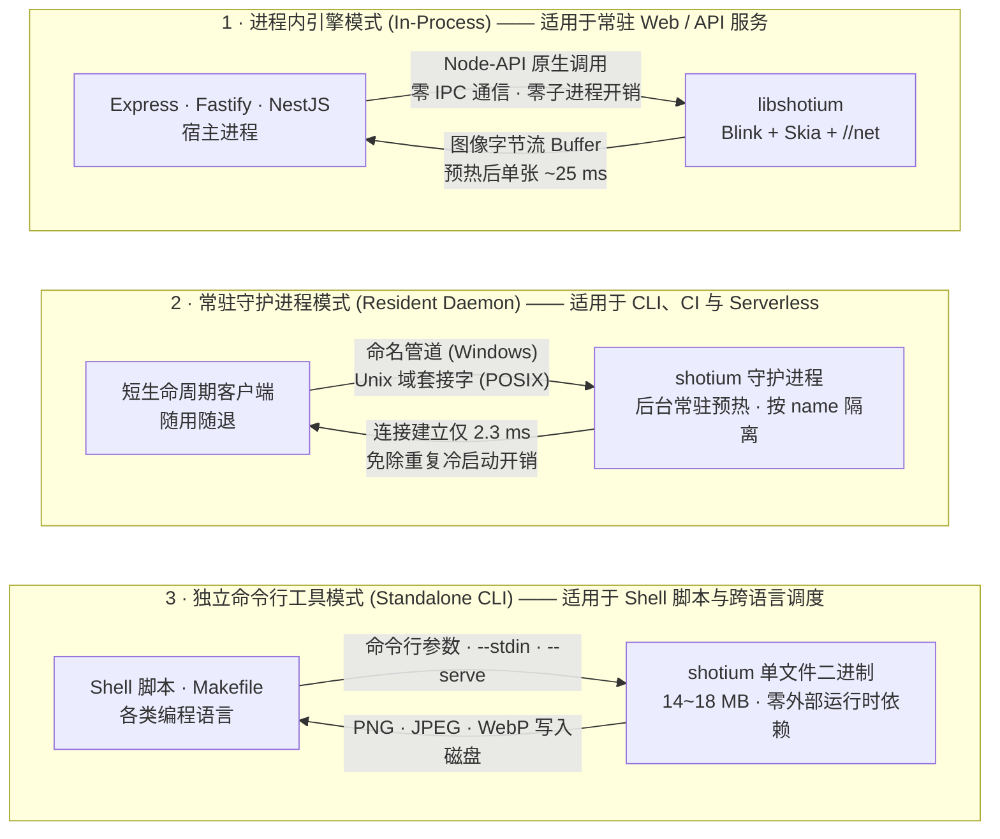
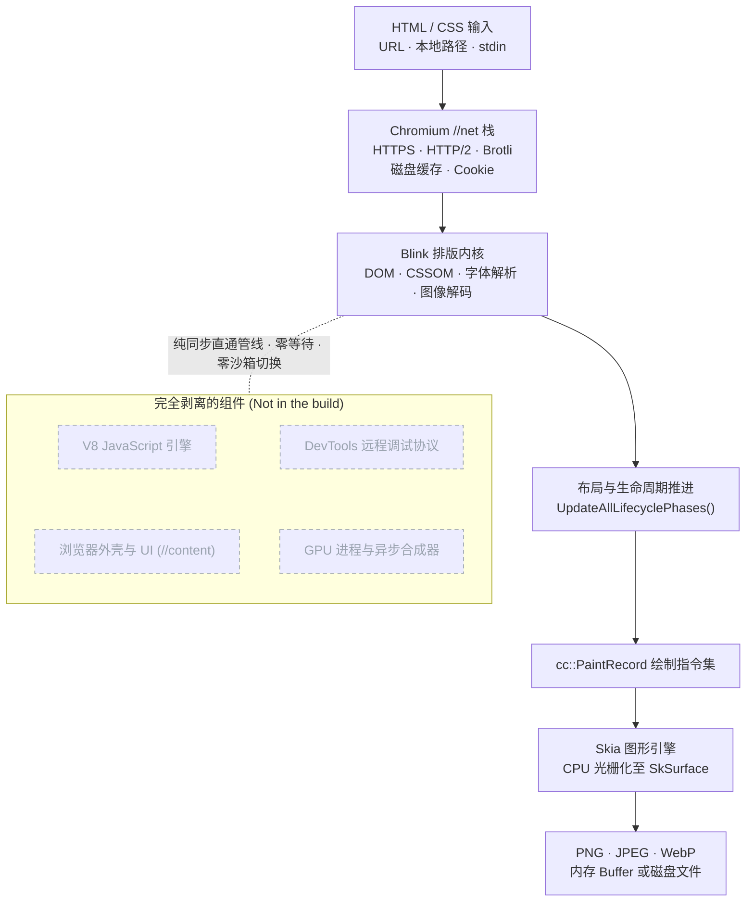

<h1 align="center">shotium</h1>

<p align="center">
  <b>基于 Chromium 内核的高性能轻量级静态 HTML/CSS 截图引擎：无浏览器外壳、无 V8、无 DevTools，纯进程内毫秒级出图。</b>
</p>

<p align="center">
  <a href="https://www.npmjs.com/package/@shotkit/shotium"></a>
  <a href="https://github.com/sj817/shotium/releases"></a>
  <a href="https://sj817.github.io/shotium/"></a>
  <a href="LICENSE"></a>
</p>

<p align="center">
  <a href="README.md">English</a> · <b>简体中文</b>
</p>

<p align="center">
  
</p>

**shotium** 将 Blink 排版引擎、Skia 图形库以及 Chromium 的 `//net` 网络栈深度精简并编译为一个约 22 MB 的 npm 包。它严格遵循 Chromium 标准排版静态 HTML 和 CSS，通过 CPU 进行光栅化并在当前宿主进程内直接返回 PNG、JPEG 或 WebP 格式的图像数据。

由于在底层构建中完全剥离了 V8 JavaScript 引擎、浏览器外壳（`//content`）、GPU 进程与 DevTools 协议，shotium 无需下载庞大的无头浏览器，消除了进程拉起、IPC 序列化通信及僵尸进程回收的全部开销。

---

## 核心优势

- **极速渲染，性能大幅超越 Headless Chrome**：在 GitHub 标准 linux-x64 CI 环境下，从进程启动到生成首张 PNG 仅需 **53 ms**（Playwright headless shell 需 256 ms，headless Chrome 需 410~471 ms）；预热后单张截图延迟低至 **25 ms**（对比 123~157 ms）。（详见 [性能基准](#性能基准)）
- **零额外依赖，开箱即用**：执行 `npm install` 自动拉取当前操作系统（Windows / macOS / Linux）与架构（x64 / arm64）对应的预编译动态库。引擎通过 Node-API 直接加载至当前进程，无需安装系统级浏览器或管理 WebSocket 管道，彻底告别浏览器崩溃导致的内存泄漏与僵尸进程。
- **百分之百 Chromium CSS 渲染一致性**：完整支持 CSS Grid、Flexbox、`@font-face`、SVG、渐变、阴影、滤镜与 CSS 变量。排版引擎与 Chrome 保持完全一致；文本光栅化采用固定伽马曲线的灰度抗锯齿，确保同一文档在不同操作系统上输出的像素逐字节完全一致。
- **极致的内存控制**：单实例活跃渲染时工作集内存仅占用约 **50 ~ 70 MiB**（私有内存约 40 MiB；相比之下 Headless 浏览器常态占用 650 MiB 至 1.3 GiB），空闲常驻守护进程的引擎内核仅占用约 **3 ~ 10 MiB**。
- **灵活的部署形态**：支持常驻服务进程内嵌入（In-Process）、短任务与 CLI 专用的预热守护进程（Resident Daemon）、无 Node.js 依赖的独立单文件 CLI 工具，以及面向 Rust / Go / Python / C++ 的标准 C ABI。

---

## 快速上手

### 1. 安装

```bash
# npm
npm install @shotkit/shotium

# pnpm / yarn / bun
pnpm add @shotkit/shotium
yarn add @shotkit/shotium
bun add @shotkit/shotium
```

### 2. Node.js / TypeScript 代码示例

以下为演示录屏中实际运行的代码 [`docs/demo/card.mjs`](docs/demo/card.mjs)：

<p align="center">
  
</p>

<details>
<summary>展开查看完整代码</summary>

```ts
import { statSync } from 'node:fs';
import shotium, { screenshot } from '@shotkit/shotium';

// 启动引擎（单进程全局单例，幂等调用）
shotium.start();

function shoot() {
  return screenshot({
    file: 'card.html',        // 支持 URL、本地相对/绝对路径或 file://
    viewport: { width: 720, height: 380 },
    scale: 2,                 // 设备像素比 (DPR)
    type: 'png',
    path: 'card.png',         // 指定输出文件路径；若为空则返回 image Buffer
  });
}

// 首次调用包含引擎子系统与字体缓存预热，后续调用处于预热状态
for (const pass of ['cold', 'warm']) {
  const { render, total } = (await shoot()).stats.timing;
  console.log(`${pass}  render ${render.toFixed(1)} ms  total ${total.toFixed(1)} ms`);
}

const kb = (statSync('card.png').size / 1024).toFixed(1);
console.log(`card.png  1440x760  ${kb} KB`);

// 优雅关闭引擎
await shotium.stop();
```

</details>

输入文件 [`docs/demo/card.html`](docs/demo/card.html) 经过 Blink 与 Skia 处理后输出的图像效果：

<p align="center">
  
</p>

### 3. 独立命令行工具 (CLI)

在无需安装 Node.js 的生产环境或 Shell 脚本中，可以直接使用官方发布的独立可执行文件从文件路径、URL 或标准输入（`stdin`）读取内容：

<p align="center">
  
</p>

---

## 性能基准

以下测试数据均采集自官方[六平台自动化 CI 基准测试](https://sj817.github.io/shotium/)。所有对比方案（shotium、Puppeteer、Playwright）均在完全相同的 GitHub Runner 硬件配置下执行相同场景，基准数据归档于 [`benchmark-results/`](benchmark-results/LATEST.md)。

下表记录了 0.3.3 版本在 `linux-x64` 环境下的中位数耗时（p50，单位：毫秒，数值越小越优）：

| 测试场景 | shotium | Playwright (headless shell) | Puppeteer (headless shell) | Playwright (Chrome) | Puppeteer (Chrome) |
|---|--:|--:|--:|--:|--:|
| 进程启动至首张 PNG 输出 | **53** | 256 | 282 | 410 | 471 |
| 预热后单次截图耗时 | **25** | 123 | 132 | 波动过大 (noisy) | 157 |
| 完整生命周期（启动-截图-退出） | **54** | 263 | 289 | 489 | 565 |
| 4 并发在途请求（吞吐量/秒） | **128（20.7 req/s）** | 356（9.7 req/s）| 391（9.0 req/s）| 407（8.4 req/s）| 运行失败 |
| 持续高压 4 并发（吞吐量/秒） | **165（19.7 req/s）** | 403（9.1 req/s）| 461（8.4 req/s）| 波动过大 (noisy) | 基础设施错误 |

综合该平台上 10 项可比测试的几何平均值：Playwright headless shell 耗时约为 shotium 的 **3.6 倍**，Puppeteer headless shell 约为 **4.2 倍**，完整 Headless Chrome 约为 **4.8 ~ 6.3 倍**。

在跨平台「启动 → 截图 → 关闭」端到端基准测试中，shotium 在所有支持平台中均取得第一：

| 操作系统与架构 | shotium | 最优竞品表现 |
|---|--:|--:|
| **linux-x64** | **54 ms** | 263 ms（Playwright shell）|
| **linux-arm64** | **73 ms** | 238 ms（Playwright shell）|
| **darwin-arm64** | **98 ms** | 339 ms（Playwright shell）|
| **win32-x64** | **112 ms** | 608 ms（Playwright shell）|
| **darwin-x64** | **194 ms** | 1,053 ms（Playwright shell）|

### 测试指标与方法说明

- **严格对等比对**：仅当两个引擎在同一台 Runner 物理节点、相同测试用例与相同并发参数下均成功跑通时，才计算耗时比值；出现波动标记（`noisy`）的数据单独标注，不计入平均值。
- **并发机制差异**：单个 shotium 引擎采用高效串行渲染设计，其并发指标通过单机多工作进程测试得出；浏览器竞品则使用单个浏览器实例内开启多个 Tab 页面的机制。
- **平台兼容性约束**：Puppeteer 在 Linux 和 Windows 上暂无官方 arm64 预编译构建，Playwright 在 Windows arm64 环境下运行 x64 模拟构建，此类单元在基准报告中标记为 `n/a`。
- **内存开销对比**：单实例引擎活跃渲染时工作集仅约 50 ~ 70 MiB（多工作进程并发测试峰值约 256 MiB），相较于 Headless 浏览器动辄数百 MiB 至数 GiB 的进程树具有压倒性轻量优势。

> [!TIP]
> **关于 PGO 优化与性能反馈**：
> 当前预编译二进制版本尚未完成基于大规模真实生产语料的 PGO（Profile-Guided Optimization，性能引导优化）训练。尽管在绝大多数常规页面与标准排版中表现优异，但在部分极端、超长文档或特定复杂 CSS 属性组合场景下，渲染性能可能尚未达到理论峰值。若您在实际业务中遇到渲染较慢或表现不及预期的页面，欢迎提交包含复现 HTML/CSS 的 [Issue](https://github.com/sj817/shotium/issues)，我们将把该用例纳入后续的 PGO 训练语料集进行针对性优化。

---

## 方案对比

| 对比维度 | shotium | Puppeteer / Playwright | Satori (`@vercel/og`) | wkhtmltoimage |
|---|---|---|---|---|
| **排版引擎** | Chromium Blink + Skia | 完整 Chromium | 自研排版器 | QtWebKit（2023 年已归档）|
| **CSS 特性支持** | Chrome 完整标准 CSS 支持 | Chrome 完整标准 CSS 支持 | Flexbox 等受限子集，不支持 Grid | 2012 年旧版 WebKit 标准 |
| **输入源** | HTML 文件、URL、`stdin` | HTML 文件、URL | JSX 节点树 | HTML 文件、URL |
| **JavaScript 支持** | 不执行（完全剥离 V8）| 支持执行 | 不适用 | 旧版 JavaScriptCore |
| **进程运行模式** | 宿主进程内直接调用（Node-API / C ABI）| 独立进程 + IPC 通信 | 宿主进程内（WASM/JS）| 子进程调用 |
| **分发与包体积** | 约 22 MB 独立包 | 需下载浏览器（> 100 MB）| 极小（纯 JS/WASM）| 需系统级安装包 |
| **首图输出耗时 (linux-x64)** | **53 ms** | 256 ~ 471 ms | n/a | n/a |

### 选型建议

- **选用 Headless 浏览器**：页面强依赖客户端 JavaScript 执行、数据水合（Hydration）或复杂的动态交互动作。
- **选用 Satori**：仅需简单的卡片布局、使用受限的 Flexbox 子集且生产环境严禁引入任何原生二进制扩展。
- **选用 shotium**：输入源为服务端渲染（SSR）或静态 HTML 模板，追求与 Chrome 100% 像素级对齐的排版渲染效果，同时对系统吞吐量、响应延迟与内存占用有严苛要求。

---

## 典型应用场景

- **社交媒体分享卡片与 Open Graph 动态图**：在服务端高并发实时渲染包含用户头像与文章摘要的预览图。
- **电子单据与凭证生成**：基于 HTML/CSS 模板高保真输出发票、小票、收据、工单与各类资格证书。
- **机器人消息卡片渲染**：在即时通信机器人中替代重型 Puppeteer。例如 [yunzai-renderer-shotium](https://github.com/sj817/yunzai-renderer-shotium) 用于 Miao-Yunzai，[zhin-plugin-shotium](https://github.com/sj817/zhin-plugin-shotium) 用于 zhin.js。
- **服务端数据报表与看板导出**：将包含复杂 SVG 矢量图表与排版样式的报表批量导出为高质量图片。
- **邮件模板与设计稿渲染预览**：确保在任何操作系统下排版效果与字体渲染一致。
- **大规模静态页面缩略图生成**：以传统浏览器集群无法比拟的高吞吐量与极低内存开销批量生成网页快照。

---

## 设计边界与非目标

- **不执行 JavaScript**：构建产物中完全移除了 V8 引擎。文档中的 `<script>` 标签将被直接忽略。输入内容必须是已完成渲染的完整静态 HTML、模板产物或 SSR 页面。
- **无多进程安全沙箱**：Chromium 的多进程沙箱架构随浏览器外壳一同剥离。上层应用在接收不可信输入前，必须自行完成 URL 合法性校验并防范 SSRF 攻击。`file://` 协议子资源访问默认处于关闭状态（`allowFileAccess: false`）。
- **不支持以 `data:` URL 作为主文档**：动态拼接生成的 HTML 需先写入临时文件，或通过命令行管道以 `--stdin` 方式输入。
- **单引擎实例串行处理**：单个 shotium 引擎内部采用队列串行渲染机制。若需提升并发吞吐量，请通过多工作进程（Worker Process）或配置不同 `name` 的多个守护进程进行水平扩展。

---

## 三种运行模式



### 模式选型速查

| 业务场景 | 推荐模式 | 选型理由 |
|---|---|---|
| **常驻 Web / API 服务**（Express、Fastify、NestJS）| [进程内引擎](#1-进程内引擎) | 零 IPC 通信开销，零进程启动耗时，单请求渲染延迟最低。|
| **CLI 命令行工具、CI 流水线、Serverless 函数** | [常驻守护进程](#2-常驻守护进程) | 引擎子系统在后台保持预热，客户端连接仅需 2.3 ms，彻底消除冷启动。|
| **非 Node.js 环境、自动化脚本与批处理** | [独立命令行工具](#3-独立命令行工具) 或 [C ABI 与 FFI 跨语言集成](#c-abi-与-ffi-跨语言集成) | 单文件便携分发，支持标准输入管道（`--stdin`）与常驻服务模式（`--serve`）。|

---

## 运行模式详解

### 1. 进程内引擎

引擎通过 Node-API 模块直接加载至当前 Node.js 进程，绑定 [`shot/shot_api.h`](shot/shot_api.h) 中定义的标准 C ABI。调用 `screenshot()` 即可在内存中直接获取编码后的图片 Buffer。

```ts
import { writeFile } from 'node:fs/promises';
import { tmpdir } from 'node:os';
import { join } from 'node:path';
import shotium, { screenshot } from '@shotkit/shotium';

// 1. 初始化并启动引擎，返回磁盘缓存状态
const { cacheDir, cacheActive } = shotium.start();

// 2. 截取远程 URL 页面
const res1 = await screenshot({
  file: 'https://example.com',
  viewport: { width: 1280, height: 720 },
  type: 'webp',
  quality: 85,
});

// 3. 截取动态生成的 HTML（需先落盘为临时文件）
const html = `<div style="padding: 24px; background: #f6f8fa;"><h2>Invoice #1024</h2></div>`;
const page = join(tmpdir(), 'invoice-1024.html');
await writeFile(page, html);

const res2 = await screenshot({
  file: page,
  viewport: { width: 600, height: 300 },
});

// 4. 请求高峰后主动回收内存：
//    releaseMemory() 立即清理 Blink 堆、Skia 缓存与 PartitionAlloc 空闲链表；
//    releaseWorkingSet: true 可进一步通知操作系统回收物理工作集内存。
shotium.releaseMemory({ releaseWorkingSet: true });

// 5. 退出时安全终止引擎
await shotium.stop();
```

#### 生命周期与设计特性

- **单进程全局单例**：由于 Blink 依赖不可重置的进程级全局静态状态，同一个 Node.js 进程中所有 `Runtime` 实例与顶层 API 共享同一个底层引擎。
- **`start()` 与 `stop()`**：`stop()` 会排空当前任务队列、标记 `running: false` 并释放工作集内存；之后再次调用 `start()` 可快速重新激活引擎，并完整保留已预热的磁盘缓存。
- **配置固定原则**：引擎启动参数在首次调用 `start()` 时固化，后续使用不兼容配置调用 `start()` 将明确抛出异常。
- **串行队列**：并发调用 `screenshot()` 时内部自动排队并按序渲染；如需提升并行能力，请通过 Node.js Worker 进程横向扩展。
- **状态感知**：`start()` 与 `status()` 均返回 `{ running, cacheDir, cacheActive }`。若缓存目录因权限问题无法读写，`cacheActive` 将为 `false`，引擎自动降级为无缓存模式平稳运行。

### 2. 常驻守护进程

专为短生命周期的 CLI 任务、CI 流水线步骤和 Serverless 场景设计，避免每次调用都承担数十毫秒的冷启动开销。

守护进程将渲染引擎托管在独立的后台进程中，通过高效的本地 IPC 端点（Windows 采用命名管道，类 Unix 系统采用 Unix 域套接字）提供服务。启动时会自动预热渲染一张空白页，客户端建立连接仅需约 2.3 ms，首个请求即可享受毫秒级预热响应。

```ts
import { daemon } from '@shotkit/shotium';

// 1. 连接现有守护进程；若尚未启动则自动在后台拉起
const client = await daemon.connect({
  name: 'default',          // 可选：通过指定 name 隔离多个守护进程实例
  idleTimeoutMs: 300000,    // 无活跃连接时自动退出超时（默认 5 分钟；0 为永不退出）
  prewarm: true,            // 启动时是否自动渲染空白页完成预热（默认 true）
});

// 2. 发起截图请求
const { image, stats } = await client.screenshot({
  file: 'https://example.com',
  viewport: { width: 1280, height: 720 },
});

// 3. 运维与内存管理
const clientStatus = await client.status();
await client.releaseMemory({ releaseWorkingSet: false });
client.close();

// 4. 进程级管理（可选）
const daemonInfo = await daemon.status();
console.log(`Daemon PID: ${daemonInfo.pid}, Uptime: ${daemonInfo.uptimeMs}ms, Served: ${daemonInfo.served}`);

await daemon.stop();
```

- **请求多路复用**：单个客户端连接支持并发多路在途请求，每个数据包携带唯一 `id`，响应结果按完成先后顺序返回。
- **独立实例隔离**：每个守护进程内部串行渲染；通过指定不同 `name` 参数可同时启动多个守护进程实现并行渲染。

### 3. 独立命令行工具

从 [GitHub Releases](https://github.com/sj817/shotium/releases) 下载对应平台的单文件可执行程序（`.7z` 压缩包仅 14~18 MB，解压即用，无任何外部运行时依赖）：

```bash
# 1. 指定视口尺寸截取远程 URL
shotium https://example.com --width 1280 --height 720 -o output.png

# 2. 截取本地 HTML 文件整页并输出为 WebP 格式
shotium --file page.html --full-page --type webp --quality 85 -o output.webp

# 3. 通过标准输入 (stdin) 管道接收 HTML 并输出图片
cat template.html | shotium --stdin --width 800 --height 600 -o banner.png

# 4. 常驻服务模式：从 stdin 持续接收长度前缀的 JSON 请求
shotium --serve --cache-dir /var/tmp/shotium-cache
```

CLI 参数选项（`--selector`、`--scale`、`--omit-background`、`--wait-until`、`--timeout-ms`、`--user-agent`、`--cache-max-bytes` 等）与 API 配置项完全对应，执行 `shotium --help` 可查看完整参数列表。

---

## API 参考

### `ScreenshotOptions`

```ts
interface ScreenshotOptions {
  /** 目标地址（http/https/file 协议 URL）或本地文件绝对/相对路径 */
  file: string;

  /** 输出图像格式（默认：'png'） */
  type?: 'png' | 'jpeg' | 'webp';

  /** 视口尺寸配置（默认：1280x720） */
  viewport?: { width?: number; height?: number };

  /** 是否截取整个可滚动文档（整页截图） */
  fullPage?: boolean;

  /** 截取首个匹配 CSS 选择器的 DOM 元素包围盒 */
  selector?: string;

  /** 指定裁剪区域（单位：CSS 像素） */
  clip?: { x: number; y: number; width: number; height: number };

  /** 图像压缩质量，取值范围 1~100（仅针对 jpeg 与 webp，默认：90） */
  quality?: number;

  /** 设备像素比 (DPR)，取值范围 0.01~8.0（默认：1.0） */
  scale?: number;

  /** 是否保留透明通道而非填充白色背景（仅针对 png 与 webp，默认：false） */
  omitBackground?: boolean;

  /** 输出文件路径。指定后由引擎直接写入磁盘，返回值中的 image 为 null */
  path?: string;

  /** 页面导航与加载控制选项 */
  pageGotoParams?: {
    /** 导航超时时间，单位：毫秒（默认：30000） */
    timeout?: number;
    /**
     * 等待策略：
     * - 'load': DOM 解析完成且子资源加载完毕（默认）
     * - 'networkidle': 额外等待直至连续 500 ms 内无任何在途网络请求
     */
    waitUntil?: 'load' | 'networkidle';
  };

  /** 是否允许加载 file:// 协议的本地子资源（默认：false） */
  allowFileAccess?: boolean;

  /** HTTP 缓存策略（默认：'default'） */
  cache?: 'default' | 'reload' | 'no-store' | 'only-if-cached';

  /** 附加请求头（仅发送至同源目标 URL） */
  headers?: Record<string, string>;
}
```

> **参数约束说明**：`fullPage`、`selector` 与 `clip` 三者互斥，同时指定多个将抛出参数校验异常。

#### `ScreenshotResult`

```ts
interface ScreenshotResult {
  /** 编码后的图片二进制 Buffer；若配置了 path 参数且已落盘则为 null */
  image: Buffer | null;
  /** 本次截图任务的精细耗时分析与网络统计指标 */
  stats: CaptureStats;
}
```

#### 配置项细节补充

- **`file` 格式规范**：支持 `https://example.com`、`./template.html`、`/absolute/path/index.html` 与 `file:///...`。动态 HTML 需先写入临时文件，暂不支持 `data:` URI。在 CLI 环境下请直接使用 `--stdin`。
- **`cache` 策略语义**：与浏览器 Fetch API 保持一致：
  - `default`：遵循标准的 HTTP 缓存控制头规则。
  - `reload`：绕过现有缓存并发起网络请求，同时更新本地缓存。
  - `no-store`：不读取缓存，亦不将响应内容写入缓存。
  - `only-if-cached`：仅从本地磁盘缓存读取；若缓存未命中则直接报错，不发起网络请求。
- **`headers` 同源限制**：为保障安全性，自定义 Headers（如 `Authorization`、`Cookie` 等）仅发送至主请求域名，不会泄露给跨域引用的静态资源（如 CDN 样式表、第三方字体或图片）。

---

### `StartOptions`

```ts
interface StartOptions {
  /**
   * HTTP 磁盘缓存目录路径。
   * 默认位于 ~/.shotium/cache/<project-hash>；传入 null 则禁用磁盘缓存。
   */
  cacheDir?: string | null;

  /** 磁盘缓存容量上限，单位：字节（默认：256 MB） */
  cacheMaxBytes?: number;

  /** 自定义 User-Agent 请求头 */
  userAgent?: string;

  /** 资源数据包 shotium_data.pak 与 shotium_strings.pak 所在目录（仅源码开发环境需指定） */
  resourceDir?: string;
}
```

#### `StartResult`

```ts
interface StartResult {
  /** 引擎是否处于就绪运行状态 */
  running: boolean;
  /** 当前生效的磁盘缓存目录路径；禁用时为 null */
  cacheDir: string | null;
  /** 磁盘缓存目录是否已成功初始化并激活使用 */
  cacheActive: boolean;
}
```

---

### `CaptureStats`

每次截图均返回详尽的性能耗时拆解与网络指标统计：

```ts
interface CaptureStats {
  requests: number;     // 页面触发的网络请求总数（含主文档）
  fromCache: number;    // 由本地 HTTP 磁盘缓存命中的资源数
  failed: number;       // 加载失败的子资源总数
  bytes: number;        // 解码后的响应体数据总字节数
  httpStatus: number;   // 主文档 HTTP 状态码（本地文件为 0）
  finalUrl: string;     // 经历重定向后的最终生效 URL
  timing: {
    fetch: number;      // 主文档获取阶段耗时（DNS 解析、TCP 握手、TLS 协商与往返）
    render: number;     // 核心渲染阶段耗时（HTML 解析、子资源、样式计算、排版与绘制）
    setup: number;      // 页面与 Frame 初始化、文档对象挂载耗时
    wait: number;       // DOM 解析等待、load 事件与子资源等待耗时
    lifecycle: number;  // 裁剪区域计算、样式重算与生命周期更新耗时
    paint: number;      // 提取 cc::PaintRecord 绘制指令耗时
    raster: number;     // SkSurface 分配与 Skia 光栅化回放耗时
    encode: number;     // 图像格式（PNG/JPEG/WebP）编码耗时
    total: number;      // 本次截图端到端总墙钟耗时
  };
}
```

#### 耗时分布分析

在无缓存的远程 HTTPS 请求中，`timing.fetch`（网络往返）占据绝大部分耗时；一旦命中本地磁盘缓存，网络阶段耗时将缩短至 1 ms 以内：

| 场景分类 | `fetch` 阶段 | `render` 阶段 | `total` 总耗时 |
|---|--:|--:|--:|
| 本地文件（`file:` 或路径）| 0.2 ms | 20 ms | 25 ms |
| HTTPS 远程页面（冷请求）| 321.1 ms | 16 ms | 350 ms |
| HTTPS 远程页面（缓存命中）| 0.7 ms | 18 ms | 31 ms |

- **`fromCache` 计数说明**：仅统计响应体完全来自本地磁盘缓存的资源；返回 `304 Not Modified` 的条件请求仍需经历网络往返。
- **异常上下文捕获**：当截图发生异常或超时时，错误对象中会挂载 `error.stats`，包含出错前收集到的全部指标。

---

### `daemon` 模块

```ts
import { daemon } from '@shotkit/shotium';

// 1. 建立连接（按需拉起）
const client = await daemon.connect({
  name: 'custom-pool',      // 可选：指定实例名称实现隔离
  idleTimeoutMs: 300000,    // 空闲退出超时时间（毫秒）
  prewarm: true,            // 启动时是否自动执行预热渲染
});

// 2. 客户端操作
const res = await client.screenshot({ file: 'https://example.com' });
const status = await client.status();
await client.releaseMemory({ releaseWorkingSet: false });
client.close();

// 3. 守护进程运维管理
const info: DaemonStatus = await daemon.status();
await daemon.stop();
```

#### `DaemonStatus`

```ts
interface DaemonStatus {
  pid: number;              // 守护进程系统的 PID
  endpoint: string;         // 本地 IPC 路径或命名管道名称
  cacheDir: string | null;  // 当前生效的磁盘缓存路径
  warm: boolean;            // 预热渲染是否已完成
  uptimeMs: number;         // 进程运行时长（毫秒）
  connections: number;      // 当前处于连接状态的客户端数量
  inFlight: number;         // 当前正在处理中的渲染任务数
  served: number;           // 启动以来累计完成的渲染请求数
  idleTimeoutMs: number;    // 配置的空闲自动退出超时时间
  version: string;          // 底层渲染引擎版本号
}
```

---

### `cache` 模块

shotium 的 HTTP 磁盘缓存支持跨进程共享并在引擎重启后持久化保留：

```ts
import { cache } from '@shotkit/shotium';

// 1. 查询缓存路径
cache.getDir();                     // 获取当前项目的缓存目录（绝对路径）
cache.getDirs({ target: 'all' });   // 获取本机所有 shotium 缓存目录

// 2. 遍历缓存条目
const files = await cache.getFiles(); // [{ url, lastUsedMs, bytes, dir }, ...]

// 3. 执行缓存淘汰并获取统计结果
const result: CacheClearResult = await cache.clear({
  glob: ['https://example.com/**'], // 支持按 URL glob 模式匹配
  maxAge: 86400,                    // 清理超过 24 小时未访问的条目（秒）
  maxSize: 64 * 1024 * 1024,        // 依据 LRU 算法将体积收缩至 64 MB 以内
});

console.log(`Removed: ${result.removed}, Bytes before: ${result.bytesBefore}, Bytes after: ${result.bytesAfter}`);
```

- **存储规范**：缓存统一保存在 `~/.shotium/cache/<project-hash>`，避免存放在系统重启即被清空的 `/tmp` 目录。
- **数据完整性**：条目依据 URL Hash 命名并通过索引文件统一维护；请始终通过 `cache` API 进行清理，避免手动删除文件导致索引损坏。
- **多进程安全**：内置文件锁与并发安全机制，支持多个进程同时读写同一个缓存目录。

---

## 技术架构



整条渲染管线在单个进程的单线程内同步执行：无独立渲染进程拉起，无需等待合成器帧同步，更无 JavaScript 运行时等待。

1. **直接驱动 Blink**：shotium 实例化 `PageNonOrdinary`，同步调用 `LocalFrameView::UpdateAllLifecyclePhases()`，绕过 Chromium `//content` 外壳与复杂合成器。
2. **Skia CPU 光栅化**：将排版阶段生成的 `cc::PaintRecord` 直接回放至内存中的 `SkSurface`，像素阵列直通 Skia 内置的高性能图片编码器。
3. **原生集成 Chromium 网络栈**：直接链接 `//net` 核心库，包含 `URLRequestContext`、BoringSSL、SPDY/HTTP2 会话管理与持久化磁盘缓存。
4. **统一底层内核**：npm 原生扩展与独立 CLI 共享完全相同的底层 C++ `shot::Capture` 核心实现，确保不同调用形态下的输出像素级一致。

---

## 环境变量

| 环境变量名 | 说明 |
|---|---|
| `SHOTIUM_ENDPOINT` | 覆盖守护进程的 IPC 通信地址（Unix Socket 路径或 Windows 命名管道）。 |
| `SHOTIUM_DAEMON_LOG` | 指定 `daemon.connect()` 自动拉起的后台守护进程的诊断日志输出路径。 |

在从源码构建或调试场景下，可通过 `resourceDir` 指定数据包所在目录：

```ts
shotium.start({ resourceDir: '/path/to/out/Shot' });
```

---

## C ABI 与 FFI 跨语言集成

针对 C++、Rust、Go、Python 等开发语言，shotium 在 [`shot/shot_api.h`](shot/shot_api.h) 中导出了标准纯 C 接口：

```c
#include "shot_api.h"

shot_engine* engine = NULL;
shot_buffer* error = NULL;
shot_engine_create("{}", &engine, &error);

shot_buffer* png = NULL;
shot_buffer* stats = NULL;  /* 可选参数；无需统计数据时可传入 NULL */
shot_engine_capture(engine, "{"file":"https://example.com"}",
                    &png, &stats, &error);

const uint8_t* data = shot_buffer_data(png);
size_t size = shot_buffer_size(png);

/* 释放内存并销毁引擎 */
shot_buffer_free(png);
shot_buffer_free(stats);
shot_engine_destroy(engine);
```

> **ABI 兼容性校验**：当前 ABI 版本为 **2**（自 0.3 版本起新增 `out_stats` 参数及 `shot_engine_status`、`shot_cache_list`、`shot_cache_clear` 接口）。调用动态库前可通过 `shot_abi_version()` 比对头文件中的 `SHOT_ABI_VERSION` 确保兼容性。

---

## 源码构建

### 前置条件

- [depot_tools](https://commondatastorage.googleapis.com/chrome-infra-docs/flat/depot_tools/docs/html/depot_tools_tutorial.html#_setting_up) 已安装并配置至系统 `PATH`
- 至少 40 GB 可用磁盘空间
- 对应平台的编译器工具链：
  - **Windows**：Visual Studio 2022 与 Windows SDK（10.0.26100.0 或 10.0.28000）
  - **macOS**：Xcode
  - **Linux**：运行 `./build/install-build-deps.sh --no-prompt --no-nacl` 安装依赖

### 构建步骤

```bash
mkdir shotium-build && cd shotium-build

cat > .gclient <<'EOF'
solutions = [{
  "name": "src",
  "url": "https://github.com/sj817/shotium.git",
  "managed": False,
  "custom_deps": {},
  "custom_vars": {"checkout_configuration": "small"},
}]
target_os = ["win"] # 根据平台设置为 ["mac"] 或 ["linux"]
EOF

gclient sync --nohooks --no-history
gclient runhooks

cd src

# 重新打包精简版 ICU 数据文件
python3 tools/shot/icu_repack.py   third_party/icu/cast/icudtl.dat   third_party/icu/shot/icudtl.dat --preset shot

mkdir -p out/Shot
echo 'import("//build/args/shot.gn")' > out/Shot/args.gn
# macOS: echo 'import("//build/args/shot-mac.gn")' > out/Shot/args.gn
# Linux: echo 'import("//build/args/shot-linux.gn")' > out/Shot/args.gn

gn gen out/Shot
ninja -C out/Shot shot
```

如需进行 PGO（Profile-Guided Optimization，性能引导优化）构建，可运行辅助脚本执行插桩编译、语料训练、Profile 合并与最终优化构建：

```bash
python3 tools/shot/pgo.py --out out/ShotPgo --jobs 12
```

### 测试套件

```bash
python tools/shot/serve_check.py   out/Shot/shotium.exe  # 协议与图像编解码校验
python tools/shot/net_check.py     out/Shot/shotium.exe  # HTTP、TLS、重定向与缓存校验
node   tools/shot/node_check.cjs   out/Shot/shotium.exe  # Node 扩展绑定、任务队列与生命周期
node   tools/shot/daemon_check.cjs out/Shot/shotium.exe  # 守护进程 IPC 与并发校验
python tools/shot/demo_check.py    out/Shot/shotium.exe  # 视觉回归参考测试（84 例 reftest）
```

基于本地编译的共享库重新构建 Node.js 扩展：

```bash
export SHOT_INCLUDE_DIR=$PWD/shot SHOT_LIB_DIR=$PWD/out/Shot
npx node-gyp@13 rebuild -C shotium/native
cp out/Shot/libshotium.so out/Shot/*.pak shotium/native/build/Release/
npm --prefix shotium install && npm --prefix shotium run build
```

---

## 文档素材生成

文档中的所有图片与演示动图均由 [`docs/demo/`](docs/demo) 目录下的源文件自动渲染生成，确保演示与代码实现完全一致：

```bash
npm run docs:assets   # 重新生成 card.webp、example-node.webp、example-cli.webp
npm run docs:demo     # 重新生成 demo.gif（基于 docs/demo.tape 自动化录制）
npm run docs          # 运行上述全量素材生成
```

- `docs:assets`：通过 shotium 本身渲染 `card.html`，并使用 [freeze](https://github.com/charmbracelet/freeze) 与 ffmpeg 将 `card.mjs` 及终端会话固化为高质量代码图片。
- `docs:demo`：使用 [vhs](https://github.com/charmbracelet/vhs) 配合 ttyd、ffmpeg 与 bash 录制 [`docs/demo.tape`](docs/demo.tape)。录制过程中会真实拉取发布的 npm 包并在干净环境中运行，保证展示效果真实可靠。
- 命令行演示依赖 `shotium` 可执行文件（可通过 `SHOTIUM_CLI=...` 指定，或放置于 `out/Shot*` 目录下）；未检测到二进制文件时将自动复用已录制的 [`docs/demo/cli-session.txt`](docs/demo/cli-session.txt)。

---

## 许可证

本项目基于与 Chromium 上游完全一致的 **BSD-3-Clause** 开源许可证。详见 [LICENSE](LICENSE)。\n