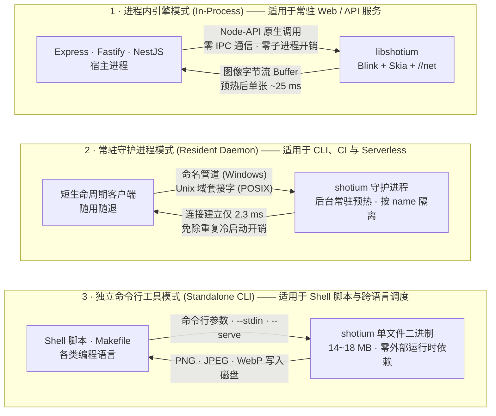
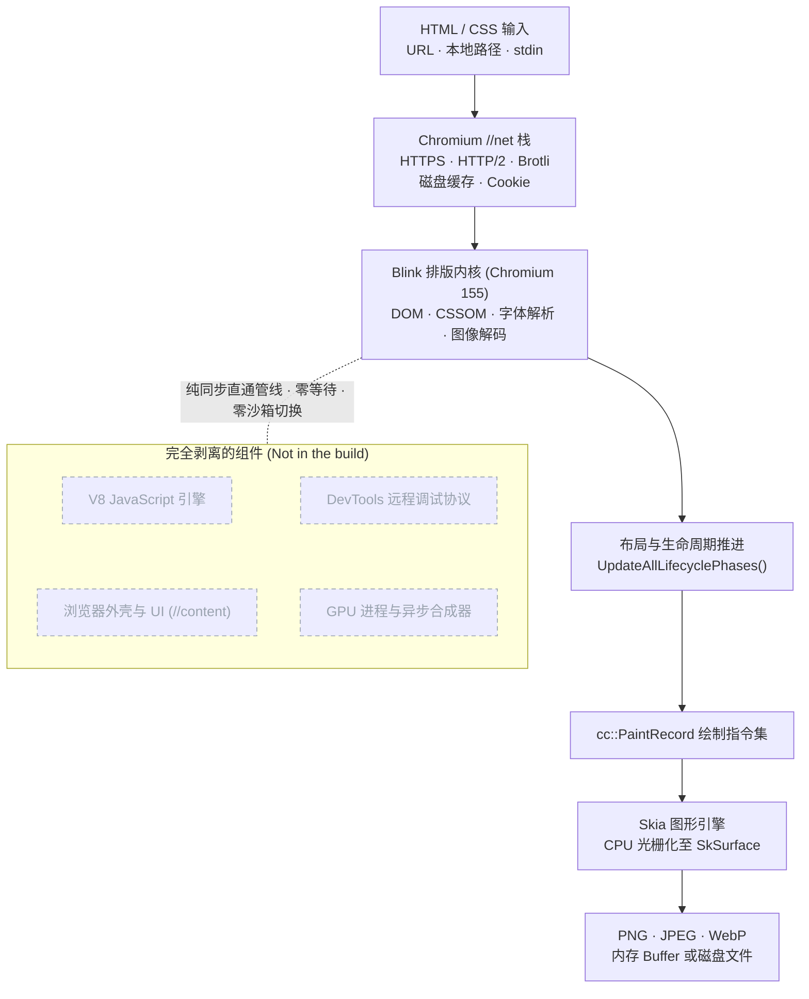

<h1 align="center">shotium</h1>

<p align="center">
  <b>基于 Chromium 内核的高性能轻量级静态 HTML/CSS 截图引擎：无浏览器外壳、无 V8、无 DevTools，纯进程内毫秒级出图。</b>
</p>

<p align="center">
  <a href="https://www.npmjs.com/package/@shotkit/shotium"></a>
  <a href="https://chromium.googlesource.com/chromium/src/+/refs/tags/155.0.8048.0"></a>
  <a href="https://github.com/sj817/shotium/releases"></a>
  <a href="https://sj817.github.io/shotium/"></a>
  <a href="LICENSE"></a>
</p>

<p align="center">
  <a href="README.md">English</a> · <b>简体中文</b>
</p>

<p align="center">
  
</p>

**shotium** 将 Blink 排版引擎、Skia 图形库以及 Chromium 的 `//net` 网络栈深度精简并编译为一个仅约 22 MB 的原生引擎。它严格遵循 Chromium 标准排版静态 HTML 和 CSS，通过 CPU 进行光栅化并在当前宿主进程内直接返回 PNG、JPEG 或 WebP 格式的图像数据。

由于在底层构建中完全剥离了 V8 JavaScript 引擎、浏览器外壳（`//content`）、GPU 进程与 DevTools 远程协议，shotium 彻底消除了浏览器拉起耗时、IPC 序列化开销与孤儿僵尸进程。

---

## 核心优势

- **Chromium 155 基准渲染精度**：保留的 Blink DOM/CSS 排版引擎、Skia 图形库与 `//net` 网络栈深度同步至上游 Chromium **`155.0.8048.0`**。全面支持现代 CSS Grid、Flexbox、容器查询 (Container Queries)、`@font-face`、SVG、CSS 变量、阴影与渐变，保证 100% 对齐 Chrome 真实视觉呈现。
- **可审计的跨引擎性能基准**：通过官方六平台自动化 CI 原生运行对比 Shotium、Puppeteer 与 Playwright 各变体。所有数据必须具备完整六平台分片与可核验凭证方可发布，异常与噪声单元格清晰标记（详见 [性能基准](#性能基准)）。
- **零额外依赖，开箱即用**：`npm install @shotkit/shotium` 自动拉取当前操作系统（Windows / macOS / Linux）与架构（x64 / arm64）对应的预编译二进制扩展。引擎通过 Node-API 直接加载至宿主进程，无需配置无头浏览器，告别内存泄漏与僵尸进程。
- **确定性文字排版与跨平台一致性**：排版引擎与 Chrome 保持完全一致；文本光栅化采用固定伽马曲线的灰度抗锯齿，确保同一文档在不同操作系统上输出的像素逐字节完全一致。
- **透明可查的内存占用**：测试系统全程追踪完整进程树、物理 RSS 峰值与常驻漂移。单实例活跃渲染工作集仅约 **50 ~ 70 MB**（私有内存约 15 MB，远低于常规 Headless 浏览器的数百 MB 至数 GB）。
- **多语言与多形态生态**：支持常驻服务进程内嵌入（Node.js `@shotkit/shotium`）、短任务毫秒响应的常驻守护进程（Resident Daemon）、面向 Shell 脚本与管道的单文件独立 CLI，以及面向 Rust / Go / C++ 的标准纯 C ABI；提供 Go、Python、Rust、C#、Java 源码示例，暂不单独发布语言包。

---

## 快速上手

### 1. 安装

```bash
# Node.js / TypeScript 环境 (npm, pnpm, yarn, bun)
pnpm add @shotkit/shotium
```

### 2. Node.js 极速调用示例

无需繁琐的启动配置，直接调用 `screenshot()` 即可开箱即用：

```ts
import { writeFileSync } from 'node:fs';
import { screenshot } from '@shotkit/shotium';

// 直接截取在线 URL 或本地 HTML 文件；引擎在首次调用时自动启动
const { image, stats } = await screenshot({
  file: 'https://example.com',
  viewport: { width: 1280, height: 720 },
  type: 'png',
});

console.log(`渲染耗时: ${stats.timing.render.toFixed(1)}ms (总耗时: ${stats.timing.total.toFixed(1)}ms)`);
writeFileSync('example.png', image!);
```

> 📖 **想要查阅完整的 Node.js / TypeScript 开发手册？**
> 请直接参阅 **[Node.js 专属文档 (`apps/demo/shotium/README.md`)](apps/demo/shotium/README.md)**，包含 Express/Fastify 服务端实战、动态 HTML 渲染方案、本地文件访问权限（`allowFileAccess`）、超长切片落盘以及完备的 TypeScript 类型参考。

### 3. 独立命令行工具 (CLI)

在无需安装 Node.js 的生产环境或 Shell 脚本中，可以直接使用官方发布的独立单文件可执行文件（从文件路径、URL 或标准输入 `stdin` 读取）：

<p align="center">
  
</p>

---

## 性能基准

基准测试数据全部采集自官方[六平台自动化 CI 基准测试矩阵](https://sj817.github.io/shotium/)。Shotium 与 Puppeteer/Playwright 的 Chrome 及 headless-shell 变体在相同的 GitHub Runner 硬件配置上执行完全相同的测试场景。测试结果必须同时满足“六平台分片全量完成、凭证完备、无阻塞性框架或 Shotium 故障”方可录入排行榜。出现噪声或偶发失败的单元格会予以明确标注，避免由于个别竞品环境故障抹杀其他维度的真实对比。最新发布的基准报告与原始数据归档可从 [`benchmark-results/LATEST.md`](benchmark-results/LATEST.md) 获取。本文档遵循工程严谨原则，不在文档中固化未经核验的数值。

### 基准测试原则与方法

- **严格对等比对**：仅当双方引擎在同一台物理 Runner、相同测试用例与相同并发参数下均完整运行成功时，才计算加速比；标记为 `noisy` 的波动数据予以单独标明，不纳入综合排行。
- **并发调度机制**：测试平台向单个引擎实例发起等量并发请求。不同引擎遵循其真实的并发拓扑（Shotium 采用精简高效的串行队列，竞品采用浏览器内部多标签/多 Worker 机制），以此度量真实的业务吞吐表现。
- **平台兼容性边界**：Puppeteer 暂无 Linux 和 Windows 的官方原生 arm64 构建，Playwright 在 Windows arm64 下运行 x64 模拟架构，此类单元在矩阵中如实标记为 `n/a`。
- **内存真实遥测**：全程监控每个场景下的系统物理 RSS 与进程树占用，内存指标遵循与延迟指标同样严苛的准入审计门槛。

> [!TIP]
> **关于 PGO 优化与性能反馈**：
> 当前预编译二进制版本尚未完成基于大规模真实生产语料的 PGO（Profile-Guided Optimization，性能引导优化）训练。尽管在绝大多数常规页面与标准排版中表现优异，但在部分极端、超长文档或特定复杂 CSS 属性组合场景下，渲染性能可能尚未达到理论峰值。若您在实际业务中遇到渲染较慢或表现不及预期的页面，欢迎提交包含复现 HTML/CSS 的 [Issue](https://github.com/sj817/shotium/issues)，我们将把该用例纳入后续的 PGO 训练语料集进行针对性优化。

---

## 方案对比

| 对比维度 | shotium | Puppeteer / Playwright | Satori (`@vercel/og`) | wkhtmltoimage |
|---|---|---|---|---|
| **排版引擎** | Chromium Blink 155 + Skia | 完整 Chromium | 自研排版器 | QtWebKit（2023 年已归档）|
| **CSS 特性支持** | Chrome 155 完整现代标准 | Chrome 155 完整现代标准 | Flexbox 受限子集，不支持 Grid | 2012 年旧版 WebKit 标准 |
| **输入源** | HTML 文件、URL、`stdin` | HTML 文件、URL | JSX 节点树 | HTML 文件、URL |
| **JavaScript 支持** | 不执行（完全剥离 V8）| 支持执行 | 不适用 | 旧版 JavaScriptCore |
| **进程运行模式** | 宿主进程内直接调用（Node-API / C ABI）| 独立进程 + IPC 通信 | 宿主进程内（WASM/JS）| 子进程调用 |
| **分发与包体积** | 约 22 MB 原生引擎 | 需下载浏览器（> 100 MB）| 极小（纯 JS/WASM）| 需系统级安装包 |
| **首图输出耗时 (linux-x64)** | [详见实测基准](https://sj817.github.io/shotium/) | [详见实测基准](https://sj817.github.io/shotium/) | 不适用 | 不适用 |

### 选型建议

- **选用 Headless 浏览器**：页面强依赖客户端 JavaScript 动态交互、前端 SPA 数据水合（Hydration）或复杂模拟点击操作。
- **选用 Satori**：仅需简单的卡片布局、使用受限的 Flexbox 子集且生产环境严禁引入任何原生二进制扩展。
- **选用 shotium**：输入源为服务端渲染（SSR）或静态 HTML/CSS 模板，追求与 Chrome 100% 像素级对齐的排版渲染效果，同时对系统吞吐量、响应延迟与内存占用有严苛要求。

---

## 典型应用场景

- **社交媒体分享卡片与 Open Graph 动态图**：在服务端高并发实时渲染包含用户头像与文章摘要的预览图。
- **电子单据与凭证生成**：基于 HTML/CSS 模板高保真输出发票、小票、收据、工单与各类资格证书。
- **机器人消息卡片渲染**：在即时通信机器人中替代重型 Puppeteer。例如 [yunzai-renderer-shotium](https://github.com/sj817/yunzai-renderer-shotium) 用于 Miao-Yunzai，[zhin-plugin-shotium](https://github.com/sj817/zhin-plugin-shotium) 用于 zhin.js。
- **服务端数据报表与看板导出**：将包含复杂 SVG 矢量图表与排版样式的报表批量导出为高质量图片。
- **邮件模板与设计稿渲染预览**：确保在任何操作系统下排版效果与字体渲染一致。
- **大规模静态页面缩略图生成**：以传统浏览器集群无法比拟的高吞吐量与极低内存开销批量生成网页快照。

---

## 设计边界与非目标

- **不执行 JavaScript**：构建产物中完全移除了 V8 引擎。文档中的 `<script>` 标签将被直接忽略。输入内容必须是已完成渲染的完整静态 HTML、模板产物或 SSR 页面。
- **无多进程安全沙箱**：Chromium 的多进程沙箱架构随浏览器外壳一同剥离。上层应用在接收不可信输入前，必须自行完成 URL 合法性校验并防范 SSRF 攻击。`file://` 协议子资源访问默认处于关闭状态（`allowFileAccess: false`）。
- **不支持以 `data:` URL 作为主文档**：动态拼接生成的 HTML 需先写入临时文件，或通过命令行管道以 `--stdin` 方式输入。
- **单引擎实例串行处理**：单个 shotium 引擎内部采用队列串行渲染机制。若需提升并发吞吐量，请通过多工作进程（Worker Process）或配置不同 `name` 的多个守护进程进行水平扩展。

---

## 运行模式与架构拓扑



### 模式选型速查

| 业务场景 | 推荐模式 | 选型理由 |
|---|---|---|
| **常驻 Web / API 服务**（Express、Fastify、NestJS）| **进程内引擎** | 零 IPC 通信开销，零进程启动耗时，单请求渲染延迟最低。|
| **CLI 命令行工具、CI 流水线、Serverless 函数** | **常驻守护进程** | 引擎子系统在后台保持预热，客户端建立连接仅需约 2 ms，彻底消除冷启动。|
| **非 Node.js 环境、自动化脚本与批处理** | **独立命令行工具** 或 **C ABI / FFI 跨语言集成** | 单文件便携分发，支持标准输入管道（`--stdin`）与常驻服务模式（`--serve`）。|

---

## 客户端与多语言生态

Shotium 的底层 C 核心支持多种主流语言与调用环境：

### 1. Node.js & TypeScript (`@shotkit/shotium`)

官方首发的 JavaScript / TypeScript SDK。既支持直接在主服务进程内无缝直调，也支持透明连接后台守护进程：

```ts
import shotium, { screenshot } from '@shotkit/shotium';

// 常驻服务生命周期管理
shotium.start({ cacheMaxBytes: 256 * 1024 * 1024 });

const { image } = await screenshot({
  file: './report.html',
  allowFileAccess: true, // 访问本地样式、字体与图片时必须开启
  viewport: { width: 1280, height: 720 },
});

// 请求洪峰后主动释放非必要缓存
shotium.releaseMemory({ releaseWorkingSet: true });

// 停机时安全清理
await shotium.stop();
```

👉 **[查阅完整的 Node.js 开发指南与 API 手册 (`apps/demo/shotium/README.md`)](apps/demo/shotium/README.md)**，包含：
- 三种运行范式（开箱即用直接截图、常驻 Web 服务生命周期管理、常驻守护进程复用）；
- 内存中动态 HTML 字符串的安全落盘渲染方案；
- 本地子资源安全访问权限（`allowFileAccess`）；
- 内存 Buffer 与零拷贝原子落盘（`path`）；
- 超长页面切片（`screenshotTiles`）与 `{n}` 占位符流式落盘；
- 缓存管理模块（`cache.getFiles()`、`cache.clear({ glob })`）；
- 详尽完备的 TypeScript 类型定义与错误诊断上下文。

---

### 2. 独立命令行工具 (`shotium`)

从 [GitHub Releases](https://github.com/sj817/shotium/releases) 下载对应平台的单文件可执行程序（包含 CLI、动态库、C 头文件和资源包）：

```bash
# 1. 指定视口尺寸截取远程 URL
shotium https://example.com --width 1280 --height 720 -o output.png

# 2. 截取本地 HTML 文件整页并输出为 WebP 格式
shotium --file page.html --full-page --type webp --quality 85 -o output.webp

# 3. 通过标准输入 (stdin) 管道接收 HTML 并输出图片
cat template.html | shotium --stdin --width 800 --height 600 -o banner.png

# 4. 将超长页面切成分片输出，{n} 会被替换为 1、2、3 ...
shotium --file article.html --full-page --tile-height 8000 -o article-{n}.png

# 5. 常驻服务模式：从 stdin 持续接收长度前缀的 JSON 请求
shotium --serve --cache-dir /var/tmp/shotium-cache
```

执行 `shotium --help` 可查看完整的命令行参数列表。

---


### 多语言示例与预编译 C ABI

项目初期暂不发布 Go、Python、Rust、C#、Java 的 Shotium 语言包。统一提供 **C ABI + GitHub Release 预编译动态库**，有需求后再发布正式绑定包。压缩包包含动态库、`shot_api.h`、资源包与接入文档；已有 npm 包继续发布。

[通用下载与接入说明](apps/c-abi/README.md) · [Go](apps/go/README.md) · [Python](apps/python/README.md) · [Rust](apps/rust/README.md) · [C#](apps/csharp/README.md) · [Java](apps/java/README.md)

完整 npm 源码已迁至 [`apps/demo/shotium/`](apps/demo/shotium/README.md)，同步维护 npm 打包、加载路径和 CI；[应用目录](apps/README.md)提供所有示例入口。

### 3. C ABI 与 FFI 跨语言集成 (`shot/shot_api.h`)

针对 Rust、Go、Python、C++ 等支持 C FFI 的开发语言，shotium 在 [`shot/shot_api.h`](shot/shot_api.h) 中导出了纯 C 标准接口：

```c
#include "shot_api.h"

shot_engine* engine = NULL;
shot_buffer* error = NULL;
shot_engine_create("{}", &engine, &error);

shot_buffer* png = NULL;
shot_buffer* stats = NULL;  /* 可选参数；无需统计数据时可传入 NULL */
shot_engine_capture(engine, "{\"file\":\"https://example.com\"}",
                    &png, &stats, &error);

const uint8_t* data = shot_buffer_data(png);
size_t size = shot_buffer_size(png);

/* 释放内存并销毁引擎 */
shot_buffer_free(png);
shot_buffer_free(stats);
shot_engine_destroy(engine);
```

> **ABI 兼容性**：当前 ABI 版本为 **3**。ABI 3 新增 `shot_engine_capture_tiles()` 以及用于管理分片所有权的 `shot_tile_list_*` 接口。调用前可通过 `shot_abi_version()` 比对 `SHOT_ABI_VERSION`。

---

### 4. Python example / Python 示例

使用 [ctypes 示例](apps/python/README.md)直接调用预编译动态库，无需 pip 安装 Shotium。暂不发布 Python SDK，有实际需求后再提供语言包。

---

## 核心引擎通用参数规范

Shotium 在 CLI 命令行、Node.js API 与 C ABI JSON 请求中共享相同的底层引擎配置参数：

| 参数含义 | CLI 参数 | Node.js 配置字段 | 说明 |
|---|---|---|---|
| 渲染目标 | `[url]` 或 `--file <path>` | `file: string` | 远程 URL（`https://`、`http://`）或本地文件路径。不支持 `data:` URL。 |
| 标准输入 | `--stdin` | 不适用 | 直接从标准输入管道读取 HTML。 |
| 视口尺寸 | `--width <px> --height <px>` | `viewport: { width, height }` | 页面排版视口（CSS 像素）。默认：`1280x720`。 |
| 整页截图 | `--full-page` | `fullPage: boolean` | 截取整个可滚动的完整文档高度。 |
| CSS 选择器 | `--selector <sel>` | `selector: string` | 截取匹配该选择器的首个 DOM 元素包围盒（内部由 `Document::querySelector` 计算）。 |
| 裁剪区域 | `--clip <x,y,w,h>` | `clip: { x, y, width, height }` | 指定特定矩形裁剪区域（CSS 像素）。 |
| 输出格式 | `--type <png\|jpeg\|webp>` | `type: 'png' \| 'jpeg' \| 'webp'` | 输出图片编码格式。默认：`png`。 |
| 压缩质量 | `--quality <1-100>` | `quality: number` | 图片压缩质量（仅针对 `jpeg` 与 `webp`）。默认：`90`。 |
| 设备像素比 | `--scale <dpr>` | `scale: number` | 设备像素比 (DPR，取值 0.01~8.0)。默认：`1.0`。 |
| 透明背景 | `--omit-background` | `omitBackground: boolean` | 保留透明通道而非填充白色背景（仅支持 PNG/WebP）。 |
| 输出文件 | `-o <path>` / `--output <path>` | `path: string` | 输出文件路径。指定后由底层原子写入磁盘。 |
| 分片切片 | `--tile-height <px>` | `tile: { height: number }` | 将长页面切分为水平分片（每片至多 32,000 CSS 像素）。 |
| 本地子资源 | `--allow-file-access` | `allowFileAccess: boolean` | 是否允许加载本地 `file://` 子资源（图片/字体/样式表）。默认：`false`。 |
| 缓存策略 | `--cache <mode>` | `cache: CacheMode` | `'default'`、`'reload'`、`'no-store'` 或 `'only-if-cached'`。 |
| 等待策略 | `--wait-until <mode>` | `pageGotoParams.waitUntil` | `'load'`（默认）或 `'networkidle'`（额外等待 500ms 静默无网络请求）。 |
| 超时时间 | `--timeout-ms <ms>` | `pageGotoParams.timeout` | 导航与渲染超时（毫秒）。默认：`30000`。 |

> **互斥约束**：`fullPage`、`selector` 与 `clip` 三者严格互斥，同时传入多个将抛出参数异常。

---

## 技术架构



整条渲染管线在单个进程的单线程内同步执行：无独立渲染进程拉起，无需等待合成器帧同步，更无 JavaScript 运行时等待。

1. **直接驱动 Blink**：shotium 实例化 `PageNonOrdinary`，同步调用 `LocalFrameView::UpdateAllLifecyclePhases()`，绕过 Chromium `//content` 外壳与复杂合成器。
2. **Skia CPU 光栅化**：将排版阶段生成的 `cc::PaintRecord` 直接回放至内存中的 `SkSurface`，像素阵列直通 Skia 内置的高性能图片编码器。
3. **原生集成 Chromium 网络栈**：直接链接 `//net` 核心库，包含 `URLRequestContext`、BoringSSL、SPDY/HTTP2 会话管理与持久化磁盘缓存。
4. **统一底层内核**：npm 原生扩展与独立 CLI 共享完全相同的底层 C++ `shot::Capture` 核心实现，确保不同调用形态下的输出像素级一致。

---

## 环境变量

| 环境变量名 | 说明 |
|---|---|
| `SHOTIUM_ENDPOINT` | 覆盖守护进程的 IPC 通信地址（Unix Socket 路径或 Windows 命名管道）。 |
| `SHOTIUM_DAEMON_LOG` | 指定 `daemon.connect()` 自动拉起的后台守护进程的诊断日志输出路径。 |

在从源码构建或调试场景下，可通过 `resourceDir` 指定数据包所在目录：

```ts
shotium.start({ resourceDir: '/path/to/out/Shot' });
```

---

## 源码构建

### 前置条件

- [depot_tools](https://commondatastorage.googleapis.com/chrome-infra-docs/flat/depot_tools/docs/html/depot_tools_tutorial.html#_setting_up) 已安装并配置至系统 `PATH`
- 至少 40 GB 可用磁盘空间
- 对应平台的编译器工具链：
  - **Windows**：Visual Studio 2022 与 Windows SDK（10.0.26100.0 或 10.0.28000）
  - **macOS**：Xcode
  - **Linux**：运行 `./build/install-build-deps.sh --no-prompt --no-nacl` 安装依赖

### 构建步骤

```bash
mkdir shotium-build && cd apps/demo/shotium-build

cat > .gclient <<'EOF'
solutions = [{
  "name": "src",
  "url": "https://github.com/sj817/shotium.git",
  "managed": False,
  "custom_deps": {},
  "custom_vars": {"checkout_configuration": "small"},
}]
target_os = ["win"] # 根据平台设置为 ["mac"] 或 ["linux"]
EOF

gclient sync --nohooks --no-history
gclient runhooks

cd src

# 重新打包精简版 ICU 数据文件（每个 checkout 先执行一次 pnpm -C scripts install）
pnpm icu:repack third_party/icu/cast/icudtl.dat third_party/icu/shot/icudtl.dat --preset shot

mkdir -p out/Shot
echo 'import("//build/args/shot.gn")' > out/Shot/args.gn
# macOS: echo 'import("//build/args/shot-mac.gn")' > out/Shot/args.gn
# Linux: echo 'import("//build/args/shot-linux.gn")' > out/Shot/args.gn

gn gen out/Shot
ninja -C out/Shot shot
```

### 测试套件

```bash
pnpm verify:serve  out/Shot/shotium.exe  # 协议与图像编解码校验
pnpm verify:net    out/Shot/shotium.exe  # HTTP、TLS、重定向与缓存校验
pnpm verify:node   out/Shot/shotium.exe  # Node 扩展绑定、任务队列与生命周期
pnpm verify:daemon out/Shot/shotium.exe  # 守护进程 IPC 与并发校验
pnpm verify:demos  out/Shot/shotium.exe  # 视觉回归参考测试（84 例 reftest）
```

---

## 文档素材生成

文档中的所有图片与演示动图均由 [`docs/demo/`](docs/demo) 目录下的源文件自动渲染生成，确保演示与代码实现完全一致：

```bash
pnpm run docs:assets   # 重新生成 card.webp、example-node.webp、example-cli.webp
pnpm run docs:demo     # 重新生成 demo.gif（基于 docs/demo.tape 自动化录制）
pnpm run docs          # 运行上述全量素材生成
```

---

## License

BSD-3-Clause，与上游 Chromium 保持一致。详见 [LICENSE](LICENSE)。

### Node 原生入口

Node-API addon 由 GN 与引擎核心一起构建：`pnpm build:engine --target shot_node`
生成 `out/Shot/shotium.node`。截图请求和统计以对象跨越 Node 边界，渲染在引擎线程
执行，通过 Node-API 兑现 Promise，不占用 libuv 工作线程等待渲染。
公开的 `stop()` / `start()` 行为保持不变。

npm 平台包包含独立 `.node`、CLI 和资源包。C ABI 动态库继续由 GitHub Release
归档提供，Node 不加载该动态库。addon 构建需要完整源码和 `scripts/node-sdk.ts`
准备的固定版本 SDK，不再使用 node-gyp。
