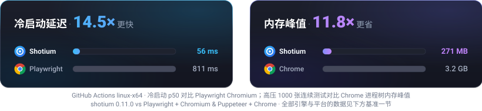
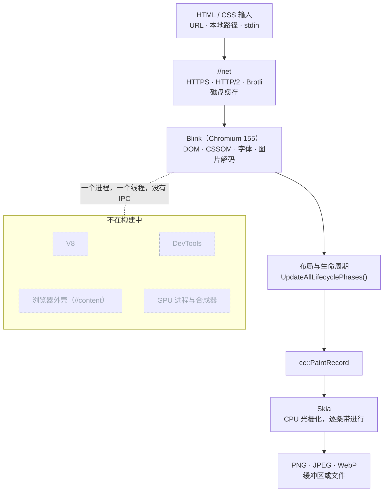

<h1 align="center">shotium</h1>

<p align="center">
  <b>基于 Chromium 深度裁剪的静态 HTML/CSS 截图引擎：保留 Blink 布局绘制与网络栈，剥离外部浏览器外壳与 JS 引擎</b>
</p>

<p align="center">
  <a href="https://www.npmjs.com/package/@pixel.js/shotium"></a> <a href="https://chromium.googlesource.com/chromium/src/+/refs/tags/155.0.8048.0"></a> <a href="https://github.com/sj817/shotium/releases"></a> <a href="https://sj817.github.io/shotium/"></a> <a href="LICENSE"></a>
</p>

<p align="center">
  <a href="README.md">English</a> · <b>简体中文</b>
</p>

<p align="center">
  
</p>

shotium 提取了 Chromium 中将 HTML/CSS 转化为像素的核心能力：由 Blink 负责 DOM 解析、样式计算、排版与绘制，由 Skia 负责光栅化与图像编码，由 `//net` 负责资源拉取与磁盘缓存；彻底剥离了浏览器外壳（`//content`）、V8 引擎、多进程架构、Compositor 合成器、GPU 进程以及 DevTools 等与静态渲染无关的组件

引擎直接运行在宿主调用方进程内，通过专有串行渲染线程完成页面排版绘制，并直接输出 PNG、JPEG 或 WebP 图像数据。排版引擎严格基于 Chromium 155 标准，渲染效果与原生 Chrome 保持一致；文字渲染采用灰度抗锯齿与固定伽马值，确保在同构环境下拥有完全确定性的像素级输出

### 核心特性

- **极速低延迟**：单张渲染低至 14 ms，冷启动仅 56 ms，无需等待外部浏览器拉起与 DevTools 协议握手
- **按需分发**：CLI、C ABI 与语言示例分别打包，只下载需要的用途和平台；新包体积以实际发布附件为准
- **零 CDP 协议开销**：剥离 V8 与外部 IPC，直接通过 Node-API / C ABI 嵌入宿主进程调用 Blink 核心渲染流水线
- **高弹性与生产就绪**：内置流式长图分片（`screenshotTiles`）、短生命周期常驻守护进程（`daemon`）及显式 GC 内存控制

---

### 官方 SDK 与多语言支持

| 语言 / 生态 | 绑定机制 | 核心特性 | 示例工程与文档 |
|:---|:---|:---|:---:|
|  **Node.js / TypeScript** | Node-API 原生插件 | 进程内加载、流式长图分片、后台守护进程 | [TypeScript SDK 指南](apps/typescript/README.zh.md) |
|  **Go** | [`purego`](https://github.com/ebitengine/purego) | 纯 Go 动态符号绑定，无需 cgo 编译器 | [Go SDK 指南](apps/go/README.zh.md) |
|  **Python** | 标准库 `ctypes` | 零第三方包依赖，原生结构体交互与内存管理 | [Python SDK 指南](apps/python/README.zh.md) |
|  **Rust** | `libloading` | 零成本抽象，通过 `Drop` trait 实现自动 RAII 资源释放 | [Rust SDK 指南](apps/rust/README.zh.md) |
|  **C# / .NET** | P/Invoke | `DllImportResolver` 跨平台解析与非托管内存释放 | [C# SDK 指南](apps/csharp/README.zh.md) |
|  **Java** | JNA | 跨平台 `Native.load` 动态绑定与 UTF-8 JSON 交互 | [Java SDK 指南](apps/java/README.zh.md) |
|  **CLI 命令行** | 独立原生二进制 | 开箱即用，支持 URL、本地文件、stdin 及 `--serve` | [命令行用法说明](#命令行) |
|  **C ABI 规范** | 标准 C 动态库 | 跨语言底层契约与跨分配器内存所有权原则 | [C ABI 规范指南](apps/c-abi/README.zh.md) |

<p align="center">
  <a href="#安装">快速安装</a> &nbsp;•&nbsp;
  <a href="#用法">代码示例</a> &nbsp;•&nbsp;
  <a href="#选项">配置选项</a> &nbsp;•&nbsp;
  <a href="#工作原理">架构原理</a> &nbsp;•&nbsp;
  <a href="#非目标与设计边界">设计边界</a> &nbsp;•&nbsp;
  <a href="#方案选型对比">方案选型</a> &nbsp;•&nbsp;
  <a href="#基准测试">性能基准</a> &nbsp;•&nbsp;
  <a href="#常见问题-faq">常见问题</a> &nbsp;•&nbsp;
  <a href="#仓库布局">仓库结构</a>
</p>

---

## 安装

#### Node.js / TypeScript

```bash
npm install @pixel.js/shotium   # 或 npm、yarn、bun；自动安装适配当前系统的原生预编译包
```

<details>
<summary><b>旧包名 <code>@shotkit/shotium</code>（过渡期继续发布）</b></summary>

从 0.7.3 起，`@shotkit/shotium` 是 `@pixel.js/shotium` 的兼容别名：两者同版本号同步发布，安装旧名会自动带上 `@pixel.js/shotium` 及对应平台包。已有项目无需改动即可继续收到每一个新版本。旧的六个 `@shotkit/shotium-<os>-<arch>` 平台包停留在 0.7.2，不再更新。

切换到正式包名：

```bash
npm uninstall @shotkit/shotium
npm install @pixel.js/shotium
```

```diff
- import { screenshot } from '@shotkit/shotium';
+ import { screenshot } from '@pixel.js/shotium';
```

</details>

#### 独立 CLI / C 动态库 / 各语言示例

在 **[GitHub Releases](https://github.com/sj817/shotium/releases)** 按需下载对应平台的预编译产物，包内解压顶层目录均不带版本后缀：

| 类别 | 附件命名格式 | 包含平台 / 语言 | 包含内容 |
|---|---|---|---|
| **CLI** | `shotium-cli-<平台>.7z` | win / linux / macos (x64 / arm64) | 独立可执行文件、两份 `.pak` 核心资源及许可证 |
| **C ABI** | `shotium-c-abi-<平台>.7z` | win / linux / macos (x64 / arm64) | 动态链接库、`.pak` 资源、`shot_api.h` 头文件、接口指南及导入库（Windows） |
| **示例** | `shotium-example-<语言>.7z` | go / python / rust / csharp / java | 完整源码工程、页面模板、工程依赖清单及校验清单（不含原生库） |
| **校验清单** | [`SHA256SUMS`](https://github.com/sj817/shotium/releases/latest/download/SHA256SUMS) | 全部 17 个 `.7z` 压缩包 | 标准 SHA-256 校验列表，按文件名排序 |

> 平台标识为 `windows-amd64`、`windows-arm64`、`linux-amd64`、`linux-arm64`、`macos-amd64`、`macos-arm64`；多语言示例通过下载对应平台的 `shotium-c-abi-<平台>.7z` 并解压至 `native/` 目录下即可一键运行

<details>
<summary><b>下载并校验独立 CLI（Linux / macOS / Windows 快速上手）</b></summary>

```bash
# Linux / macOS（以 linux-amd64 为例，需要 7z 或 7zz）
curl -fLO https://github.com/sj817/shotium/releases/latest/download/shotium-cli-linux-amd64.7z
curl -fLO https://github.com/sj817/shotium/releases/latest/download/SHA256SUMS

# 可选完整性校验并解压
sha256sum --check --ignore-missing SHA256SUMS
7z x shotium-cli-linux-amd64.7z
./shotium-cli-linux-amd64/shotium --help
```

```powershell
# Windows PowerShell（以 windows-amd64 为例）
curl.exe -fLO https://github.com/sj817/shotium/releases/latest/download/shotium-cli-windows-amd64.7z
curl.exe -fLO https://github.com/sj817/shotium/releases/latest/download/SHA256SUMS

# 校验并解压
$expected = (Get-Content SHA256SUMS | Select-String "shotium-cli-windows-amd64.7z").Line.Split(" ")[0]
if ((Get-FileHash shotium-cli-windows-amd64.7z -Algorithm SHA256).Hash.ToLower() -ne $expected) { throw "SHA256 校验不匹配" }
7z x shotium-cli-windows-amd64.7z
.\shotium-cli-windows-amd64\shotium.exe --help
```

</details>

## 用法

### Node.js / TypeScript

安装 `@pixel.js/shotium` 后即可在项目中直接引入：

```ts
import { writeFileSync } from 'node:fs';
import { screenshot, screenshotTiles, start, stop, purgeMemory } from '@pixel.js/shotium';

// -------------------------------------------------------------
// 1. 基础截图：仅需传入 URL 或文件路径，其余参数均有默认值
// -------------------------------------------------------------
const { image } = await screenshot({ file: 'https://example.com' });
writeFileSync('example.png', image!);

// -------------------------------------------------------------
// 2. 超长页面分片渲染：流式逐段光栅化，避免超大位图爆内存（OOM）
// -------------------------------------------------------------
for await (const tile of screenshotTiles({
  file: 'article.html',
  fullPage: true,
  tile: { height: 8000 },                 // 每 8000px 导出一张独立分片
})) {
  console.log(`导出分片 #${tile.index} (y=${tile.rect.y}, ${tile.image.length} 字节)`);
  writeFileSync(`article-${tile.index}.png`, tile.image);
}

// -------------------------------------------------------------
// 3. 显式生命周期与内存管理（可选的高级控制）
// -------------------------------------------------------------
// 预热引擎并配置 HTTP 磁盘缓存目录与容量上限
await start({ cacheDir: './cache', cacheMaxBytes: 256 * 1024 * 1024 });

// 业务高峰过后主动释放：触发 Blink GC 并清理 Skia 绘制缓存
purgeMemory();

// 进程退出前优雅销毁引擎，释放全部原生资源
await stop();
```

> [!TIP]
> **短生命周期任务（CLI / CI 脚本 / Serverless）？**
> 推荐使用内置的常驻守护进程模块，免除重复冷启动耗时：
> ```ts
> import { daemon } from '@pixel.js/shotium';
> 
> const { image } = await daemon.screenshot({ file: 'page.html', fullPage: true });
> ```
> 完整选项参数（CSS 选择器、等待策略、自定义请求头等）请参阅 [TypeScript SDK 完整指南](apps/typescript/README.zh.md)

### 命令行 (CLI)

`shotium-cli-<平台>.7z` 仅包含许可证、两个 `.pak` 资源及独立可执行文件 `shotium`（Windows 上为 `shotium.exe`），无需安装 Node.js 或任何浏览器依赖：

<p align="center">
  
</p>

```bash
# 截取远程 URL 为 PNG 图片
shotium https://example.com --width 1280 --height 720 -o output.png

# 截取本地 HTML 页面为 WebP 整页长图（质量 85）
shotium --file page.html --full-page --type webp --quality 85 -o output.webp

# 从标准输入 (stdin) 管道接收 HTML 内容并直接渲染
cat template.html | shotium --stdin --width 800 --height 600 -o banner.png

# 超长页面分片导出（每 8000px 切割为一个独立文件：article-0.png, article-1.png...）
shotium --file article.html --full-page --tile-height 8000 -o article-{n}.png

# 启动常驻工作进程（基于 stdin/stdout 传输带长度前缀的 JSON 请求，实现跨语言高效复用）
shotium --serve --cache-dir /var/tmp/shotium-cache
```

> 运行 `shotium --help` 可查看完整的命令行参数与选项列表

> **没有装可执行文件？** `npx @pixel.js/shotium <相同参数>` 会通过 npm 包里的 Node 插件运行同一个引擎。它只是兜底，不是 CLI 本体：每次调用都要多付一次 Node 启动与插件加载的开销，且不支持 `--serve`。经常运行的场景请下载 `shotium-cli-<平台>.7z`

### C ABI 与其他语言

`shotium-c-abi-<平台>.7z` 提供跨平台的 C 动态库（`shotium.dll` / `libshotium.so` / `libshotium.dylib`）及标准 C 头文件 `shot_api.h`。接口遵循简洁的 C 契约，支持在任意支持 FFI 的编程语言中调用：

```c
// 1. 初始化引擎单例
ShotEngine* engine = NULL;
shot_engine_create(NULL, &engine);

// 2. 发起截图请求（传入 UTF-8 JSON 配置字符串）
ShotBuffer image = {0};
const char* request = "{\"file\":\"card.html\",\"width\":720,\"height\":380,\"type\":\"png\"}";
shot_engine_capture(engine, request, &image, NULL, NULL);

// 3. 释放引擎分配的图像缓冲区（严格遵循“哪方分配哪方释放”原则）
shot_buffer_free(&image);

// 4. 销毁引擎实例
shot_engine_destroy(engine);
```

每个支持语言的示例工程均已打包为 `shotium-example-<语言>.7z` 在 Release 中分发，渲染完全一致的 720×380 登机牌卡片：
- [Go 示例 (purego)](apps/go/README.zh.md)
- [Python 示例 (ctypes)](apps/python/README.zh.md)
- [Rust 示例 (libloading)](apps/rust/README.zh.md)
- [C# 示例 (P/Invoke)](apps/csharp/README.zh.md)
- [Java 示例 (JNA)](apps/java/README.zh.md)

> 完整接口签名、内存所有权模型及状态码规范，请参阅 [C ABI 核心规范](apps/c-abi/README.zh.md)

## 选项

各接入形态共享统一的引擎配置规范。其中 Node.js 列对应 `ScreenshotOptions` 接口字段；C ABI 列对应请求 JSON 中的键名（C ABI 协议中视口参数直接展开在根对象）：

### 核心选项

| 用途 | Node.js | 命令行 | C ABI JSON | 默认 |
|---|---|---|---|---|
| 输入 | `file` | `URL_OR_PATH`、`--file PATH`、`--stdin` | `file` | 必填 |
| 视口尺寸 | `viewport.width`、`viewport.height` | `--width N --height N` | `width`、`height` | 1280 × 720 |
| 整页长图 | `fullPage` | `--full-page` | `fullPage` | 关 |
| 输出格式 | `type` | `--type png\|jpeg\|webp` | `type` | `png` |
| 编码质量 | `quality` | `--quality N` | `quality` | 90 |
| 设备缩放比 | `scale` | `--scale N` | `scale` | 1 |
| 透明背景 | `omitBackground` | `--omit-background` | `omitBackground` | 关 |

<details>
<summary><b>展开查看高级排版、局部截取、流式分片与网络缓存选项...</b></summary>
<br/>

| 用途 | Node.js | 命令行 | C ABI JSON | 默认 |
|---|---|---|---|---|
| 单个元素 | `selector` | `--selector CSS` | `selector` | 无 |
| 区域裁剪 | `clip` | 不支持 | `clip` | 无 |
| 输出文件路径 | `path` | `-o PATH` | `path` | 返回字节缓冲区 |
| 分片渲染 | `screenshotTiles({ tile: { height } })` | `--tile-height N` | `tile.height` | 无 |
| 注入 CSS | `css` | 不支持 | `css` | 无 |
| 加载超时 | `pageGotoParams.timeout` | `--timeout-ms N` | `timeout` | 30000 ms |
| 等待策略 | `pageGotoParams.waitUntil` | `--wait-until load\|networkidle` | `waitUntil` | `load` |
| 本地子资源 | `allowFileAccess` | `--allow-file-access`（仅影响 `--serve`） | `allowFileAccess` | 关 |
| 缓存策略 | `cache` | 不支持 | `cache` | `default` |
| 额外请求头 | `headers` | 不支持 | `headers` | 无 |
| 磁盘缓存路径 | `start({ cacheDir })` | `--cache-dir PATH` | 引擎选项 `cacheDir` | Node: `~/.shotium/cache`；CLI/C ABI: 无 |
| 磁盘缓存上限 | `start({ cacheMaxBytes })` | `--cache-max-bytes N` | 引擎选项 `cacheMaxBytes` | Node: 256 MB；CLI/C ABI: 由后端自定 |
| User Agent | `start({ userAgent })` | `--user-agent STRING` | 引擎选项 `userAgent` | 内置默认标头 |

> 注：`fullPage`、`selector`、`clip` 三者互斥

</details>

## 工作原理



1. **网络加载**：文档通过 Chromium 自身网络栈（`//net`）拉取，支持 TLS、HTTP/2、Brotli 压缩与磁盘缓存
2. **排版计算**：Blink 在专有 `Page` 实例中同步完成解析、样式计算与排版，无需外部渲染进程与合成器介入
3. **条带光栅化**：绘制指令由 Skia 按水平条带（Tiles）流式光栅化，每条光栅化完毕即刻编码写入，无需在内存中维护整张超大位图
4. **确定性输出**：Node-API 扩展、CLI 与 C ABI 动态库底层调用统一的 `shot::Capture()` 核心，针对相同输入产出逐字节完全一致的图像数据

## 非目标与设计边界

> [!NOTE]
> shotium 专为**高吞吐、高保真、纯静态的服务端页面渲染**而设计。以下特性不在支持范围内：

- **不执行客户端 JavaScript**：引擎已彻底剔除 V8，HTML 中的 `<script>` 标签将被忽略。页面必须是服务端就绪的静态 HTML（如 SSR、模板渲染产物或纯 HTML/CSS）
- **无多进程沙箱**：Chromium 多进程安全沙箱已随浏览器外壳剥离。若需截取外部不可信 URL，调用方必须在请求到达引擎前完成合法性校验与 SSRF 防护。本地 `file:` 子资源访问默认禁用
- **不支持 `data:` 协议主文档**：主页面需通过本地文件路径、标准输入管道（stdin）或 HTTP(S) URL 提供
- **单进程单实例约束**：底层 Blink 依赖进程级全局状态，不支持重复初始化。单进程内请求串行渲染；如需并行并发，请采用多进程部署或配置多个独立的守护进程实例

## 方案选型对比

| 维度 | shotium | Puppeteer / Playwright | Satori（`@vercel/og`） | wkhtmltoimage |
|---|---|---|---|---|
| **排版引擎** | Blink 155 + Skia | 完整 Chromium | 自研排版引擎 | QtWebKit（已归档） |
| **CSS 支持度** | Chrome 155 完整规范 | Chrome 完整规范 | Flexbox 子集，不支持 Grid | 2012 年旧版 WebKit |
| **输入来源** | 本地文件、URL、标准输入 (stdin) | 本地文件、URL | JSX / 虚拟 DOM 树 | 本地文件、URL |
| **JavaScript 执行** | 否（纯静态排版） | 是（完整执行） | 不适用 | 旧版 JavaScriptCore |
| **进程与内存模型** | 宿主进程内嵌入，或轻量守护进程 | 独立浏览器子进程 + IPC 通信 | 纯 JS 进程内运算 | 每次独立启动子进程 |
| **分发与安装体积** | CLI / C ABI 独立按需分发（压缩包 ~11 MB / 单引擎 ~32 MB） | 需下载并解压完整 Chromium（400+ MB） | 纯 JS / WASM（数十 KB） | 操作系统依赖包（~100 MB） |

- **选择无头浏览器（Puppeteer/Playwright）**：当页面依赖客户端 JS 动态渲染、用户交互、登录态或复杂 SPA 页面时
- **选择 Satori**：当只需极简 Flexbox 卡片、在无原生二进制运行权限的 Edge 边缘函数环境时
- **选择 shotium**：当页面为静态/SSR HTML，且对 Chrome 标准排版保真度、高并发批量生成、亚秒级延迟与极低内存占用有严苛要求时

## 基准测试

下表来自 [v0.7.4 CI 归档](apps/docs/benchmarks/v0.7.4/20260911T182956Z-gh34628753598-a1/report.zh-CN.md)的 Linux x64 实测。冷启动和预热截图取 p50；吞吐量取 parallel 场景的单并发结果。表中所有计时数据均通过归档的质量检查。吞吐量与顶部卡片的 soak 数据各来自一个实测批次；归档保留了原始样本和六平台完整结果。

| 引擎方案 | 冷启动首张 (p50) | 预热截图 (p50) | 吞吐量 (单并发) | 下载体积 (压缩后) | 安装体积 (压缩前) |
|:---|---:|---:|---:|---:|---:|
| **Shotium** | **61 ms** | **13.6 ms** | **27.6 张/秒** | **~11 MB** | **~32 MB** |
| Puppeteer (headless-shell) | 615 ms (10.1×) | 133.3 ms (9.8×) | 6.0 张/秒 | ~130 MB | ~380 MB |
| Playwright (headless-shell) | 780 ms (12.8×) | 150.2 ms (11.0×) | 6.7 张/秒 | ~130 MB | ~390 MB |
| Puppeteer (Chrome 完整浏览器) | 880 ms (14.4×) | 190.1 ms (14.0×) | 4.9 张/秒 | ~170 MB | ~450 MB |
| Playwright (Chrome 完整浏览器) | 968 ms (15.9×) | 176.7 ms (13.0×) | 5.5 张/秒 | ~170 MB | ~480 MB |

> 注：Shotium 体积取最小平台构建（macOS arm64 / Linux arm64），单执行文件/共享库约 32 MB；对比浏览器方案包含 Chromium 二进制及完整多媒体运行时

- **[交互式基准看板（VitePress）](https://sj817.github.io/shotium/)**：浏览各平台得分、冷启动耗时、并发吞吐与内存消耗曲线
- **[历史基准测试数据归档](apps/docs/benchmarks/README.zh.md)**：包含每次基准运行的完整原始样本，最新测试结论参见 [`LATEST.md`](apps/docs/benchmarks/LATEST.md)

## 常见问题 (FAQ)

<details>
<summary><b>Q1: 为什么 Shotium 彻底剥离了 JavaScript 执行能力？</b></summary>

Shotium 针对的是服务端海量高并发「HTML/CSS 转化为图像」的场景。传统无头浏览器渲染绝大部分耗时与内存开销消耗在 V8 虚拟机初始化、JS 执行以及 DevTools 协议握手通信上，同时直接执行外部不可信脚本存在巨大的安全隐患与沙箱逃逸攻击面

剥离 V8 后，Shotium 获得了亚毫秒级的渲染执行开销、仅 56ms 的极速冷启动和更轻量可控的内存占用。如果页面包含动态数据，强烈建议在服务端（Node.js / Go / Python 等）使用模板引擎或 SSR 预先完成数据与 HTML 的组装拼接，再交由 Shotium 进行高保真排版光栅化
</details>

<details>
<summary><b>Q2: 在 Docker 容器环境中中文字体缺失或显示乱码方块怎么办？</b></summary>

Linux 容器镜像（如 `debian:*-slim` 或 `alpine`）通常不自带中文字体。Blink 依赖系统 Fontconfig 获取字体，缺少字体时将退化为缺失字形。只需在 Dockerfile 中安装开源的 Noto CJK 字体即可：

```dockerfile
FROM node:22-bookworm-slim

WORKDIR /app

# 安装开源 CJK 中文字体包（避免中文字符方块或缺失）
RUN apt-get update && apt-get install -y --no-install-recommends \
    fonts-noto-cjk \
    && rm -rf /var/lib/apt/lists/*

COPY package.json pnpm-lock.yaml ./
RUN npm install -g pnpm && pnpm install --frozen-lockfile

COPY . .
CMD ["node", "server.mjs"]
```

Shotium 会自动检测并优先匹配系统已安装的 Noto Sans / Serif CJK 字体，输出完美的中文排版
</details>

<details>
<summary><b>Q3: 在高并发高吞吐的服务端场景下，如何组织架构？</b></summary>

由于底层 Blink 依赖进程级全局排版上下文，Shotium 在单个进程内使用专用渲染线程按串行队列处理请求。为避免多线程锁竞争，单进程内是线程安全的串行模型

若业务面临数十到数百 QPS 的高并发吞吐需求：
1. **多工作进程（Worker Pool）**：在 Node.js 中结合 `cluster` 模块或 `worker_threads` 派生多个工作进程，每个进程加载一个独立的 Shotium 实例
2. **常驻服务模式（Daemon / `--serve`）**：启动多个 `shotium --serve` 守护进程，通过反向代理或任务队列分配任务
3. **分片渲染控内存**：对于超长网页，请使用 `screenshotTiles` 分段光栅化，并在高频批量任务后定期调用 `purgeMemory()` 清理图形缓存
</details>

## 仓库布局

本项目为基于上述基线版本的 Chromium 深度裁剪切片，代码树仅保留支撑引擎构建所需的最小源文件子集：

```text
shotium/
├── shot/                      # 引擎核心：C++ 源码、shot_api.h 接口、GN 构建配置与测试语料
├── apps/
│   ├── typescript/            # 官方 Node.js / TypeScript SDK（npm: @pixel.js/shotium）
│   ├── c-abi/                 # 跨语言 C ABI 规范指南与契约说明
│   ├── go/                    # Go 示例工程（基于 purego，无 cgo）
│   ├── python/                # Python 示例工程（基于标准库 ctypes）
│   ├── rust/                  # Rust 示例工程（基于 libloading 与 RAII）
│   ├── csharp/                # C# / .NET 示例工程（基于 P/Invoke）
│   ├── java/                  # Java 示例工程（基于 JNA）
│   ├── demo-card/             # 多语言共用的登机牌卡片源（Canonical Card）
│   ├── demo-express/          # Express Web 服务集成截图示例
│   ├── demo-genshin-card/     # 角色卡片演示应用
│   ├── demo-hello/            # 最小静态 HTML 测试样例
│   ├── benchmark/             # 六平台跨引擎基准测试套件
│   ├── benchmark-site/        # 基于 VitePress 的基准测试交互式数据看板
│   ├── docs/                  # 架构设计演进、技术文档与历史基准归档
│   └── test/render/           # 像素级视觉回归测试套件
└── scripts/                   # 仓库工程自动化工具（构建、依赖裁剪、类型检查与 CI 辅助）
```

## 从源码构建

- 日常使用 npm 包或 Release 二进制压缩包的开发者无需进行源码编译
- 若需自行构建引擎，需配置以本仓库为 `src` 的 `gclient` 环境、对应平台的 C++ 编译工具链及约 40 GB 可用磁盘空间
- 随后执行 `pnpm build:engine`

详细构建参数、目录规约与验证套件请查阅维护者指南 [CLAUDE.md](CLAUDE.md)，技术架构演进请参阅 [apps/docs](apps/docs/README.zh.md)

## 参与贡献

- 欢迎通过 [GitHub Issues](https://github.com/sj817/shotium/issues) 提交反馈与缺陷报告
- 如遇页面渲染异常，提供能够稳定复现的最小 HTML 代码片将对快速定位问题大有帮助
- 欢迎提交 Pull Request

在开始修改前，请仔细阅读 [CLAUDE.md](CLAUDE.md) 了解代码风格、线程约束及自动化验证流程

社区生态集成案例：

- [karin-plugin-shotium](https://github.com/KarinJS/plugin-shotium)
- [yunzai-renderer-shotium](https://github.com/sj817/yunzai-renderer-shotium)（适用于 Miao-Yunzai）
- [zhin-plugin-shotium](https://github.com/sj817/zhin-plugin-shotium)（适用于 zhin.js）

## 许可证

本项目遵循与上游 Chromium 一致的 BSD-3-Clause 开源协议。详情请参见 [LICENSE](LICENSE)
