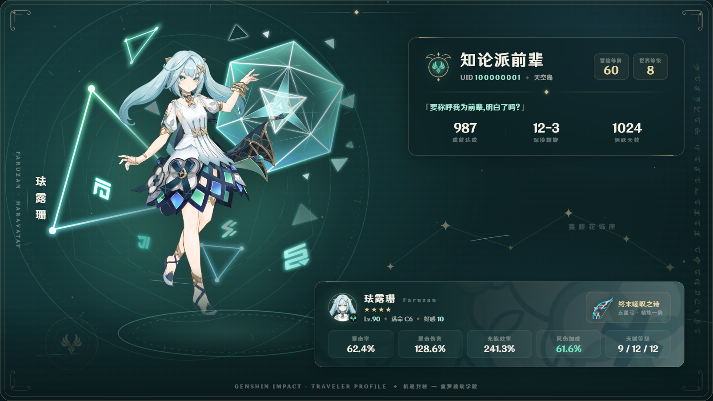

# demo-genshin-card

[English](./README.md) · 简体中文

基于《原神》角色「珐露珊」视觉主题的横向个人资料展示卡片（标准分辨率 1600 × 900，16:9）。项目采用原生 HTML、CSS 与 JavaScript 构建，由 Vite 本地开发服务器托管，无框架或后端依赖。本页面作为 [demo-express](../demo-express/README.zh.md) 的渲染目标。



## 目录结构

```text
demo-genshin-card/
├─ index.html          页面结构与全部 SVG 装饰（神之眼、命之座、卷草角饰等）
├─ style.css           视觉样式，颜色、阴影、圆角统一由 CSS 变量管理
├─ script.js           资料配置、渲染、卡片等比缩放、背景粒子
├─ preview.png         最终效果截图
└─ assets/
   ├─ character/faruzan-splash.png     珐露珊官方祈愿立绘，透明 PNG，2048 × 1024
   ├─ icons/faruzan-icon.png           珐露珊官方头像图标
   ├─ icons/weapon-elegy.png           武器「终末嗟叹之诗」官方图标
   ├─ background/namecard-faruzan.png  珐露珊「机关」名片纹样，用作养成面板底纹
   └─ fonts/
      ├─ HYWenHei-Extended.ttf         原神游戏字体，全局使用
      └─ GenshinSumeru.ttf             须弥文装饰字体，仅右缘装饰条
```

## 运行

```bash
pnpm install --frozen-lockfile
pnpm run dev
```

在浏览器中访问 Vite 控制台输出的本地服务地址。页面资源（字体与图片）通过 HTTP 伺服，建议在 Chrome 或 Edge 等 Chromium 内核浏览器中查看最佳视觉效果。

## 修改玩家资料

`script.js` 顶部的 `profileData` 集中管理全部文案：

```js
const profileData = {
  nickname: '知论派前辈',
  uid: '100000001',
  server: '天空岛',
  adventureRank: 60,
  worldLevel: 8,
  // 签名、成就、深渊、角色等级、命座、武器、词条……
};
```

修改保存后刷新页面生效。支持通过 URL Query 参数动态覆盖配置项，无需直接修改源码：

```text
index.html?nickname=旅行者&uid=123456789&critRate=75.0%
```

## 替换角色图片

1. 把新的透明背景立绘放入 `assets/character/`
2. 修改 `index.html` 中 `.character-art` 的 `src`
3. 构图偏移时，在 `style.css` 中调整 `.character-art` 的 `width`、`left`、`top`，以及 `mask-image` 的两条渐变

## 截图

卡片基础视口为 1600 × 900 CSS 像素，具备响应式等比自适应布局。背景粒子与光效采用平缓动效，支持通过 `prefers-reduced-motion` 自动禁用动效。在自动化截图中（如 `demo-express`），可通过选择器 `selector: '#card'` 精确截取卡片内容；手动截屏建议设置视口不小于 1760 × 1000，并可配合 `scale: 2` 生成高分辨率图片。

## 素材来源

| 素材 | 来源 |
|---|---|
| 祈愿立绘、头像、武器图标、名片纹样 | 《原神》官方游戏资源，经 [enka.network](https://enka.network) UI 镜像获取（`UI_Gacha_AvatarImg_Faruzan` 等） |
| 角色资料核验（命之座「蔓藤花饰座」、室罗婆耽学院、武器内部名） | [Project Amber / gi.yatta.moe](https://gi.yatta.moe) 公开 API |
| 风元素符号矢量路径 | 开源项目 [frzyc/genshin-optimizer](https://github.com/frzyc/genshin-optimizer)（MIT） |
| 原神字体 HYWenHei Extended | [cawa-93/HYWenHei-Extended-Font](https://github.com/cawa-93/HYWenHei-Extended-Font) |
| 须弥文装饰字体 | [thomas200593/genshin-fonts-collections](https://github.com/thomas200593/genshin-fonts-collections)，社区手工字体 |

神之眼徽记、机关圆盘、命之座星图、卷草角饰、风场流线等装饰均为本目录手绘的 SVG 与 CSS。

《原神》游戏素材与「汉仪文黑」字体版权归 miHoYo / HoYoverse 及汉仪字库所有。本卡片仅用于个人非商业性质的资料分享，请勿商用。

## 注意事项与已知限制

- 立绘、图标与字体包含游戏版权素材，仅供个人学习交流与非商业展示
- 面板毛玻璃质感依赖 CSS `backdrop-filter`，在不支持硬件加速的旧版环境或虚拟 GPU 环境中会平滑降级为半透明背景
- 页面仅提供桌面横屏比例展示，未适配移动端竖屏布局
- 页面本身不包含客户端截图或导出按钮，需配合 shotium CLI 或 SDK 进行图像截取

## 许可证

本目录的代码与仓库其余部分一样采用 BSD-3-Clause 开源协议（素材版权归原权利人所有），详情参见 [LICENSE](../../LICENSE)

